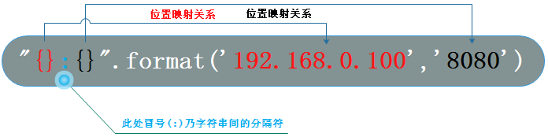

##     1.Python历史与简介

### 1.python的出生与应用

　　python的创始人为 <font color=#ff0000>吉多·范罗苏姆（Guido van Rossum）</font>。1989年的圣诞节期间，吉多·范罗苏姆（中文名字：龟叔）为了在阿姆斯特丹打发时间，决心开发一个新的脚本解释程序，作为ABC语言的一种继承。  

（龟叔：2005年加入谷歌至2012年，2013年加入Dropbox直到现在，依然掌握着Python发展的核心方向，被称为仁慈的独裁者）。

2017年7月的TIOBE排行榜，Python已经占据第四的位置， Python崇尚优美、清晰、简单，是一个优秀并广泛使用的语言。

<font color="ff0000">**2019年7月编程语言排行榜TOP20**</font>

 


由上图可见，Python整体呈上升趋势，反映出Python应用越来越广泛并且也逐渐得到业内的认可！！！

Python可以应用于众多领域，如：**数据分析、组件集成、网络服务、图像处理、数值计算和科学计算等**众多领域。目前业内几乎所有大中型互联网企业都在使用Python，如：<font color=#ff0000>Youtube、Dropbox、BT、Quora（中国知乎）、豆瓣、知乎、Google、Yahoo!、Facebook、NASA、百度、腾讯、汽车之家、美团等</font>。

**目前Python主要应用领域：**

- **云计算**: 云计算最火的语言， 典型应用OpenStack。
- **WEB开发**: 众多优秀的WEB框架，众多大型网站均为Python开发，Youtube, Dropbox, 豆瓣。。。 典型WEB框架有Django
- **科学运算、人工智能**: 典型库NumPy,  SciPy,  Matplotlib, Enthought librarys, Pandas
- **系统运维**: 运维人员必备语言
- **金融**：量化交易，金融分析，在金融工程领域，Python不但在用，且用的最多，而且重要性逐年提高。原因：作为动态语言的Python，语言结构清晰简单，库丰富，成熟稳定，科学计算和统计分析都很牛逼，生产效率远远高于c,c++,java,尤其擅长策略回测。
- **图形GUI**: PyQT, WxPython,TkInter

**Python在一些公司的应用：** 

- 谷歌：Google App Engine 、code.google.com 、Google earth 、谷歌爬虫、Google广告等项目都在大量使用Python开发
- CIA: 美国中情局网站就是用Python开发的
- NASA: 美国航天局(NASA)大量使用Python进行数据分析和运算
- YouTube:世界上最大的视频网站YouTube就是用Python开发的
- Dropbox:美国最大的在线云存储网站，全部用Python实现，每天网站处理10亿个文件的上传和下载
- Instagram:美国最大的图片分享社交网站，每天超过3千万张照片被分享，全部用python开发
- Facebook:大量的基础库均通过Python实现的
- Redhat: 世界上最流行的Linux发行版本中的yum包管理工具就是用python开发的
- 豆瓣: 公司几乎所有的业务均是通过Python开发的
- 知乎: 国内最大的问答社区，通过Python开发(国外Quora)
- 春雨医生：国内知名的在线医疗网站是用Python开发的
- 除上面之外，还有搜狐、金山、腾讯、盛大、网易、百度、阿里、淘宝 、土豆、新浪、果壳等公司都在使用Python完成各种各样的任务。 

**python发展史**

- 1989年，为了打发圣诞节假期，Guido开始写Python语言的编译器。Python这个名字，来自Guido所挚爱的电视剧Monty Python’s Flying Circus。他希望这个新的叫做Python的语言，能符合他的理想：创造一种C和shell之间，功能全面，易学易用，可拓展的语言。
- 1991年，第一个Python编译器诞生。它是用C语言实现的，并能够调用C语言的库文件。从一出生，Python已经具有了：类，函数，异常处理，包含表和词典在内的核心数据类型，以及模块为基础的拓展系统。
- Granddaddy of Python web frameworks, Zope 1 was released in 1999
- Python 1.0 - January 1994 增加了 [lambda](https://en.wikipedia.org/wiki/Lambda_calculus), [map](https://en.wikipedia.org/wiki/Map_%28higher-order_function%29), [filter](https://en.wikipedia.org/wiki/Filter_%28higher-order_function%29) and [reduce](https://en.wikipedia.org/wiki/Fold_%28higher-order_function%29).
- Python 2.0 - October 16, 2000，加入了内存回收机制，构成了现在Python语言框架的基础
- Python 2.4 - November 30, 2004, 同年目前最流行的WEB框架Django 诞生
- Python 2.5 - September 19, 2006
- Python 2.6 - October 1, 2008
- Python 2.7 - July 3, 2010
- In November 2014, it was announced that Python 2.7 would be supported until 2020, and reaffirmed that there would be no 2.8 release as users were expected to move to Python 3.4+ as soon as possible
- Python 3.0 - December 3, 2008
- Python 3.1 - June 27, 2009
- Python 3.2 - February 20, 2011
- Python 3.3 - September 29, 2012
- Python 3.4 - March 16, 2014
- Python 3.5 - September 13, 2015
- Python 3.6 - December 16,2016

### 2.python是什么编程语言

编程语言主要从以下几个角度为进行分类，<font color=#ff0000>编译型和解释型、静态语言和动态语言、强类型定义语言和弱类型定义语言</font>，每个分类代表什么意思呢，我们一起来看一下。

#### 2.1 编译型与解释型

**编译型**：把源程序的每一条语句都编译成机器语言,并保存成二进制文件,这样运行时计算机可以直接以机器语言来运行此程序,速度很快。


- 优点：
  - 编译器一般会有预编译的过程对代码进行优化。因为编译只做一次，运行时不需要编译，所以编译型语言的程序执行效率高。可以脱离语言环境独立运行。
- 缺点：
  - 编译之后如果需要修改就需要整个模块重新编译。编译的时候根据对应的运行环境生成机器码，不同的操作系统之间移植就会有问题，需要根据运行的操作系统环境编译不同的可执行文件。


**解释型**：只在执行程序时,才一条一条的解释成机器语言给计算机来执行，因为计算机不能直接认识并执行我们写的语句,它只能认识机器语言(是二进制的形式)，因此导致运行速度是不如编译后的程序运行的快的。


- 优点：
  - 有良好的平台兼容性，在任何环境中都可以运行，前提是安装了解释器（虚拟机）。灵活，修改代码的时候直接修改就可以，可以快速部署，不用停机维护。
- 缺点：
  - 每次运行的时候都要解释一遍，性能上不如编译型语言。

常见编译型语言：

- C
- C++
- GO
- Swift
- Object-C
- Pascal

常见解释型语言：

- JavaScript
- Python
- Ruby
- PHP
- Perl
- Erlang

混合型语言：

- Java
- C#

#### 2.2 动态语言和静态语言

通常我们所说的动态语言、静态语言是指动态类型语言和静态类型语言。

- 动态类型语言：
  - 动态类型语言是指在运行期间才去做数据类型检查的语言，也就是说，在用动态类型的语言编程时，永远也不用给任何变量指定数据类型，该语言会在你第一次赋值给变量时，在内部将数据类型记录下来。Python和Ruby就是一种典型的动态类型语言，其他的各种脚本语言如VBScript也多少属于动态类型语言。
- 静态类型语言：
  - 静态类型语言与动态类型语言刚好相反，它的数据类型是在编译其间检查的，也就是说在写程序时要声明所有变量的数据类型，C/C++是静态类型语言的典型代表，其他的静态类型语言还有C#、JAVA等。

#### 2.3 强类型定义语言和弱类型定义语言

- 强类型定义语言：
  - 强制数据类型定义的语言。也就是说，一旦一个变量被指定了某个数据类型，如果不经过强制转换，那么它就永远是这个数据类型了。举个例子：如果你定义了一个整型变量a,那么程序根本不可能将a当作字符串类型处理。强类型定义语言是类型安全的语言。
- 弱类型定义语言：
  - 数据类型可以被忽略的语言。它与强类型定义语言相反, 一个变量可以赋不同数据类型的值。

强类型定义语言在速度上可能略逊色于弱类型定义语言，但是强类型定义语言带来的严谨性能够有效的避免许多错误。另外，“这门语言是不是动态语言”与“这门语言是否类型安全”之间是完全没有联系的！


例如：Python是动态语言，是强类型定义语言（类型安全的语言）; VBScript是动态语言，是弱类型定义语言（类型不安全的语言）; JAVA是静态语言，是强类型定义语言（类型安全的语言）。

通过上面这些介绍，我们可以得出，**python是一门动态解释性的强类型定义语言。**

### 3.python的优缺点

- 优点

1. Python的定位是“优雅”、“明确”、“简单”，所以Python程序看上去总是简单易懂，初学者学Python，不但入门容易，而且将来深入下去，可以编写那些非常非常复杂的程序。
2. 开发效率非常高，Python有非常强大的第三方库，基本上你想通过计算机实现任何功能，Python官方库里都有相应的模块进行支持，直接下载调用后，在基础库的基础上再进行开发，大大降低开发周期，避免重复造轮子。
3. 高级语言————当你用Python语言编写程序的时候，你无需考虑诸如如何管理你的程序使用的内存一类的底层细节
4. 可移植性————由于它的开源本质，Python已经被移植在许多平台上（经过改动使它能够工 作在不同平台上）。如果你小心地避免使用依赖于系统的特性，那么你的所有Python程序无需修改就几乎可以在市场上所有的系统平台上运行
5. 可扩展性————如果你需要你的一段关键代码运行得更快或者希望某些算法不公开，你可以把你的部分程序用C或C++编写，然后在你的Python程序中使用它们。
6. 可嵌入性————你可以把Python嵌入你的C/C++程序，从而向你的程序用户提供脚本功能。

- 缺点：

1. 速度慢，Python 的运行速度相比C语言确实慢很多，跟JAVA相比也要慢一些，因此这也是很多所谓的大牛不屑于使用Python的主要原因，但其实这里所指的运行速度慢在大多数情况下用户是无法直接感知到的，必须借助测试工具才能体现出来，比如你用C运一个程序花了0.01s,用Python是0.1s,这样C语言直接比Python快了10倍,算是非常夸张了，但是你是无法直接通过肉眼感知的，因为一个正常人所能感知的时间最小单位是0.15-0.4s左右，哈哈。其实在大多数情况下Python已经完全可以满足你对程序速度的要求，除非你要写对速度要求极高的搜索引擎等，这种情况下，当然还是建议你用C去实现的。
2. 代码不能加密，因为PYTHON是解释性语言，它的源码都是以名文形式存放的，不过我不认为这算是一个缺点，如果你的项目要求源代码必须是加密的，那你一开始就不应该用Python来去实现。
3. 线程不能利用多CPU问题，这是Python被人诟病最多的一个缺点，GIL即全局解释器锁（Global Interpreter Lock），是[计算机程序设计语言](http://zh.wikipedia.org/wiki/%E8%AE%A1%E7%AE%97%E6%9C%BA%E7%A8%8B%E5%BA%8F%E8%AE%BE%E8%AE%A1%E8%AF%AD%E8%A8%80)[解释器](http://zh.wikipedia.org/wiki/%E8%A7%A3%E9%87%8A%E5%99%A8)用于[同步](http://zh.wikipedia.org/wiki/%E5%90%8C%E6%AD%A5)[线程](http://zh.wikipedia.org/wiki/%E7%BA%BF%E7%A8%8B)的工具，使得任何时刻仅有一个线程在执行，Python的线程是操作系统的原生线程。在Linux上为pthread，在Windows上为Win thread，完全由操作系统调度线程的执行。一个python解释器进程内有一条主线程，以及多条用户程序的执行线程。即使在多核CPU平台上，由于GIL的存在，所以禁止多线程的并行执行。关于这个问题的折衷解决方法，我们在以后线程和进程章节里再进行详细探讨。

当我们编写Python代码时，我们得到的是一个包含Python代码的以`.py`为扩展名的文本文件。要运行代码，就需要Python解释器去执行`.py`文件。

由于整个Python语言从规范到解释器都是开源的，所以理论上，只要水平够高，任何人都可以编写Python解释器来执行Python代码（当然难度很大）。事实上，确实存在多种Python解释器。

宏观上：

python2与python3区别：

```python
1：打印时，py2需要可以不需要加括号，py3 需要
python 2 ：print ('lili')   ,   print 'lili'
python 3 : print ('lili')   
python3 必须加括号

exec语句被python3废弃，统一使用exec函数

2：内涵
Python2：1，臃肿，源码的重复量很多。
          　  2，语法不清晰，掺杂着C，php，Java，的一些陋习。
Python3：几乎是重构后的源码，规范，清晰，优美。

3、输出中文的区别
python2：要输出中文 需加 # -*- encoding:utf-8 -*-
Python3 ： 直接搞

4：input不同
python2 ：raw_input
python3 ：input 统一使用input函数

5：指定字节
python2在编译安装时，可以通过参数-----enable-unicode=ucs2 或-----enable-unicode=ucs4分别用于指定使用2个字节、4个字节表示一个unicode；
python3无法进行选择，默认使用 ucs4
查看当前python中表示unicode字符串时占用的空间：

impor sys
print（sys.maxunicode）
#如果值是65535，则表示使用usc2标准，即：2个字节表示
#如果值是1114111，则表示使用usc4标准，即：4个字节表示

6：
py2：xrange
　　　　range
py3：range  统一使用range，Python3中range的机制也进行修改并提高了大数据集生成效率

7：在包的知识点里
包：一群模块文件的集合 + __init__
区别：py2 ： 必须有__init__
　　　py3：不是必须的了

8：不相等操作符"<>"被Python3废弃，统一使用"!="

9：long整数类型被Python3废弃，统一使用int

10：迭代器iterator的next()函数被Python3废弃，统一使用next(iterator)

11：异常StandardError 被Python3废弃，统一使用Exception

12：字典变量的has_key函数被Python废弃，统一使用in关键词

13：file函数被Python3废弃，统一使用open来处理文件，可以通过io.IOBase检查文件类型
```


### 4.python的种类

#### CPython

当我们从[Python官方网站](https://www.python.org/)下载并安装好Python 3.6后，我们就直接获得了一个官方版本的解释器：CPython。这个解释器是用C语言开发的，所以叫CPython。在命令行下运行`python`就是启动CPython解释器。

CPython是使用最广的Python解释器。教程的所有代码也都在CPython下执行。

#### IPython

IPython是基于CPython之上的一个交互式解释器，也就是说，IPython只是在交互方式上有所增强，但是执行Python代码的功能和CPython是完全一样的。好比很多国产浏览器虽然外观不同，但内核其实都是调用了IE。

CPython用`>>>`作为提示符，而IPython用`In [``序号``]:`作为提示符。

#### PyPy

PyPy是另一个Python解释器，它的目标是执行速度。PyPy采用[JIT技术](http://en.wikipedia.org/wiki/Just-in-time_compilation)，对Python代码进行动态编译（注意不是解释），所以可以显著提高Python代码的执行速度。

绝大部分Python代码都可以在PyPy下运行，但是PyPy和CPython有一些是不同的，这就导致相同的Python代码在两种解释器下执行可能会有不同的结果。如果你的代码要放到PyPy下执行，就需要了解[PyPy和CPython的不同点](http://pypy.readthedocs.org/en/latest/cpython_differences.html)。

#### Jython

Jython是运行在Java平台上的Python解释器，可以直接把Python代码编译成Java字节码执行。

#### IronPython

IronPython和Jython类似，只不过IronPython是运行在微软.Net平台上的Python解释器，可以直接把Python代码编译成.Net的字节码。

小结：

　　Python的解释器很多，但使用最广泛的还是CPython。如果要和Java或.Net平台交互，最好的办法不是用Jython或IronPython，而是通过网络调用来交互，确保各程序之间的独立性。

## 环境配置

### Python解释器安装

### IDE安装（Pycharm）

### Typora安装

#### Markdown介绍

- Markdown是一种文本标记语言，用于快速文档排版

- Markdown文件为纯文本文件，后缀名为 .md

- Markdown介于Word和HTML之间
  - 比起Word，Markdown是纯文本，排版文档轻量、方便、快速。
  - 比起HTML，Markdown简单直观，易读、易写、易修改

#### Markdown编辑器推荐

桌面全平台指支持Windows、OSX和Linux

| 平台              | 编辑器        | 优点                         |
| ----------------- | ------------- | ---------------------------- |
| Web、Android、ios | 简书          | 简单易用可发布文章           |
| Web、Win          | 小书匠        | 大量的扩展功能               |
| Web、桌面全平台   | Editor.md     | 开源                         |
| Chrome扩展        | 马克飞象      | 适合印象笔记重度用户         |
| 桌面全平台        | **Typora**    | 所写即所得，功能强大外观简约 |
| Win/Linux         | Moe           | 模仿Moe，颜值赛高            |
| Linux             | Retext        | 即时预览                     |
| OSX               | Mou           | osx下最杰出的编辑器          |
| 桌面全平台        | Atom、VS code | 支持Markdown的两个代码编辑器 |
| Android           | MarkdownX     | 手机即可编辑预览             |

#### 下载与安装

下面以Typora为例，说明Markdown的使用。

Typora官网：

​		https://www.typora.io/

进入官网后，下滑网页至最底端，出现如下界面，选择对应系统的版本下载。


下载完成后，安装，可根据个人喜好选择是否修改安装路径。

#### Typora的使用

Typora的使用有两种模式：

- 启用源代码模式

- 关闭源代码模式

启用源代码模式即markdown格式，关闭源代码模式则为实际的效果。实际使用过程中可以用”Ctrl+/”快速启用或者关闭。

本课件主要讲解启用源代码格式时的使用。关闭源代码模式的使用同学们可以结合Typora的实际界面来操作。

##### 标题

语法：

```markdown
# 一级标题
## 二级标题
### 三级标题
#### 四级标题
##### 五级标题
###### 六级标题
```

效果：


注意: 所有语法格式中，符号与文字间均有一个空格。

##### 列表

- 无序列表
  
  - 语法：
  
  ```markdown
  - 文本1 
  - 文本2 
  - 文本3
  ```
  
  - 效果
  
  
  
  +和-、*都可以(推荐使用减号，避免与其他符号混用)
  
  - 语法：
  
  ```markdown
  + 文本4
  + 文本5
  ```
  
  
  
  - 效果：
  
  

如果你想要建立子列表或者列表描述的话，那就用四个空格或者Tab键后再输入内容。

语法：

```markdown
- 父列表1
    - 子列表1
    - 子列表2
- 父列表2
    这里是列表的描述内容
```


效果：


- 有序列表

语法：

```markdown
1. 文本1
2. 文本2
    - 子文本1
    - 子文本2
3. 文本3
    1. 子文本3
    2. 子文本4
4. 文本4
    列表的描述性语言
```

效果：


##### 链接和图片

- 链接

语法：

```markdown
[Typora下载](https://www.typora.io/)
```

效果：


- 插入图片

语法：

```markdown

```

路径种类：

- 网络上图片的实际网址
- 本地中的绝对路径
- 本地中的相对路径

demo:
```markdown


```

##### 引用

- 文字引用

  用于引用他们的文字和语言等,引用可以嵌套使用。

  语法：

  ```markdown
  > 区块引用
  >> 嵌套引用
  ```

  效果：

  

- 代码引用
  
  - 一段代码的时候
  
   我们使用` `将语句可以包起来，同时对于一些关键词、按键等也可以使用这种语法。（`的输入即英  文输入状态下，摁Tab键之上的波浪线即可）
  
  语法：
  
  ```markdown
  `Hello World`
  ```
  
  效果：
  
  
  
  - 多段代码的时候

我们使用```内容```将语句包起来

语法：

```markdown
​```python
print("Hello World")
​```
```

效果：


##### 表格


用于建立表格

语法：

```markdown
|  表头1  |  表头2   |  表头3   |
| :--: | :--: | :--: |
|  00   |  01   |  02   |
|  10   |  11   |  12   |
|  20   |  21   |  22   |
```

效果：


##### 公式

用于编辑公式，Markdown编辑公式可基于LaTeX。日常使用，推荐使用http://latex.91maths.com/


语法：

```markdown
$\sum_{i=1}^{n}2^{i}$
```

即`$公式$`

效果：


## 2.Python基础

### 2.1 第一条编程语句

```python
print("Hello, Python!")
print("To be, or not to be, it's a question.")
print("To be, or not to be, it's up to you.")
print("Make it!")
print("以梦为马，不负韶华!")
```

### 2.2 print()函数

作用：在控制台打印信息；

```python
>>> help(print)
Help on built-in function print in module builtins:

print(...)
    print(value, ..., sep=' ', end='\n', file=sys.stdout, flush=False)

    Prints the values to a stream, or to sys.stdout by default.
    Optional keyword arguments:
    file:  a file-like object (stream); defaults to the current sys.stdout.
    sep:   string inserted between values, default a space.
    end:   string appended after the last value, default a newline.
    flush: whether to forcibly flush the stream.


```

### 2.3 注释

- 单行注释
  - 一个“#”

```python
# 这是单行注释
```

- 多行注释
  - 三单引号
  - 三双引号

```python
'''
多行注释1
'''

"""
多行注释2
"""
```

demo:

```python
print("Hello, Python!") # 第一条Python程序，向Python致敬！
print("To be, or not to be, it's a question.")
print("To be, or not to be, it's up to you.")
print("Make it!")
print("以梦为马，不负韶华!")
'''
让我们开始Python之旅，
畅行在Python之途！
'''
```

### 2.3 input()函数

作用：从外部获取值

用法：括号中可以提供提示信息

**返回值为字符串类型**

```python
>>> a = input()
城市学院
>>> a
'城市学院'
>>> a = input("Please Enter School Info：")
Please Enter School Info：City College
>>> a
'City College'
>>>
```


20190716上午

------

### 2.4 运行Python程序的三种方式

#### (1) 解释器环境运行

```python
C:\Users\King>python
Python 3.6.5 |Anaconda, Inc.| (default, Mar 29 2018, 13:32:41) [MSC v.1900 64 bit (AMD64)] on win32
Type "help", "copyright", "credits" or "license" for more information.
>>> print("Hello,World")
Hello,World
>>>	
```

#### (2) 脚本运行

```python
C:\Users\King>python hello.py # 进入脚本对应的路径
```

或者

```python
C:\Users\King>python d:hello.py # 进入脚本对应的路径

```

#### (3) IDE

- pycharm
- sublime
- VS Code
- Atom

集成开发环境通常整合了文本编辑器、集成的调试器等工具，支持各种源代码控制工具。

```python
# -*- coding: utf-8 -*-
# 或者
#coding:utf-8

```

### 2.5 Python中常见的数据类型

#### 数据的概念

计算机顾明思议就是可以做数学运算的机器,因此计算机理所当然的可以处理各种数据,但是计算机能处理的远远不止数值,还有文本,图形,音频,视频网页等各种数据, 不同数据,需要定义不同的数据类型

#### Python中的数据类型（常见）

- 数字（number）
  - 整型（int）
  - 浮点型（float）
  - 布尔型（bool）
  - 复数（complex）
- 字符串（string）
- 列表（list）
- 元组（tuple）
- 字典（dict）
- 集合（set）

### 2.6 变量和常量

#### 变量

- 概念：

  - 程序可操作的存储区的名称；
  - 程序运行时存储区中能够改变的数据；

  > 每个变量都有自己的特定的数据类型

- 作用：

  - 将数据存储到内存

- 变量的定义

  - 命名

  规则：

  - 必须是字母、下划线、数字组合
  - 不能以数字开头
  - 不可以是Python中的关键字

> 注意：
>
> - 见名知意
> - 区分大小写
> - 在Python中，单下划线和双下划綫开头的变量有特殊的通途，一般不推荐使用单下划线和双下划綫开头的变量名称


- 变量定义

  - ```python
    val_name = 初始值
    
    ```

> 拓展：
>
> 关键字的查看
>
> ```python
> >>> import keyword
> >>> keyword.kwlist
> ['False', 'None', 'True', 'and', 'as', 'assert', 'break', 'class', 'continue', 'def', 'del', 'elif', 'else', 'except', 'finally', 'for', 'from', 'global', 'if',
> 'import', 'in', 'is', 'lambda', 'nonlocal', 'not', 'or', 'pass', 'raise', 'return', 'try', 'while', 'with', 'yield']
> 
> ```
>
> 


一下变量名称哪些是正确的，哪些是错误的？

666，错

City666,对

\_56city,对


类型测试 type()

```python
type(val_name)

```

内存地址 id()

```python
id(val_name)

```

#### 常量

常量即指不变的量，如pai 3.141592653..., 或在程序运行过程中不会改变的量。在Python中没有一个专门的语法代表常量，程序员约定俗成用变量名全部大写代表常量。

通常用大写，如

```python
PI = 3.1415926

```

举例：

```python
>>> a = 1
>>> b = 6.6
>>> c = "xyz"
>>> tp = 1, 2, 3
>>> x, y, z = tp
>>> x
1
>>> y
2
>>> z
3
>>> type(tp)
<class 'tuple'>
>>>
>>>
>>> a, b, c = 111, 222, 33
>>> a
111
>>> b
222
>>> c
33
>>> a = 111
>>> b = 222
>>> c = 333
>>> x = "abc"
>>> y = "def"
>>>
>>> z = x, y
>>> type(z)
<class 'tuple'>
>>>

```


互换两元素的值：

```python
>>> a = 123
>>> b = 456
>>> tmp = a
>>> a = b
>>> b = tmp
>>>
>>> a
456
>>> b
123
>>>
>>> x = 123
>>> y = 456
>>> x, y = y, x
>>> x
456
>>> y
123

```


### 2.7 数字

#### 种类

- 整型（int）

  - 32bit，取值范围 $-2^{31} - 2^{31}-1$ 
  - 64bit，取值范围$-2^{63} - 2^{63}-1$

  以前Python区分短整型和长整型，目前，无这些区分。

- 浮点型（float）

  - 带有小数点的数字

- 布尔型（bool）

  - True
  - False

- 复数（complex）

  - 实部 （cpx.real）
  - 虚部 （cpx.imag）
  - 共轭复数 （cpx.conjugate()）

#### 常见的数学函数

|        函数名        |                           描述                            |
| :------------------: | :-------------------------------------------------------: |
|        abs(x)        |                          绝对值                           |
|      pow(x, y)       |                           $x^y$                           |
|    round(x, [n])     | 返回四舍五入的值，如果给出n，表明四舍五入后的小数点的位数 |
|     math.exp(x)      |                       返回e的x次幂                        |
|     math.fabs(x)     |                 返回绝对值，类型为浮点数                  |
|     math.ceil(x)     |                   返回数字的`上入整数`                    |
|    math.floor(x)     |                   返回数字的`下舍整数`                    |
|   math.log(x, [y])   |          单参数，默认以e为底；双参数，以[y]为底           |
|     math.modf(x)     |              返回浮点数的小数部分和整数部分               |
|     math.sqrt(x)     |                          平方根                           |
| $max(x_1, x_2, ...)$ |                        返回最大值                         |
| $min(x_1, x_2, ...)$ |                        返回最小值                         |

### 2.8 表达式与运算符

- 表达式

  - 由变量，常量和运算符组成的式子，成为表达式

- 运算符

  - 算术运算符
  - 比较运算符
  - 逻辑运算符
  - 赋值运算符
  - 成员运算符
  - 身份运算符
  - 位运算符

  

#### Python算术运算符

| 运算符 | 描述                                            | 实例  |
| ------ | ----------------------------------------------- | :---: |
| +      | 加 : 两个对象相加                               | a + b |
| -      | 减 :得到负数或是一个数减去另一个数              | a - b |
| *      | 乘 : 两个数相乘或是返回一个被重复若干次的字符串 | a * b |
| /      | 除 : x 除以 y                                   | b / a |
| **     | 幂 : 返回x的y次幂                               | a**b  |
| %      | 取模 : 返回除法的余数                           | b % a |
| //     | 取整除 : 向下取接近除数的整数                   | a//b  |

> 拓展：
> divmod(x, y)
>
> ```python
> >>> divmod(23, 4)
> (5, 3)
> 
> ```

```python
a = 6
b = 12
c = 0
 
c = a + b
print ("1: c 的值为：", c)
 
c = a - b
print ("2: c 的值为：", c)
 
c = a * b
print ("3: c 的值为：", c)
 
c = a / b
print ("4: c 的值为：", c)
 
c = a % b
print ("5 - c 的值为：", c)
 
# 修改变量 a 、b 、c
a = 2
b = 3
c = a**b 
print ("6 - c 的值为：", c)
 
a = 10
b = 5
c = a//b 
print ("7 - c 的值为：", c)

```

#### Python比较运算符

以下假设变量a为10，变量b为20：

| 运算符 | 描述                                                         | 实例                  |
| :----: | ------------------------------------------------------------ | --------------------- |
|   ==   | 等于 - 比较对象是否相等                                      | (a == b) 返回 False。 |
|   !=   | 不等于 - 比较两个对象是否不相等                              | (a != b) 返回 True。  |
|   >    | 大于 - 返回x是否大于y                                        | (a > b) 返回 False。  |
|   <    | 小于 - 返回x是否小于y。所有比较运算符返回1表示真，返回0表示假。这分别与特殊的变量True和False等价。注意，这些变量名的大写。 | (a < b) 返回 True。   |
|   >=   | 大于等于 - 返回x是否大于等于y。                              | (a >= b) 返回 False。 |
|   <=   | 小于等于 - 返回x是否小于等于y。                              | (a <= b) 返回 True。  |

#### Python赋值运算符

以下假设变量a为10，变量b为20：

| 运算符 | 描述             | 实例                                  |
| :----: | ---------------- | ------------------------------------- |
|   =    | 简单的赋值运算符 | c = a + b 将 a + b 的运算结果赋值为 c |
|   +=   | 加法赋值运算符   | c += a 等效于 c = c + a               |
|   -=   | 减法赋值运算符   | c -= a 等效于 c = c - a               |
|   *=   | 乘法赋值运算符   | c *= a 等效于 c = c * a               |
|   /=   | 除法赋值运算符   | c /= a 等效于 c = c / a               |
|   %=   | 取模赋值运算符   | c %= a 等效于 c = c % a               |
|  **=   | 幂赋值运算符     | c\*\*= a 等效于 c = c \*\* a          |
|  //=   | 取整除赋值运算符 | c //= a 等效于 c = c // a             |

#### Python位运算符

| **运算符** |                           **描述**                           |
| :--------: | :----------------------------------------------------------: |
|     &      | 按位与运算符：参与运算的两个值,如果两个相应位都为1,则该位的结果为1,否则为0 |
|     \|     | 按位或运算符：只要对应的二个二进位有一个为1时，结果位就为1。 |
|     ^      |       按位异或运算符：当两对应的二进位相异时，结果为1        |
|     ~      | 按位取反运算符：对数据的每个二进制位取反,即把1变为0,把0变为1。**~x** 类似于 **-x-1** |
|     <<     | 左移动运算符：运算数的各二进位全部左移若干位，由"<<"右边的数指定移动的位数，高位丢弃，低位补0。 |
|     >>     | 右移动运算符：把">>"左边的运算数的各二进位全部右移若干位，">>"右边的数指定移动的位数 |

下表中变量 a 为 31，b 为 15二进制格式如下：

```shell
a =    0001 1111
b =    0000 1111
----------------
a&b =  0000 1111
a|b =  0001 1111
a^b =  0001 0000
~a =   1110 0000
a<<2 = 0111 1100
a>>2 = 0000 0111

```

```python
>>> a = 31
>>> b = 15
>>> a & b
15
>>> a | b
31
>>> a ^ b
16
>>> ~a
-32
>>> a << 2
124
>>> a >> 2
7

```

#### Python逻辑运算符

Python语言支持逻辑运算符，

| 运算符 | 逻辑表达式 |                             描述                             |
| :----: | :--------: | :----------------------------------------------------------: |
|  and   |  x and y   | 布尔"与" - 如果 x 为 False，x and y 返回 False，否则它返回 y 的计算值。 |
|   or   |   x or y   | 布尔"或" - 如果 x 是 True，它返回 x 的值，否则它返回 y 的计算值。 |
|  not   |   not x    | 布尔"非" - 如果 x 为 True，返回 False 。如果 x 为 False，它返回 True。 |

同样仍以变量 a 为 31，b 为 15为例：

```python
>>> a and b
15
>>> a or b
31
>>> not a
False

```

针对逻辑运算的进一步研究：

　　1,在没有()的情况下not 优先级高于 and，and优先级高于or，即优先级关系为( )>not>and>or，同一优先级从左往右计算。

判断逻辑语句的正与负：

```python
3>4 or 4<3 and 1==1 #
1 < 2 and 3 < 4 or 1>2 #
2 > 1 and 3 < 4 or 4 > 5 and 2 < 1 #
1 > 2 and 3 < 4 or 4 > 5 and 2 > 1 or 9 < 8 #
1 > 2 and 3 < 4 or 4 > 5 and 2 > 1 or 9 > 8 #
1 > 1 and 3 < 4 or 4 > 5 and 2 > 1 and 9 > 8 or 7 < 6 #
not 2 > 1 and 3 < 4 or 4 > 5 and 2 > 1 and 9 > 8 or 7 < 6#

```


```python
3>4 or 4<3 and 1==1 #F
1 < 2 and 3 < 4 or 1>2 #T
2 > 1 and 3 < 4 or 4 > 5 and 2 < 1 #T
1 > 2 and 3 < 4 or 4 > 5 and 2 > 1 or 9 < 8 #F
1 > 2 and 3 < 4 or 4 > 5 and 2 > 1 or 9 > 8 #T
1 > 1 and 3 < 4 or 4 > 5 and 2 > 1 and 9 > 8 or 7 < 6 #F
not 2 > 1 and 3 < 4 or 4 > 5 and 2 > 1 and 9 > 8 or 7 < 6#F

```

#### python成员运算符

测试是否包含某个成员，一般测试字符串，列表，元组

| 运算符 |                     描述                      |
| :----: | :-------------------------------------------: |
|   in   |  如果存在于指定序列中，返回True；否则，False  |
| not in | 如果不存在于指定序列中，返回True；否则，False |

Demo：

```python
>>> sr = "abc"
>>> "a" in sr
True
>>> "a" not in sr
False

>>> li = list(sr)
>>> li
['a', 'b', 'c']
>>> "a" in li
True
>>>

```

#### python身份运算符

用于比较两个对象的存储单元

id()函数用于获取对象内存地址。

| 运算符 |                 描述                 |
| :----: | :----------------------------------: |
|   is   | 判断两个标识符是不是引用自同一个对象 |
| not is | 判断两个标识符是不是引用自同一个对象 |


#### Python运算符优先级

以下表格列出了从最高到最低优先级的所有运算符：


|                 运算符                 |                          描述                          |
| :------------------------------------: | :----------------------------------------------------: |
|                   **                   |                   指数 (最高优先级)                    |
|               ~、 +、 -                | 按位翻转, 一元加号和减号 (最后两个的方法名为 +@ 和 -@) |
|             * 、/、 %、 //             |                  乘，除，取模和取整除                  |
|                 +、 -                  |                        加法减法                        |
|                >>、 <<                 |                    右移，左移运算符                    |
|                   &                    |                        位 'AND'                        |
|                 ^ 、\|                 |                        位运算符                        |
|            <=、 < 、>、 >=             |                       比较运算符                       |
|              <> 、==、 !=              |                       等于运算符                       |
| =、 %=、 /=、 //=、 -= 、+=、 *=、 **= |                       赋值运算符                       |
|              is 、is not               |                       身份运算符                       |
|              in、 not in               |                       成员运算符                       |
|             not、 and 、or             |                       逻辑运算符                       |

### 2.9 数据类型的强制转换

|    强转类型    |                        描述                        |
| :------------: | :------------------------------------------------: |
| int(x, [base]) | 将x强制转化为整型。如果x是字符串，需要制定base基数 |
|    float(x)    |                  将x转换为浮点型                   |
|     str(x)     |                    强转为字符串                    |
|    repr(x)     |              将对象转换为表达式字符串              |
|    list(x)     |                  将对象转换为列表                  |
|    tuple(x)    |                  将对象转换为元组                  |
|    dict(x)     |                  将对象转换为字典                  |
|     set(x)     |                  将对象转换为集合                  |
|     chr(x)     |                  将整数转化为字符                  |
|     ord(x)     |                  将字符转化为数值                  |
|     bin(x)     |                    转换为二进制                    |
|     oct(x)     |                    转换为八进制                    |
|     hex(x)     |                   转换为十六进制                   |


```python
# int
>>> a = 12.3
>>> int(a)
12
>>> sr = "123"
>>> int(sr)
123
>>> int(sr, 8)
83
>>> 8**2 + 2 * 8 + 3
83
>>> int(sr, 16)
291

```


### 2.10 随机函数

导入这个模块

```python
import random

```

random模块的常见功能：

(1)  random.random()

- 用来生成一个0-1的随机浮点数 [0, 1)

```python
import random
# print(dir(random))
for i in range(100):
	a = random.random()
	print(a, end=" ")

```

(2) random.uniform(a, b)

- 用来生成指定范围内的浮点数，[a, b]

```python
import random
# print(dir(random))
for i in range(100):
	a = random.uniform(6, 8)
	print(a, end=" ")

```


(3) random.randint(a, b)

- 用来生成指定范围内的整数，[a, b]

```python
import random
# print(dir(random))
for i in range(100):
	a = random.randint(6, 10)
	print(a, end=" ")

```


(4) random.randrange([start], stop, [step])

- 从指定范围内，按指定基数递增或者递减的集合中，随机获取一个整数

random.randrange(1, 16, 2)

1， 3， 5， 7， 9， 11， 13， 15


```python
import random
for i in range(100):
	a = random.randrange(1, 16, 2)
	print(a, end=" ")

```

(5) random.choice(sequence)

- 从序列中随机获取一个元素，sequence可以为列表，字符串或者元组

```python
import random
for i in range(100):
	# a = random.randrange(1, 16, 2)
	b = random.choice(range(1, 16, 2))
	print(b, end=" ")

```

(6) random.shuffle(x[, random])

- 用来将一个列表的元素打乱。即将列表的元素随机排列。

```python
import random
li = ["C Language", "C++", "Java", "VB", "C#", "Python"]
# sr = "C Language"
for i in range(6):
	# a = random.randrange(1, 16, 2)
	random.shuffle(li)
	print(li)

```

(7) random.sample(sequence, k)

- 用来从指定序列中随机获取指定长度的片段并随机排列。但，不会修改原来序列。

```python
import random
li = ["C Language", "C++", "Java",\
      "VB", "C#", "Python"]
for i in range(6):
	print(random.sample(li, 4))

```

## 03_Python流程控制

### if条件分支语句

Python条件语句就是通过一条或者多条语句执行的结果（True/False）来决定执行的代码块。

- if单分支语句

```python
if 逻辑语句:
	语句(块)
```

demo:

```python
print("Hello, Python")

if False:
	print("向Python致敬，我正在学习Python。")
	
print("Welldone.")
```


```python
learning = "python"
if learning == "python":
	print("啊哈，真巧，我也在学习Python.")
print("Nice to meet you.")
```

- if 双分支语句

```python
if 逻辑语句1:
	语句(块)1
else:
	语句(块)2
```


demo:

```python
learning = "java"
if learning == "python":
	print("啊哈，真巧，我也在学习Python.")
else:
	print("小明和你一样，他也在学习Java.")

print("Nice to meet you.")
```

- if 多分支语句

C语言中

```c
if 
    if
        if
            
        esle
    else
else
```

python中，<font color=#ff0000>elif:  else if 缩写为elif。</font>

```python
if 逻辑语句1:
	语句(块)1
elif 逻辑语句2:
	语句(块)2
	...
elif 逻辑语句 n-1:
	语句(块) n-1
else:
	语句(块) n
```

练习题:

根据百分制考试成绩返回五级分制成绩。

90-100：A

80-90： B

70-80： C

60-70： D

0- 60 ： E

```python
score = int(input("请输入你的分数:"))

if score > 100:
	print("最高分才100分，多出来的分哪里来的？(黑人问号脸)")
elif score >= 90:
	print("A")
elif score >= 80:
	print("B")
elif score >= 70:
	print("C")
elif score >= 60:
	print("D")
else:
	print("E")
```

从控制台输入一个三位数，判断其是否为水仙花数。

$153 = 1 ^ 3 + 5^3 + 3^3$

```python

```

### while语句

- 循环语句

  - 所谓循环，就是用来执行部分代码在一定条件下重复执行的代码。

  格式：

  ```python
  while 逻辑语句:
  	语句(块)
  
  ```


（1）利用while来打印1-100的数字：


（2）利用while求1-100的和。


（3）利用while求1-100内所有的偶数和。


（4）求100-999内的所有水仙花数。

### for 循环

Python 中for，可以用来遍历任何序列(字符串，列表，元组，etc.)


格式:

```python
for i in 序列:
	语句(块)

```


1.range()

```python
range(end) # [0, end-1],end为整数

range(start, end) # [start, end-1], 两个数均为整数

range(start, end, step) # [start, start+step, start+2*step, ... , end)

```


### break 和 continue

- break 用来结束一个循环，跳出循环体。
- continue 终止本次循环的动作，直接进入下次循环。


### while...else...

### for ... else ...

while...else，for... else中while和else是一块的，for和else也是一块的。

当有break或者return的时候就会跳出while。如果没有break或者return，不管while是否执行，都会执行else语句

```python
# if 逻辑语句:
# 	语句(块)
# 	
# print("Hello, Python")

# if False:
# 	print("向Python致敬，我正在学习Python。")

# print("Welldone.")
# 
# learning = "python"
# if learning == "python":
# 	print("啊哈，真巧，我也在学习Python.")
# print("Nice to meet you.")
# 
# if 逻辑语句1:
# 	语句(块)1
# else:
# 	语句(块)2
# 	
# 	
# learning = input("请输入你学习的编程语言:")
# if learning == "python":
# 	print("啊哈，真巧，我也在学习Python.")
# else:
# 	print("小明和你一样，他也在学习Java.")

# print("Nice to meet you.")
# 
# if 逻辑语句1:
# 	语句(块)1
# elif 逻辑语句2:
# 	语句(块)2
# 	...
# elif 逻辑语句 n-1:
# 	语句(块) n-1
# else:
# 	语句(块) n
# score = int(input("请输入你的分数:"))

# if score > 100:
# 	print("最高分才100分，多出来的分哪里来的？(黑人问号脸)")
# elif score >= 90:
# 	print("A")
# elif score >= 80:
# 	print("B")
# elif score >= 70:
# 	print("C")
# elif score >= 60:
# 	print("D")
# else:
# 	print("E")
# 	

# while 逻辑语句:
# 	语句(块)
# 	
# flag = 0
# i = 0
# while True:
# 	print("I Love Python.")
	
# 	if i == 5:
# 		break
# 	i += 1

#1 i=0,print, i=1
#2 i=1,print, i=2
#3 i=2,print, i=3
#4 
#
#
# count = 1
# while count <= 100:	
# 	print(count, end=' ')
# 	count += 1
# 	
# count = 1
# sum = 0
# while count <= 100:
# 	if count % 2 == 0:
# 		sum += count
# 	count += 1
# print(sum)

# a = int(input("Enter a int:"))
# print((a//100, a%100//10, a%10))
# num = 100
# while num < 1000:
# 	if num == (num//100)**3 + (num%100//10)**3 + (num%10)**3:
# 		print(num)
# 	num += 1
# 	
# for i in 序列:
# 	语句(块)
# 	
# for i in range(2, 15, 2):
# 	print(i, end=" ")
# 	if i == 10:
# 		# break
# 		continue
# 	# print(i, end=" ")
# 	
# count = int(input("Enter a INT："))
# while count <= 5:
# 	print(count, end=" ")
# 	count += 1
# 	if count == 3:
# 		break
# else:
# 	print("这里是else语句。")

```

## 04_字符串(String)

### 什么是字符串

​	字符串是 Python 中最常用的数据类型。我们可以使用引号('或")来创建字符串。事实上，在Python中,加了引号的字符都被认为是字符串！

```python
name = "Changsha" # 双引号
age = "5000" # 只要加双引号就是字符串
age_1 = 5000 # 不加，整型
msg = """I'm in Changsha""" # 三双引号
msg_1 = '''I'm in Hengyang''' # 三单引号
hometowm = 'Changsha' # 单引号
print(type(name), type(age), type(age_1), type(msg), type(msg_1), type(hometown), sep = "|")
<class 'str'>|<class 'str'>|<class 'int'>|<class 'str'>|<class 'str'>|<class 'str'>
```

ascii：字母，数字，特殊字符：1个字节，8位

Unicode：16位两个字节升级32位四个字节

utf-8：最少一个字节8位表示。英文字母8位1个字节欧洲16位，2个字节中文24位，3个字节

gbk：中文2个字节，英文字母1个字节。

那单引号、双引号、多引号有什么区别呢？ 让我大声告诉你，单双引号木有任何区别，只有下面这种情况 你需要考虑单双的配合。

```python
msg = "My name is linus , I'm 18 years old!"
```

多引号什么作用呢？作用就是多行字符串必须用多引号。

```python
msg = """
轻轻的我走了， 
正如我轻轻的来； 
我轻轻的招手， 
作别西天的云彩。 
"""
print(msg)
```


### 字符串运算及操作

数字可以进行加减乘除等运算，字符串呢？让我大声告诉你，也能？what ?是的，但只能进行"相加"和"相乘"运算。

#### (1)拼接

```python
>>> a = "Hello"
>>> b = "Python"
>>> a + b
'HelloPython'
```

注意，字符串的拼接只能是双方都是字符串，不能跟数字或其它类型拼接。

```python
>>> age_1 = 5000
>>> name + age_1
Traceback (most recent call last):
  File "<stdin>", line 1, in <module>
TypeError: must be str, not int
```

#### (2)重复

```python
>>> a = "Hello"
>>> a * 3
'HelloHelloHello'
```

#### (3)字符串索引([]以及切片([::])

```python
#########012345678901234567890123456789
>>> a = "Life is short, I use python"
>>> len(a)
27
>>> # 索引
>>> a[0]
'L'
>>> a[15]
'I'
>>> a[-1]
'n'
>>> a[-6]
'p'
>>> # 切片
...
>>> a[:13]
'Life is short'
>>> a[15:]
'I use python'
>>> a[15::2]
'Iuepto'
>>> a[::-1]
'nohtyp esu I ,trohs si efiL'
>>>
```

#### (4)大小写转换

- str.lower(): 转小写
- str.upper(): 转大写
- str.swapcase(): 大小写对换
- str.capitalize(): 字符串首为大写，其余小写
- str.title(): 以分隔符为标记，首字符为大写，其余为小写

```python
>>> a = "Life is short, I use python"
>>> a.lower() # 将所有大写字符转换为小写字符
'life is short, i use python'
>>> a.upper() # 将所有小写字符转换问大写字符
'LIFE IS SHORT, I USE PYTHON'
>>> a.swapcase() # 将所有小写字符变成大写，将大写字符变成小写
'lIFE IS SHORT, i USE PYTHON'
>>> a.capitalize() # 将字符串的第一个字符大写
'Life is short, i use python'
>>> a.title() # 返回标题化的字符串，
'Life Is Short, I Use Python'
>>>
```

应用：

```python
# 不区分大小写
s_str = "AbcD"
inputofyou = input("请输入验证码，不区分大小写:")
if s_str.lower() == inputofyou.lower():
    print("输入成功。")
else:
    print("请重新输入。")

```

#### (5)字符串格式输出对齐

- str.center()， 居中
- str.ljust()， 左对齐
- str.rjust()， 右对齐
- str.zfill()， 右对齐。前面以0填充

```python
 >>> a = "Life is short, I use python"
>>> a.center(35, '*') # 返回一个原字符串居中,并使用空格填充至长度 width 的新字符串
'****Life is short, I use python****'
>>> a.ljust(35, '*') # 返回一个原字符串左对齐,并使用空格填充至长度 width 的新字符串
'Life is short, I use python********'
>>> a.rjust(35, '*') # 返回一个原字符串右对齐,并使用空格填充至长度 width 的新字符串
'********Life is short, I use python'
>>> a.zfill(35) # 返回长度为 width 的字符串，原字符串 string 右对齐，前面填充0,只有一个参数
'00000000Life is short, I use python'

```

r   ---   >   right

l    ---   >   left

#### (6)删除指定字符

- str.strip()
- str.lstrip()
- str.rstrip()

```python
>>> a = "****Life is short, I use python****"
>>> a.strip("*")
'Life is short, I use python'
>>> a.lstrip("*")
'Life is short, I use python****'
>>> a.rstrip("*")
'****Life is short, I use python'
>>>

```

#### (7)计数

excel表中:

```mssql
=COUNTIF(B2:B31, ">=30")/COUNT(B2:B31)

```

python中：

```python
>>> a = "Life is short, I use python"
>>> a.count('i') # 返回 str 在 string 里面出现的次数
2
>>> a.count('i', 4, 8) # 在索引值为[4,8)的范围内 str 出现的次数
1
>>>

```

#### (8)字符串搜索定位与替换

- str.find()

```python
>>> a = "Life is short, I use python"
>>> a.find('e') # 查找元素并返回第一次出现的元素的索引值
3
>>> a.find('e',18, 24) # 查找元素在指定索引范围内的索引
19
>>> a.find('w') # 找不到值返回-1
-1

```

- str.index()
  - 和find()方法一样，只不过如果str不在 string中会报一个异常。

```python
>>> a = "Life is short, I use python"
>>> a.index('e') 
3
>>> a.index('e', 18)
19
>>> a.index('w')
Traceback (most recent call last):
  File "<stdin>", line 1, in <module>
ValueError: substring not found
>>>

```

- str.rindex()
  - 和index方法一样，但是从右边开始。

```python
>>> a = "Life is short, I use python"
>>> a.rindex('e')
19
>>> a.rindex('e', 3, 6)
3
>>> a.rindex('w')
Traceback (most recent call last):
  File "<stdin>", line 1, in <module>
ValueError: substring not found

```

- str.replace()

```python
>>> a = "Life is short, I use python"
>>> a.replace('I use', 'You need')
'Life is short, You need python'
>>> a.replace('t', 'T')
'Life is shorT, I use pyThon'
>>> a.replace('t', 'T', 1)
'Life is shorT, I use python'
>>>

```

#### (9)字符串条件判断

- isalnum()，字符串由字母或数字组成，
- isalpha()，字符串只由字母组成，
- isdigit()，字符串只由数字组成

```python
>>> str = '1234'
>>> str.isalnum()   # 是否全是字母和数字，并至少有一个字符
True
>>> str.isdigit()    # 是否全是数字，并至少有一个字符
True      
 
 
>>> str = 'string'
 
>>> str.isalnum()  # 是否全是字母和数字，并至少有一个字符
True
>>> str.isalpha()  # 是否全是字母，并至少有一个字符 
True
>>> str.islower() # 是否全是小写，当全是小写和数字一起时候，也判断为True
True
 
>>> str = "01234abcd"
 
>>> str.islower() # 是否全是小写，当全是小写和数字一起时候，也判断为True
True
 
>>> str.isalnum()  # 是否全是字母和数字，并至少有一个字符
True
 
>>> str = ' '
>>> str.isspace()  # 是否全是空白字符，并至少有一个字符
True
 
>>> str = 'ABC'
 
>>> str.isupper()   # 是否全是大写，当全是大写和数字一起时候，也判断为True
True
 
>>> str = 'Aaa Bbb'
 
>>> str.istitle()  # 所有单词字首字母是大写，标题 
True
 
 
>>> str = 'string learn'
 
>>> str.startswith('str') # 判断字符串以'str'开头
True
 
>>> str.endswith('arn')  # 判读字符串以'arn'结尾
True

```

#### (10)制表符转化

str.expandtabs()

```python
>>> a = "L\tife is short, I use python"
>>> a.expandtabs() # 默认将制表符转化为8个空格
'L       ife is short, I use python'
>>> a.expandtabs(4) # 加上参数，将制表符转化为对应个数的空格
'L   ife is short, I use python'
>>>


```

#### (11)ASCII码和字符的转化

- chr():用一个范围在 range（256）内的（就是0～255）整数作参数，返回一个对应的字符。
- ord():将一个ASCII字符转换为对应的数字

```python
>>> chr(65)
'A'
>>> ord('a')
97
>>>

```

#### (12)字符串分割变换

- join() ， 将指定字符插入到元素之间;
- split()， 以指定字符分隔序列且去除该字符
- partition()， 以指定字符分隔序列且包含该字符

```python
# join
>>> str = "learn string"
>>> '-'.join(str)
'l-e-a-r-n- -s-t-r-i-n-g'
>>> '+'.join(str)
'l+e+a+r+n+ +s+t+r+i+n+g'
>>> li = ["learn", "string"]
>>> '-'.join(li)
'learn-string'
# split
>>> str.split('n')
['lear', ' stri', 'g']
>>> str.split('n', 1)
['lear', ' string']
>>> str.rsplit('n')
['lear', ' stri', 'g']
>>> str.rsplit('n', 1)
['learn stri', 'g']
>>> str.splitlines()
['learn string']

>>> str.partition('n')
('lear', 'n', ' string')
>>> str.rpartition('n')
('learn stri', 'n', 'g')
>>>

```


### string模块(补充)

查看：

```python
>>> import string
>>> dir(string)
['Formatter', 'Template', '_ChainMap', '_TemplateMetaclass', '__all__', '__builtins__', '__cached__', '__doc_
_', '__file__', '__loader__', '__name__', '__package__', '__spec__', '_re', '_string', 'ascii_letters', 'asci
i_lowercase', 'ascii_uppercase', 'capwords', 'digits', 'hexdigits', 'octdigits', 'printable', 'punctuation',
'whitespace']
>>> string.ascii_letters
'abcdefghijklmnopqrstuvwxyzABCDEFGHIJKLMNOPQRSTUVWXYZ'
>>> string.ascii_lowercase
'abcdefghijklmnopqrstuvwxyz'
>>> string.ascii_uppercase
'ABCDEFGHIJKLMNOPQRSTUVWXYZ'
>>> string.capwords('hUNAN yingxiao   college')
'Hunan Yingxiao College'
```

- string模块中的capwords()函数功能：
  - 1.将每个单词首字母置为大写
  - 2.将每个单词除首字母外的字母均置为小写;
  - 3.将词与词之间的多个空格用一个空格代替
  - 4.其拥有两个参数，第二个参数用以判断单词之间的分割符，默认为空格。


```python
>>> string.digits
'0123456789'
>>> string.hexdigits
'0123456789abcdefABCDEF'
>>> string.octdigits
'01234567'
>>> string.printable
'0123456789abcdefghijklmnopqrstuvwxyzABCDEFGHIJKLMNOPQRSTUVWXYZ!"#$%&\'()*+,-./:;<=>?@[\\]^_`{|}~ \t\n\r\x0b\x0c'
>>> string.punctuation
'!"#$%&\'()*+,-./:;<=>?@[\\]^_`{|}~'
>>>

```


## 5.列表

列表是python中的基础数据类型之一，其他语言中也有类似于列表的数据类型，比如js中叫数组，他是以[]括起来，每个元素以逗号隔开，而且他里面可以存放各种数据类型比如：

li = [‘ex’,123,Ture,(1,2,3,’sir’),[1,2,3,’小明’,],{‘name’:’ex’}]

列表相比于字符串，不仅可以储存不同的数据类型，而且可以储存大量数据，32位python的限制是 536870912 个元素,64位python的限制是 1152921504606846975 个元素。而且列表是有序的，有索引值，可切片，方便取值。

`特点: 是一个有序的,可以重复的序列，可变类型。`

### 列表的创建

1.创建一个空列表。

```python
list1 = []
print(type(list1))
```

2.创建一个有多个值的列表，每个值用逗号隔开。

```python
lit1 = [18, 25, 16, 22, 28]
```

列表也可以存放不同类型的元素。

```python
lst2 = [18, "str", [1, 2, 3], (66, 67), {'name':'Tom', 'age':18}]
```

### 列表的拼接

加号拼接

```python
lst1 + lst2
```

### 列表的重复

乘号重复

```python
lst1 * 3
```

### 列表索引和切片

```python
>>> lst2 = [18, "str", [1, 2, 3], (66, 67), {'name':'Tom', 'age':18}]
>>> len(lst2)
>>> lst2[0]
18
>>> lst2[3]
(66, 67)
>>> lst2[-1]
{'name': 'Tom', 'age': 18}
>>> lst2[3:]
[(66, 67), {'name': 'Tom', 'age': 18}]
>>> lst2[0::2]
[18, [1, 2, 3], {'name': 'Tom', 'age': 18}]
>>>
```


### 列表的常见操作

列表：

```python
names = ['a','b','c','d']
```

#### 1.增加

append()，extend()，insert()

- 1）append()，增加到最后

```python
>>> names = ['a','b','c','d']
>>> names.append('e')
>>> names
['a', 'b', 'c', 'd', 'e']
>>> names = ['a','b','c','d']
>>> names.append([1, 2, 3])
>>> names
['a', 'b', 'c', 'd', [1, 2, 3]]
```

- 2）extend()，迭代的去增

```python
>>> names = ['a', 'b', 'c', 'd']
>>> place = ['beijing', 'shandong', 'usa']
>>> names.extend(place)
>>> names
['a', 'b', 'c', 'd', 'beijing', 'shandong', 'usa']
>>>

```

- 3）insert()，按照索引去增加

```python
>>> names = ['a', 'b', 'c', 'd']
>>> names.insert(2,'devilf')
>>> names
['a', 'b', 'devilf', 'c', 'd']

```


#### 2.删除

pop，remove，del，clear

- 1）pop()

```python
>>> names = ['a', 'b', 'c', 'd', 'e']
>>> names.pop() # 如果没有指定下标，则默认会删除最后一个元素
'e'
>>> names
['a', 'b', 'c', 'd']
>>> names.pop(2) # 指定索引时，就会删除索引所对应的元素
'c'
>>> names
['a', 'b', 'd']
>>>

```


- 2）remove()，按照元素删除

```python
>>> names = ['a', 'b', 'c', 'd', 'e', 'f', 'e']
>>> names.remove('e')
>>> names
['a', 'b', 'c', 'd', 'f', 'e']
>>>

```

- 3）del

```python
>>> names = ['a', 'b', 'c', 'd', 'e', 'f', 'e']
>>> del names[4]
>>> names
['a', 'b', 'c', 'd', 'f', 'e']
>>>

```

- 4）clear()

```python
>>> names = ['a', 'b', 'c', 'd', 'e', 'f', 'e']
>>> names.clear()
>>> names
[]

```

#### 3.改

```python
>>> li = ['a', 'b', 'c', 'd']
>>> li[1] = 'cc'
>>> li
['a', 'cc', 'c', 'd']
>>> li[0:2] = ['aa', 'bb']
>>> li
['aa', 'bb', 'c', 'd']
>>>

```

#### 4.查

切片去查，或者，循环去查

- 索引、切片、遍历

1.查找元素所在位置：index()

```python
>>> names = ['a', 'b', 'c', 'd']
>>> names.index('c')
2

```

- 遍历

3种：

（1）元素遍历

```python
>>> li = ["python", "Java", "C++"]
>>> for i in li:
...     print(i, end = " ")
...
python Java C++

```

（2）索引遍历

```python
>>> li = ["python", "Java", "C++"]
>>> for i in range(len(li)):
...     print(li[i], end = " ")
...
python Java C++ 

```

（3）枚举遍历

枚举（enumerate），对于一个可迭代的（iterable）/可遍历的对象（如列表、字符串），enumerate将其组成一个索引序列，利用它可以同时获得索引和值。

```python
>>> li = ['a', 'b', 'c', 'd']
>>> for i in enumerate(li):
...     print(i)
...
(0, 'a')
(1, 'b')
(2, 'c')
(3, 'd')
>>> li
['a', 'b', 'c', 'd']

>>> for index, name in enumerate(li, 1):
...     print(index, name)
...
1 a
2 b
3 c
4 d

>>> for index, name in enumerate(li, 10):
...     print(index, name)
...
10 a
11 b
12 c
13 d
>>>

```


### 其他操作：

1.统计元素的次数：count()

```python
>>> names = ['a', 'b', 'c', 'd']
>>> names.append('d')
>>> names.count('d')
2

```

2.反转：reverse()

```python
>>> names = ['a', 'b', 'c', 'd']
>>> names.reverse()
>>> names
['d', 'c', 'b', 'a']

```

3.排序：sort()按照ascii码来进行排序

```python
>>> names = ['a', 'b', 'c', 'd']
>>> names.insert(3,'&&')
>>> names
['a', 'b', 'c', '&&', 'd']
>>> names.sort()
>>> names
['&&', 'a', 'b', 'c', 'd']
>>> names.sort(reverse=True)
>>> names
['d', 'c', 'b', 'a', '&&']
>>> names[::-1]
['&&', 'a', 'b', 'c', 'd']

```

4.练习题

- 1）列出所有的元素

```python
names = ['&&', 'a', 'b', 'd', 'devilf', 'lebron', 'beijing', 'shandong', 'usa']
>>> names[::]
['&&', 'a', 'b', 'd', 'devilf', 'lebron', 'beijing', 'shandong', 'usa']

```

- 2）列出最后一个元素，从中间位置开始，列出后面所有的元素

```python
>>> names[-1]
'usa'

```

```python
>>> a = int(len(names)/2)
>>> names[a:]
['devilf', 'lebron', 'beijing', 'shandong', 'usa']

```

11.复制：copy()

```python
>>> names.copy()
['&&', 'a', 'b', 'd', 'devilf', 'lebron', 'beijing', 'shandong', 'usa']

```

 6.另外的几种复制的方法：

```python
>>> info = ['name',['a',100]]
>>> n1 = copy.copy(info)
>>> n2 = info[:]
>>> n3 = list(info)

```

在使用copy.copy()时，需要导入copy模块

这些均是浅copy

例如：

```python
>>> info
['name', ['a', 100]]
>>> n1 = info[:]
>>> n2 = copy.copy(info)
>>> n1
['name', ['a', 100]]
>>> n1[0] = 'devilf'
>>> n2[0] = 'lebron'
>>> n1;n2
['devilf', ['a', 100]]
['lebron', ['a', 100]]
>>> n1[1][1] = 80
>>> n1
['devilf', ['a', 80]]
>>> n2
['lebron', ['a', 80]]
```

这里可以看到修改n1列表中的值，n2中的值也会跟着改变，这就是浅copy,也就是说，浅copy会复制原列表的内存地址，也就是说，我们修改了n1和n2，就是修改了指向同一内存地址的对象，所以info列表会变化，n1和n2都会变化，例如：

```python
>>> info
['name', ['a', 80]]
```

##  6.字符串格式化

字符串的格式化方法分为两种，分别为占位符(%)和format方式。占位符方式在Python2.x中用的比较广泛，随着Python3.x的使用越来越广，format方式使用的更加广泛。

### 一. 占位符(%)

| 格式 |                     描述                     |
| :--: | :------------------------------------------: |
|  %%  |                  百分号标记                  |
|  %c  |               字符及其ASCII码                |
|  %s  |                    字符串                    |
|  %d  |             有符号整数（十进制）             |
|  %u  |             无符号整数（十进制）             |
|  %o  |             无符号整数（八进制）             |
|  %x  |            无符号整数（十六进制）            |
|  %X  |        无符号整数（十六进制大写字符）        |
|  %e  |            浮点数字（科学计数法）            |
|  %E  |       浮点数字（科学计数法，用E代替e）       |
|  %f  |           浮点数字（用小数点符号）           |
|  %g  |      浮点数字（根据值的大小采用%e或%f）      |
|  %G  |             浮点数字（类似于%g）             |
|  %p  |      指针（用十六进制打印值的内存地址）      |
|  %n  | 存储输出字符的数量放进参数列表的下一个变量中 |

demo:

`%d`

```python
age = 29
print("my age is %d" %age)
#my age is 29
```

`%s`

```python
name = "makes"
print("my name is %s" %name)
#my name is makes
```

`%f`

```python
print("%6.3f" % 2.3)
#2.300
print("%f" %2.3)
#2.300000
```


常见实例：

```python
#格式化输出实例：
#打印字符串 %s (str)
 
A = "sunwk"
B = "zhubj"
print("A=%s B=%s" %(A,B))
 
"""
执行结果如下:
A=sunwk B=zhubj
"""
 
#打印整数
 
A = 10
B = 20
print("A=%d B=%d" %(A,B))
 
"""
执行结果如下：
A=10 B=20
"""
 
#打印浮点数
 
A = 2.1234
B = 3.1415
C = 10
D = 20
print("A=%f B=%f C=%f D=%f" %(A,B,C,D))
 
"""
执行结果如下：
A=2.123400 B=3.141500 C=10.000000 D=20.000000
默认浮点数都保留6位小数
"""
 
#打印浮点数（指定保留小数点位数）
 
A = 2.1254
B = 3.1415
print("A=%.2f B=%.3f" %(A,B))
 
"""
执行结果如下：
A=2.13 B=3.142
保留小数位数是，采用四舍五入方法的方法
"""
```


### 二. format方法

#### (1) 位置映射



```python
print("{}:{}".format('192.168.0.100',8888))
#192.168.0.100:8888
```

#### (2) 关键字映射


```python
print("{server}{1}:{0}".format(8888,'192.168.1.100',server='Web Server Info :'))
#Web Server Info :192.168.1.100:8888　　
```

#### (3) 元素访问


```python
print("{0[0]}.{0[1]}".format(('baidu','com')))
#baidu.com　
```

#### 填充对齐

1. ^、<、>分别是居中、左对齐、右对齐


```python
print("{0}*{1}={2:0>2}".format(3,2,2*3))
#3*2=06
 
print("{:*^30}".format('centered'))
#***********centered***********　
```

九九乘法表

```python
for i in range(1,10):
    a = 1
    while a <= i:
        print("{0}*{1}={2:0>2}".format(a,i,a*i),end="\t")
        a +=1
    print()
     
"""
1*1=01 
1*2=02  2*2=04 
1*3=03  2*3=06  3*3=09 
1*4=04  2*4=08  3*4=12  4*4=16 
1*5=05  2*5=10  3*5=15  4*5=20  5*5=25 
1*6=06  2*6=12  3*6=18  4*6=24  5*6=30  6*6=36 
1*7=07  2*7=14  3*7=21  4*7=28  5*7=35  6*7=42  7*7=49 
1*8=08  2*8=16  3*8=24  4*8=32  5*8=40  6*8=48  7*8=56  8*8=64 
1*9=09  2*9=18  3*9=27  4*9=36  5*9=45  6*9=54  7*9=63  8*9=72  9*9=81 
```

### 精度设置


```python
print("{:.3f}".format(2.1415))
#2.142
print("{:.10f}".format(3.1415))
#3.1415000000
```

## 7.元组

元组:

```
是一个有序,可重复的，不可更改的对象;
```

```
特点:
    1.与list类似;
    2.不可变类型数据;
    3.元组使用的是()
```

元组的基本使用格式:   

```python
 (元素1, 元素2, ...,元素n)
```

基本描述:

​	元组是用()包裹起来的多个元素的数据类型,每个元素之间用","隔开;

### 1.元组的创建

- 创建一个空元组

```python
>>> st = ()
>>> st1 = tuple()
>>> st, st1
((), ())
>>> type(st), type(st1)
(<class 'tuple'>, <class 'tuple'>)
>>>
```

- 创建只含有一个元素的元组

需要注意的地方是:如果我们创建只含有一个元素的元组，我们必须在这仅有的一个元素后加上一个","。

```python
>>> tl = (6)
>>> tl, type(tl)
(6, <class 'int'>)


>>> tl = (6, ) # 只有一个元素的元组，必须加上","
>>> tl, type(tl)
((6,), <class 'tuple'>)
```

- 创建含有多个元素的元组

```python
>>> tl = (1, 2, 3, 4, 5, 6)
```

和列表一样，元组的元素也可以是不同的数据类型的元素。

```python
>>> tl = (1, "hunan", ['h', 'u', 'n', 'a', 'n'], ('I', 'love', 'python'), {"name": "Tom", "age": 18})
```

### 2.元组的基本操作

#### 查

- 通过索引值查找对应的元素

```python
>>> tl = (1, "hunan", ['h', 'u', 'n', 'a', 'n'], ('I', 'love', 'python'), {"name": "Tom", "age": 18})
>>> tl[4]
{'name': 'Tom', 'age': 18}
>>> tl[-1]
{'name': 'Tom', 'age': 18}
>>> tl[::-2]
({'name': 'Tom', 'age': 18}, ['h', 'u', 'n', 'a', 'n'], 1)
```

- 查找元素的索引值


```python
>>> tl = (1, "hunan", ['h', 'u', 'n', 'a', 'n'], ('I', 'love', 'python'), {"name": "Tom", "age": 18})
>>> tl.index("hunan")
1
>>> tl.index("hunan", 1, 4)
1
>>>

```

注意：元组是不可变的数据类型:不能够增,删,改。

```python
>>> tl = (1, "hunan", ['h', 'u', 'n', 'a', 'n'], ('I', 'love', 'python'), {"name": "Tom", "age": 18})
>>> tl[0] = 0
Traceback (most recent call last):
  File "<stdin>", line 1, in <module>
TypeError: 'tuple' object does not support item assignment

```

注意到tl里有个列表，那么这个列表中的元素是否可以更改？

```python
>>> tl = (1, "hunan", ['h', 'u', 'n', 'a', 'n'], ('I', 'love', 'python'), {"name": "Tom", "age": 18})
>>> tl[2]
['h', 'u', 'n', 'a', 'n']
>>> tl[2][2] = 'N'
>>> tl
(1, 'hunan', ['h', 'u', 'N', 'a', 'n'], ('I', 'love', 'python'), {'name': 'Tom', 'age': 18})
>>>

```

#### 拼接

```python
>>> t1 = ('a', 'b', 'c')
>>> t2 = ('d', 'e', 'f')
>>> t1 + t2
('a', 'b', 'c', 'd', 'e', 'f')
>>>

```

#### 重复

```python
>>> t1 * 3
('a', 'b', 'c', 'a', 'b', 'c', 'a', 'b', 'c')
>>>

```

判断元素是否存在

```python
>>> t1 = ('a', 'b', 'c')
>>> 'a' in t1
True
>>> 'a' not in t1
False
>>>

```

内置函数(最大值最小值)

```python 
>>> t1 = ('a', 'b', 'c')
>>> max(t1)
'c'
>>> min(t1)
'a'
>>>

```

#### 元组的遍历

1）值遍历

```python
tp = ('Python', 'Java', 'C++')
for i in tp:
	print(i, end = " ")	
# Python Java C++

```

2）索引遍历

```python
tp = ('Python', 'Java', 'C++')
for i in range(len(tp)):
	print(tp[i], end = " ")
# Python Java C++

```

3）索引-值，遍历

枚举（enumerate），对于一个可迭代的（iterable）/可遍历的对象（如列表、字符串），enumerate将其组成一个索引序列，利用它可以同时获得索引和值。

```python
tp = ('Python', 'Java', 'C++')
for index, value in enumerate(tp):
	print(index, ':', value)

# 0 : Python
# 1 : Java
# 2 : C++

tp = ('Python', 'Java', 'C++')
for index, value in enumerate(tp, 6):
	print(index, ':', value)

6 : Python
7 : Java
8 : C++

```

print(index + values)

### 二维元组

```python
>>> tp = ((1, 2, 3), (4, 5, 6), (7, 8, 9))
>>> tp[1][1]
5

```

### 三维元组

```python
>>> tp = (((1, 2, 3), (4, 5, 6), (7, 8, 9)),
...     ((1, 2, 3), (4, "Hunan", 6), (7, 8, 9)),
... ((1, 2, 3), (4, 5, 6), (7, 8, 9)))
>>> tp[1][1][1]
'Hunan'
>>>

```


## 8.字典

> 思考：
>
> 场景1
>
> 如果有列表
>
> ```python
> li = ['pyhton', 'Java', 'C++'];
> ```
>
> 需要对"pyhton"这个名字写错了，通过代码修改：
>
> ```python
> li[0] = "Python"
> ```
>
> 如果列表的顺序发生了变化，如下
>
> ```python
> li = ['Java', 'C++', 'Pyhton'];
> ```
>
> 此时就需要修改下标，才能完成名字的修改
>
> ```python
> li[2] = "Python"
> ```
>
> 有没有方法，既能存储多个数据，还能在访问元素的很方便就能够定位到需要的那个元素呢？
>
> 答：
>
> ​	字典
>
> 场景2：
>
> 学生信息列表，每个学生信息包括学号、姓名、年龄等，如何从中找到某个学生的信息？
>
> ```Python
> >>> students = [[201801, "张三", 18], [201802, "李四", 19], [201803, "王二"，17], ...]
> ```
>
> 循环遍历？ 这样很麻烦。
>
> 实际生活中，我们还经常使用汉语字典，英汉词典等等。

程序中的字典：

```python
info = {"usrname":"Lilei", "age": 18, "Class": "one"}
```


　　字典(dictionary)是除列表以外python之中最灵活的内置数据结构类型。字典是一种可变数据类型，且可存储任意类型对象。`列表是有序的对象结合，字典是无序的对象集合`。两者之间的区别在于：字典当中的元素是通过键来存取的，而不是通过偏移存取。

`格式:`

​				`{key1:value1,key2:value2,.....}`

描述: 

​	1.键-值对中间用冒号（":")连接；

​	2.key: value组成字典里的一个元素；

​	3.键-值对（元素）之间用逗号（","）隔开；

​	4.整个字典用花括号"{}"包裹起来。

### 字典的创建

#### 创建一个空字典

```python
dict = {}
type(dict)
```

#### 创建一个有多个值的字典

1.直接赋值法：d = {key1 : value1, key2 : value2 }，如

```python
>>> info = {"usrname":"Lilei", "age": 18, "Class": "one"}
>>> info
{'usrname': 'Lilei', 'age': 18, 'Class': 'one'}
```

拓展:

```python
>>> key1 = "name"
>>> value1 = "Tom"
>>> key2 = "age"
>>> value2 = 18
>>> d = {key1 : value1, key2 : value2 }
>>> d
{'name': 'Tom', 'age': 18}
>>>


```


2.通过函数创建字典（强制转换）：

```python
# 法1
>>> info = dict(usrname = "Lilei", age = 18, Class = "one")
>>> info
{'usrname': 'Lilei', 'age': 18, 'Class': 'one'}
# 法2
>>> info = dict([['name', 'LiLei'], ['age', 18]])
>>> info
{'name': 'LiLei', 'age': 18}
# 法3
>>> info = dict((('name', 'LiLei'), ('age', 18)))
>>> info
{'name': 'LiLei', 'age': 18}
# 法4
>>> info = dict([('name', 'LiLei'), ('age', 18)])
>>> info
{'name': 'LiLei', 'age': 18}
# 法5
>>> info = dict((['name', 'LiLei'], ['age', 18]))
>>> info
{'name': 'LiLei', 'age': 18}
>>>

```

> 拓展：zip()
>
> ```python
> >>> key = ["name", "age"]
> >>> keys = ["name", "age"]
> >>> values = ["Lilei", 18]
> >>> dict(list(zip(keys, values)))
> {'name': 'Lilei', 'age': 18}
> >>> dict(tuple(zip(keys, values)))
> {'name': 'Lilei', 'age': 18}
> >>>
> 
> ```
>
> 利用字典使用格式化字符串
>
> ```python
> >>> dic = {"name": "Tom", "age": 18}
> >>> print("He is %(name)s, his age is %(age)d." % dic)
> He is Tom, his age is 18.
> 
> ```
>
> 


#### 3.通过字典的fromkeys 方法创建字典

dict.fromkeys(seq, val=None) 创建并返回一个字典，以seq中的元素作为这个字典的键，val作为该字典中所有键对应的初始值（如不提供，默认为None。）

```python
>>> info = dict.fromkeys("Hello")  # 如果没有指定默认值,默认为 None;
>>> info
{'H': None, 'e': None, 'l': None, 'o': None}
>>> info = dict.fromkeys(["Lilei", "Lee", "Jack"], "123456")# 给每个元素设置默认值为 "123456";
>>> info
{'Lilei': '123456', 'Lee': '123456', 'Jack': '123456'}
>>> 

```

### 字典的常见操作

```python
>>> dir({})
['clear', 'copy', 'fromkeys', 'get', 'items', 'keys', 'pop', 'popitem', 'setdefault', 'update', 'values']
>>>

```


#### 增

- 直接添加新键-值对

  在使用 `变量名['键'] = 数据` 时，这个 “键” 在字典中，不存在，那么就会新增这个元素:

```python
>>> info = {"name": "LiLei", "age": 18}
>>> info["job"] = "IT"
>>> info
{'name': 'LiLei', 'age': 18, 'job': 'IT'}
>>>

```

- dict.update(dic)

  把字典dic的键/值对更新到dict里

  - 当两个字典中的键不同时，把dic的键值插入到dict中
  - 当两个字典中存在相同键时，dic覆盖dict的键值


```python
# 当两个字典完全不相同时
>>> info = {"name": "LiLei", "age": 18}
>>> info1 = {"job": "IT", "salary":10000}
>>> info.update(info1)
>>> info
{'name': 'LiLei', 'age': 18, 'job': 'IT', 'salary': 10000}
>>> info1
{'job': 'IT', 'salary': 10000}
>>>
# 当两个字典存在相同键时,会覆盖前面的键值
>>> info = {"name": "LiLei", "age": 18}
>>> info2 = {"name": "Tom", "salary":10000}
>>> info.update(info2)
>>> info
{'name': 'Tom', 'age': 18, 'salary': 10000}
>>> info2
{'name': 'Tom', 'salary': 10000}
>>>

```

#### 删

- dict.pop(key[,default])  删除指定键-值对
  - 如果key存在于dict中，删除并返回dict[key];
  - 如果key不存在于dict中，且没有给出默认的值，报错。

```python
>>> info = {'name': 'Tom', 'age': 18, 'salary': 10000} # 键存在
>>> info.pop("age")
18
>>> info
{'name': 'Tom', 'salary': 10000}
>>>
>>> info = {'name': 'Tom', 'age': 18, 'salary': 10000} # 键不存在，指定默认值
>>> info.pop("job", "IT")
'IT'
>>> info
{'name': 'Tom', 'age': 18, 'salary': 10000}
>>> info.pop("job") #键不存在，不指定默认值
Traceback (most recent call last):
  File "<stdin>", line 1, in <module>
KeyError: 'job'
>>>

```

- dict.popitem()
  - 随机删除字典中的一组键值对　　
  - 有返回值，以元组方式返回
  - 应用不广泛

> 注: 此处的随机其实是假的，正如列表的pop()方法总是弹出列表中最后一个元素，实际上字典的popitem()其实也是弹出字典中最后一个key-value对。由于字典存储key-value对的顺序是不可知的，因此开发者感觉字典的popitem()方法是“随机”弹出的，但实际上字典的popitem()方法总是弹出底层存储的最后一个key-value对。

```python
>>> info = {'name': 'Tom', 'age': 18, 'salary': 10000}
>>> info.popitem()
('salary', 10000)
>>> info
{'name': 'Tom', 'age': 18}
>>>

```

- del dict[keys]
  - 删除指定的元素/键-值对
  - 没有返回值

```python
>>> info = {'name': 'Tom', 'age': 18, 'salary': 10000}
>>> del info["salary"]
>>> info
{'name': 'Tom', 'age': 18}
>>>

```

- del dict
  - 删除整个字典

```python
>>> info = {"name": "LiLei", "age": 18}
>>> del info
>>> info
Traceback (most recent call last):
  File "<stdin>", line 1, in <module>
NameError: name 'info' is not defined
>>>

```

- dict.clear()
  - 清空整个字典

```python
>>> info = {"name": "LiLei", "age": 18}
>>> info.clear()
>>> info
{}
>>>

```


#### 改

字典的每个元素中的数据是可以修改的，只要通过key找到，即可修改

- 直接修改

```python
>>> info = {'name': 'Tom', 'age': 18, 'salary': 10000}
>>> info["name"] = "LiLei"
>>> info
{'name': 'LiLei', 'age': 18, 'salary': 10000}
>>>

```

- dict.setdefault()
  - 键存在，不改动，返回字典中相应的值
  - 键不存在，在字典中添加相应的键值对，并返回相应的值

```python
# 键存在，不改动，返回字典中相应的值
>>> info = {'name': 'Tom', 'age': 18, 'salary': 10000}
>>> info.setdefault("age", 20) # 有返回值
18
>>> info
{'name': 'Tom', 'age': 18, 'salary': 10000}
>>>

# 键不存在，在字典中添加相应的键值对，并返回相应的值
>>> info = {'name': 'Tom', 'age': 18, 'salary': 10000}
>>> info.setdefault("job", "IT") 
'IT'
>>> info
{'name': 'Tom', 'age': 18, 'salary': 10000, 'job': 'IT'}

```

#### 查

##### 字典值的访问（查的一种）

字典是无序的,不能通过索引值来获取值。

```python
>>> info = info[2]
Traceback (most recent call last):
  File "<stdin>", line 1, in <module>
KeyError: 2
>>> 

```

- 通过键（key）访问值（value）
  - key 值不存在的时候，会报错。

```python
>>> info = {"usrname":"Lilei", "age": 18, "Class": "one"}
>>> info["usrname"] # 通过关键字访问对应的值
'Lilei'
>>> info["age"]
18
>>> info["usname"]# 没有对应的key，报错
Traceback (most recent call last):
  File "<stdin>", line 1, in <module>
KeyError: 'usname'

```

- 使用get访问值（value）

  - dict.get(key[, default])

  不确定字典中是否存在某个键而又想获取其值时，可以使用get方法，还可以设置默认值

  - 当key不存在的，不会抛出异常，返回 None。

```python
>>> info = {"name": "LiLei", "age": 18}
>>> info.get("name")
'LiLei'
# 当key不存在的，不会抛出异常，返回 None
>>> info = {"name": "LiLei", "age": 18}
>>> info.get("name", "tom")
'LiLei'
>>> info.get("job", "it")
'it'
>>> info.get("job")
>>>


```

- dict.keys()

  - 返回字典中的所有键(keys)

- dict.values()

  - 返回字典中的所有值(values)

- dict.items()

  - 返回字典中的所有键-值对（keys-values）

- 某元素是否存在：

  - key in dict
    - 存在，True
    - 不存在，False

  Python2中，可以用dict.has_key()，如果key在字典中，返回True;否则，返回False。

```python
>>> info = {'name': 'Tom', 'age': 18, 'salary': 10000}
>>> info.keys()
dict_keys(['name', 'age', 'salary'])

>>> info.values()
dict_values(['Tom', 18, 10000])

>>> info.items()
dict_items([('name', 'Tom'), ('age', 18), ('salary', 10000)])

>>> "age" in info
True
>>> "job" in info
False
>>>

```


#### 字典的遍历

（1）遍历字典的键（key）

```python
info = {"usrname":"Lilei", "age": 18, "Class": "one"}
for key in info.keys():
    print(key, end = " ")

```

（2）遍历字典的值（value）

```python
info = {"usrname":"Lilei", "age": 18, "Class": "one"}
for value in info.values():
    print(value, end = " ")

```

（3）遍历所有的项（items)

```python
info = {"usrname":"Lilei", "age": 18, "Class": "one"}
for item in info.items():
    print(item, end = " ")

```

（4）遍历字典的键-值对（key-value）

```python
info = {"usrname":"Lilei", "age": 18, "Class": "one"}
for key, value in info.items():
    print(key,":", value, end = " ")

```

## 9.集合

集合是无序的，不重复的且不可以更改的数据集合，它里面的元素是可哈希的(不可变类型)，但是集合本身是不可哈希（所以集合做不了字典的键）的。以下是集合最重要的两点：

- 去重，把一个列表变成集合，就自动去重了。
- 关系测试，测试两组数据之前的交集、差集、并集等关系。

### 集合的创建

#### 创建一个空的集合

这里需要注意，我们不可以直接用花括号"{}"

```python
>>> st = set()
>>> st
set()
>>> st1 = {}
>>> type(st), type(st1)
(<class 'set'>, <class 'dict'>)
```

#### 多元素的集合创建

```python
>>> st = {"a", "b", "c", "d", "e"}
>>> st, type(st)
({'e', 'd', 'b', 'a', 'c'}, <class 'set'>)
>>>
>>> st = {1, 2, 3, [1, 2]}
Traceback (most recent call last):
  File "<stdin>", line 1, in <module>
TypeError: unhashable type: 'list'
>>> st = {1, 2, 3, {"age" : 18}}
Traceback (most recent call last):
  File "<stdin>", line 1, in <module>
```

#### 集合的强转

```python
>>> li = [1, "a", "n", "University"]
>>> st_li = set(li)
>>> st_li, type(st_li)
({1, 'a', 'n', 'University'}, <class 'set'>)
>>>

>>> str = "Universitysity"
>>> st_str = set(str)
>>> st_str, type(st_str)
({'i', 's', 'y', 'r', 'n', 'v', 'e', 't', 'U'}, <class 'set'>)
>>>

>>> dic = {"a": 1, "b": 2, "c": 3, "d": 4}
>>> st_dic = set(dic)
>>> st_dic, type(st_dic)
({'b', 'a', 'c', 'd'}, <class 'set'>)
>>>

>>> tp = (1, 2, 3, 4, 5)
>>> st_tp = set(tp)
>>> st_tp, type(st_tp)
({1, 2, 3, 4, 5}, <class 'set'>)
>>>
```

#### 集合的基本操作

##### 查

- 无序，不可查找

```python
>>> st = {1, 2, "Hunan", "Yingxiao", "College"}
>>> st[2]
Traceback (most recent call last):
  File "<stdin>", line 1, in <module>
TypeError: 'set' object does not support indexing
>>>
```


##### 增

- set.add()
- set.update()

```python
>>> st = {1, 2, "Hunan", "Yingxiao", "College"}
>>> st.add("Computer Science")
>>> st
{1, 2, 'Hunan', 'Computer Science', 'Yingxiao', 'College'}
>>> st.update("湖南", "长沙")
>>> st
{1, 2, '湖', 'Hunan', 'Computer Science', 'Yingxiao', '长', 'College', '南', '沙'}
>>>
```

##### 删

- set.pop()
- set.discard()
- set.remove()

```python
>>> st = {1, 2, "Hunan", "Yingxiao", "College"}
>>> st.pop() # 删除排序最小的一个元素
1
>>> st
{2, 'Hunan', 'Yingxiao', 'College'}

>>> st = {1, 2, "Hunan", "Yingxiao", "College"}
>>> st.discard(2) # 移除元素
>>> st
{1, 'Hunan', 'Yingxiao', 'College'}
>>> st.discard("HUNAN") # 如果元素不存在，不会报错，不做任何操作
>>> st
{1, 'Hunan', 'Yingxiao', 'College'}
>>>

>>> st = {1, 2, "Hunan", "Yingxiao", "College"}
>>> st.remove(2)
>>> st
{1, 'Hunan', 'Yingxiao', 'College'}
>>> st.remove("HUNAN")
Traceback (most recent call last):
  File "<stdin>", line 1, in <module>
KeyError: 'HUNAN'
>>>
```

- set.clear()
- del set名

```python
>>> st = {1, 2, 3}
>>> st.clear()
>>> st
set()
>>> st = {1, 2, 3}
>>> del st
>>> st
Traceback (most recent call last):
  File "<stdin>", line 1, in <module>
NameError: name 'st' is not defined
>>>
```


##### 改,不可以更改

```python
>>> st[0] = "Hunan"
Traceback (most recent call last):
  File "<stdin>", line 1, in <module>
TypeError: 'set' object does not support item assignment
>>>
```

#### 遍历

```python
>>> st = {1, 2, "Hunan", "Yingxiao", "College"}
>>> for i in st:
...     print(i, end = " ")
...
1 2 Hunan Yingxiao College >>>

>>> st = {1, 2, "Hunan", "Yingxiao", "College"}
>>> for index, value in enumerate(st):
...     print(index, value)
...
0 1
1 2
2 Hunan
3 Yingxiao
4 College
>>>

```

#### 集合的基本运算

##### 子集

```python
>>> a = set("abcd")
>>> b = set("cdef")
>>> c = set("ab")
>>> a, b, c
({'b', 'a', 'c', 'd'}, {'e', 'c', 'f', 'd'}, {'b', 'a'})
>>> c.issubset(a)
True
>>> c < a
True
>>> c < b
False

```

##### 交集

```python
>>> a = set("abcd")
>>> b = set("cdef")
>>> a.intersection(b)
{'c', 'd'}
>>> a & b
{'c', 'd'}
>>>

```

##### 并集

```python
>>> a = set("abcd")
>>> b = set("cdef")
>>> a.union(b)
{'e', 'd', 'b', 'a', 'f', 'c'}
>>> a|b
{'e', 'd', 'b', 'a', 'f', 'c'}
>>>
```

##### 差集

```python
>>> a = set("abcd")
>>> b = set("cdef")
>>> a.difference(b)
{'b', 'a'}
>>> a - b
{'b', 'a'}
```

## 9.文件概念

编程中，很多时候都离不开对文件的操作。在人工智能中，很多东西会涉及到数据科学，经常需要我们处理一些数据。这些数据通常会保存在一些文件里，然后，我们运用Python以及相关的数据科学等库生成或者处理这些文件。

在Python中，常用的可以生成或者读取的文件类型有很多，比如txt, csv, xlsx, json, xml,html, mp3, mp4等文件。


### 文件的打开与关闭

#### (1) open()

用Python进行文件的读取操作，必须先用Python内置的open()函数打开一个文件，创建一个file对象，相关的方法才可以调用它进行读写。

语法格式如下：

```python
file_object = open(file_name [, mode] [, encoding="utf-8"] [, buffering])
```

各个参数的解释如下：

- file_object是open()返回的文件对象；
- file_name：是要访问的---文件名的字符串值。
- mode：决定了打开文件的模式：只读，写入，追加等。所有可取值见如下的完全列表，这个参数是非强制的，默认文件访问模式为只读(r)。
- encoding指定文件编码，一般使用"utf-8"或者"gbk"。
- buffering：如果buffering的值被设为0，就不会有寄存；如果buffering的值取1，访问文件时会寄存行；如果将buffering的值设为大于1的整数，表明了这就是的寄存区的缓冲大小；如果取负值，寄存区的缓冲大小则为系统默认。

不同模式打开文件的完全列表：

| 模式 | 描述                                                         |
| :--: | :----------------------------------------------------------- |
|  r   | `以只读方式打开文件。文件的指针将会放在文件的开头。这是默认模式。` |
|  rb  | 以二进制格式打开一个文件用于只读。文件指针将会放在文件的开头。这是默认模式。 |
|  r+  | 打开一个文件用于读写。文件指针将会放在文件的开头。           |
| rb+  | 以二进制格式打开一个文件用于读写。文件指针将会放在文件的开头。 |
|  w   | `打开一个文件只用于写入。如果该文件已存在则将其覆盖。如果该文件不存在，创建新文件。` |
|  wb  | 以二进制格式打开一个文件只用于写入。如果该文件已存在则将其覆盖。如果该文件不存在，创建新文件。 |
|  w+  | 打开一个文件用于读写。如果该文件已存在则将其覆盖。如果该文件不存在，创建新文件。 |
| wb+  | 以二进制格式打开一个文件用于读写。如果该文件已存在则将其覆盖。如果该文件不存在，创建新文件。 |
|  a   | `打开一个文件用于追加。如果该文件已存在，文件指针将会放在文件的结尾。也就是说，新的内容将会被写入到已有内容之后。如果该文件不存在，创建新文件进行写入。` |
|  ab  | 以二进制格式打开一个文件用于追加。如果该文件已存在，文件指针将会放在文件的结尾。也就是说，新的内容将会被写入到已有内容之后。如果该文件不存在，创建新文件进行写入。 |
|  a+  | 打开一个文件用于读写。如果该文件已存在，文件指针将会放在文件的结尾。文件打开时会是追加模式。如果该文件不存在，创建新文件用于读写。 |
| ab+  | 以二进制格式打开一个文件用于追加。如果该文件已存在，文件指针将会放在文件的结尾。如果该文件不存在，创建新文件用于读写。 |


#### (2) file对象的属性

        一个文件被打开后，会得到一个file对象，你可以得到有关该文件的各种信息。

以下是和file对象相关的常用属性的列表：

|    属性     | 描述                                                         |
| :---------: | ------------------------------------------------------------ |
|  file.name  | 返回文件的名称。                                             |
|  file.mode  | 返回被打开文件的访问模式。                                   |
| file.closed | 返回true如果文件已被关闭，否则返回false。返回true如果文件已被关闭，否则返回false。 |

```python
>>> f = open("GreenFlowerPorcelain.txt", "r")
>>> type(f)
<class '_io.TextIOWrapper'>
>>> dir(f)
['_CHUNK_SIZE', '__class__', '__del__', '__delattr__', '__dict__', '__dir__', '__doc__', '__enter__', '__eq__', '__exit__', '__format__', '__ge__', '__getattribute__', '__getstate__', '__gt__', '__hash__', '__init__',
'__init_subclass__', '__iter__', '__le__', '__lt__', '__ne__', '__new__', '__next__', '__reduce__', '__reduce_ex__', '__repr__', '__setattr__', '__sizeof__', '__str__', '__subclasshook__', '_checkClosed', '_checkReadable', '_checkSeekable', '_checkWritable', '_finalizing', 'buffer', 'close', 'closed', 'detach', 'encoding', 'errors', 'fileno', 'flush', 'isatty', 'line_buffering', 'mode', 'name', 'newlines', 'read', 'readable', 'readline', 'readlines', 'seek', 'seekable', 'tell', 'truncate', 'writable', 'write', 'writelines']
>>> f.name
'GreenFlowerPorcelain.txt'
>>> f.mode
'r'
>>> f.closed
False
>>>
```

#### (3) close() 函数

        file对象的 close()方法刷新缓冲区里任何还没写入的信息，并关闭该文件，这之后便不能再进行写入。当一个文件对象的引用被重新指定给另一个文件时，Python 会关闭之前的文件。用 close()方法关闭文件是一个很好的习惯。

因为文件对象会占用计算机操作系统的资源，并且操作系统同一时间能打开的文件数量也是有限的，为节省计算机资源和提高性能，我们需要在使用完文件后，将其关闭。


语法：

```python
fileObject.close()
```

例：

```python
# 打开一个文件
>>> f = open("GreenFlowerPorcelain.txt", "r")
>>> f.name
'GreenFlowerPorcelain.txt' 
# 关闭打开的文件
>>> f.close()
```


> 我们在写程序的时候，读写随时可能可能产生错误，一旦出错，无法调用close()方法，就不能保证在出错时能够正确关闭文件。
>
> 所以，为了保证无论是否出错都能正确地关闭文件，我们可以用下列方法：
>
> ```python
> with open("GreenFlowerPorcelain.txt" ,"r", encoding="utf-8") as f:
>  print(f.read())
>  
>  
>  
> with open("GreenFlowerPorcelain.txt" ,"w", encoding="utf-8") as f:
>   f.write('Hello, World')
> ```


### 文件的读写操作

​        file对象提供了一系列方法，能让我们的文件访问更轻松。来看看如何使用read()和write()方法来读取和写入文件。

#### 读取

##### (1) read()方法

read()     一次读取全部文件内容。这里，Python字符串可以是二进制数据，而不是仅仅是文字。

语法：

```python
fileObject.read([count])
```

- 该方法从文件的开头开始读入，传递的count是要从已打开文件中读取的字节计数。
- 如果没有传入count，读取全部文件内容。

例：这里我们用到以上创建的 TestFile.txt 文件。

```python
>>> f = open("GreenFlowerPorcelain.txt", "r")
>>> sr1 = f.read(20)
>>> sr1
' 1 Green Flower Porc'
>>> len(sr1)
20
>>> f = open("GreenFlowerPorcelain.txt", "r")
>>> f.read()
" 1 Green Flower Porcelain\n 2 You are the face that has changed my whole world.\n 3 You are the face that I see everywhere I go.\n 4 You are so beautiful to me that I can't explain ,\n 5 Just like a green flower porce lain.\n 6 You're like a moon that I awaken to say hello,\n 7 So beautiful and bright that you make me content to play it so.\n 8 I see your face on the leaves,telling me how lonely I have been.\n 9 This is a dream of mine that I have just dreamed.\n10 Just see your smiling face everywhere I go.\n11 The love I feel for you to shine inside me.\n12 But it's all over now you're gone."
>>>

```


##### (2) readline()方法

f.readline() 会从文件中读取单独的一行。换行符为 '\n'。f.readline() 如果返回一个空字符串, 说明已经已经读取到最后一行。

```python
>>> f = open("GreenFlowerPorcelain.txt", "r")
>>> f.readline()
' 1 Green Flower Porcelain\n'
>>> f.readline()
' 2 You are the face that has changed my whole world.\n'
>>> f.readline()
' 3 You are the face that I see everywhere I go.\n'
>>> for i in range(3):
...    f.readline()
...
" 4 You are so beautiful to me that I can't explain ,\n"
' 5 Just like a green flower porcelain.\n'
" 6 You're like a moon that I awaken to say hello,\n"
>>> f.readline(2)
' 7'
>>> f.readline(20)
' So beautiful and br'
>>>
>>> f.close()

```

##### (3) readlines()方法

​        f.readlines([sizehint]) 

- 以列表的形式返回该文件中包含的所有行，列表中的一项表示文件的一行。
- 如果设置可选参数 sizehint, 则读取指定长度的字节, 并且将这些字节按行分割。

```python
>>> f = open("GreenFlowerPorcelain.txt", "r")
>>> f.readlines()
[' 1 Green Flower Porcelain\n', ' 2 You are the face that has changed my whole world.\n', ' 3 You are the face that I see everywhere I go.\n', " 4 You are so beautiful to me that I can't explain ,\n", ' 5 Just like a green flower porcelain.\n', " 6 You're like a moon that I awaken to say hello,\n", ' 7 So beautiful and bright that you make me content to play it so.\n', ' 8 I see your face on the leaves,telling me how lonely I have been.\n', ' 9 This is a dream of mine that I have just dreamed.\n', '10 Just see your smiling face everywhere I go.\n', '11 The love I feel for you to shine inside me.\n', "12 But it's all over now you're gone."]
>>> f.close()
>>>

```

另一种方式是迭代一个文件对象然后读取每行:

```python
>>> f = open("GreenFlowerPorcelain.txt", "r")
>>> for line in f:
...     print(line)
...
 1 Green Flower Porcelain

 2 You are the face that has changed my whole world.

 3 You are the face that I see everywhere I go.

 4 You are so beautiful to me that I can't explain ,

 5 Just like a green flower porcelain.

 6 You're like a moon that I awaken to say hello,

 7 So beautiful and bright that you make me content to play it so.

 8 I see your face on the leaves,telling me how lonely I have been.

 9 This is a dream of mine that I have just dreamed.

10 Just see your smiling face everywhere I go.

11 The love I feel for you to shine inside me.

12 But it's all over now you're gone.
>>> f.close()

>>> f = open("GreenFlowerPorcelain.txt", "r")
>>> for line in f:
...     print(line, end="")
...
 1 Green Flower Porcelain
 2 You are the face that has changed my whole world.
 3 You are the face that I see everywhere I go.
 4 You are so beautiful to me that I can't explain ,
 5 Just like a green flower porcelain.
 6 You're like a moon that I awaken to say hello,
 7 So beautiful and bright that you make me content to play it so.
 8 I see your face on the leaves,telling me how lonely I have been.
 9 This is a dream of mine that I have just dreamed.
10 Just see your smiling face everywhere I go.
11 The love I feel for you to shine inside me.
12 But it's all over now you're gone.
>>> f.close()

>>> f = open("GreenFlowerPorcelain.txt", "r")
>>> for line in f:
...     print(line, end="|")
...
 1 Green Flower Porcelain
| 2 You are the face that has changed my whole world.
| 3 You are the face that I see everywhere I go.
| 4 You are so beautiful to me that I can't explain ,
| 5 Just like a green flower porcelain.
| 6 You're like a moon that I awaken to say hello,
| 7 So beautiful and bright that you make me content to play it so.
| 8 I see your face on the leaves,telling me how lonely I have been.
| 9 This is a dream of mine that I have just dreamed.
|10 Just see your smiling face everywhere I go.
|11 The love I feel for you to shine inside me.
|12 But it's all over now you're gone.|
>>> f.close()

>>> f = open("GreenFlowerPorcelain.txt", "r")
>>> for line in f:
...     print(line.strip())
...
1 Green Flower Porcelain
2 You are the face that has changed my whole world.
3 You are the face that I see everywhere I go.
4 You are so beautiful to me that I can't explain ,
5 Just like a green flower porcelain.
6 You're like a moon that I awaken to say hello,
7 So beautiful and bright that you make me content to play it so.
8 I see your face on the leaves,telling me how lonely I have been.
9 This is a dream of mine that I have just dreamed.
10 Just see your smiling face everywhere I go.
11 The love I feel for you to shine inside me.
12 But it's all over now you're gone.
>>> f.close()

```

这个方法很简单, 但是并没有提供一个很好的控制。 因为两者的处理机制不同, 最好不要混用。

#### 写

##### (1) write()

​        write()方法可将任何字符串写入一个打开的文件。需要重点注意的是，Python字符串可以是二进制数据，而不是仅仅是文字。write()方法不会在字符串的结尾添加换行符('\n')：

语法：

```python
fileObject.write(string)
```

在这里，被传递的参数是要写入到已打开文件的内容。

如：

```python
>>> f = open("TestFile.txt", "w+", encoding="utf-8")
>>> f.write("青花瓷十分好听!")
8
>>> f.close()
>>>
```

上述方法会创建TestFile.txt文件，并将收到的内容写入该文件，并最终关闭文件。如果你打开这个文件，将看到以下内容:

```txt
青花瓷十分好听!
```

##### (2)writelines

语法

writelines() 方法语法如下：

```python
fileObject.writelines( [ str ])
```

参数

- **str** -- 要写入文件的字符串序列。

返回值

该方法没有返回值。

实例

以下实例演示了 writelines() 方法的使用：

```python
#!/usr/bin/python
# -*- coding: UTF-8 -*-

# 打开文件
fo = open("test.txt", "w", encoding="utf-8")
print("文件名为: ", fo.name)
seq = ["python1\n", "蟒蛇2"]
fo.writelines( seq )

# 关闭文件
fo.close()

```


### 文件定位读取

- f.seek()
  - seek（offset [,from]） 改变当前文件的位置。
    - Offset变量表示要移动的字节数。
    - From变量指定开始移动字节的参考位置。如果from被设为0，这意味着将文件的开头作为移动字节的参考位置。如果设为1，则使用当前的位置作为参考位置。如果它被设为2，那么该文件的末尾将作为参考位置。 

```python
f = open(文件名)
f.seek([偏移字节数], 0) # 开头
f.seek([偏移字节数], 1) # 当前操作的位置
f.seek([偏移字节数], 2) # 末尾

```

- f.tell()  
  - tell() 获取文件内的当前位置；换句话说，下一次的读写会发生在文件开头这么多字节之后。

```python
>>> f = open("GreenFlowerPorcelain.txt")
>>> f.read(30)
' 1 Green Flower Porcelain\n 2 Y'
>>> f.tell()
31
>>> f.seek(0, 0)
0
>>> f.tell()
0
>>> f.seek(32)
32
>>> f.tell()
32
>>> f.read(30)
'u are the face that has change'
>>>

```

## 10.模块和包

在计算机程序的开发过程中，随着程序代码越写越多，在一个文件里代码就会越来越长，越来越不容易维护。

为了编写可维护的代码，我们把很多函数分组，分别放到不同的文件里，这样，每个文件包含的代码就相对较少，很多编程语言都采用这种组织代码的方式。在Python中，一个`.py`文件就称之为一个**模块（Module）**。

即：

- 包含我们定义的函数以及变量的文件，以“.py”为后缀名。
- 模块可以被其他的程序引用，以使用该模块中的函数或者数据。

模块的优点:

- 1.提高了代码可维护性
- 2.提高了代码的复用性
- 3.可以导入很多功能模块 ( 标准库模块,自定义模块,第三方模块)
- 4.避免了变量名重复

Python中导入模块的方法的简单形式主要有以下三种：

```python
import 模块名
import模块名 as 新名称
from 模块名 import 函数名
```

区别：

- `import 模块名`和`import 模块名  as  新名称`

  - 会导入整个模块；
  - 如果需要使用其中的某一个函数，必须以“模块名.函数名()”的形式调用函数。(通常这种方法，更有利于增强代码的可读性，优先推荐使用该种方法)
  - `import  模块名  as 新名称`用来重新命名导入的模块，以使名称简便，方便使用。

- `from 模块名 import 函数名`

  - 只是导入模块中的某一函数，而不是导入整个模块。
  - 可以直接使用函数名称调用函数，无须再在其前加上“模块名.”。

  如果程序语句非常多，我们不建议采用“from 模块名 import 函数名”这种方式，因为采用这种方式调用函数时，我们直接使用函数名称调用函数，当程序语句非常多，我们调用了很多模块后，可能造成函数名重名，引发错误，而“模块名.函数名”的方式则会避免这种情况的发生。


例子：

以Python内建的calendar模块为例，其名称为calendar.py，里面定义了一些日历格式。只要使用import指令导入此模块，就可以使用calendar模块了。

1, 3， 5, 7， 8， 10， 12    --->31天

2月除外，30天

二月：闰年29，平年28

- import ...

```python
>>> import calendar # 导入calendar模块
>>> print(calendar.month(2019,4)) # 调用用模块中的month()函数 
     April 2019
Mo Tu We Th Fr Sa Su
 1  2  3  4  5  6  7
 8  9 10 11 12 13 14
15 16 17 18 19 20 21
22 23 24 25 26 27 28
29 30

>>> calendar.isleap(2019)
False
```

- import  ...  as  ...

```python
>>> import calendar as cal
>>> print(cal.month(2019, 4))
     April 2019
Mo Tu We Th Fr Sa Su
 1  2  3  4  5  6  7
 8  9 10 11 12 13 14
15 16 17 18 19 20 21
22 23 24 25 26 27 28
29 30

>>> cal.isleap(2019)
False
```

- from ... import ...

```python
>>> from calendar import month
>>> print(month(2019, 4))
     April 2019
Mo Tu We Th Fr Sa Su
 1  2  3  4  5  6  7
 8  9 10 11 12 13 14
15 16 17 18 19 20 21
22 23 24 25 26 27 28
29 30

>>> isleap(2019)
Traceback (most recent call last):
  File "<stdin>", line 1, in <module>
NameError: name 'isleap' is not defined
>>>

```

`注意，`

`- import 语句的模块顺序：`

我们推荐所有的模块在 Python 模块的开头部分导入。 而且最好按照这样的顺序:

- Python 标准库模块
- Python 第三方模块
- 应用程序自定义模块

然后使用一个空行分割这三类模块的导入语句。 这将确保模块使用固定的习惯导入, 有助于减少每个模块需要的 import 语句数目。 其他的提示请参考《 Python 风格指南》（Python’s Style Guide）, PEP8 。 


`- 限制使用 "from module import *"`

在实践中, 我们认为 "from module import *" 不是良好的编程风格, 因为它"污染"当前名称空间, 而且很可能覆盖当前名称空间中现有的名字; 但如果某个模块有很多要经常访问的变量或者模块的名字很长, 这也不失为一个方便的好办法。
我们只在两种场合下建议使用这样的方法, 一个场合是：目标模块中的属性非常多, 反复键入模块名很不方便, 例如 Tkinter (Python/Tk) 和 NumPy (Numeric Python) 模块, 可能还有socket 模块。另一个场合是在交互解释器下, 因为这样可以减少输入次数。 


模块的路径查看：

`模块名.__file__`

```python
>>> calendar.__file__
'D:\\Anaconda3\\lib\\calendar.py'
>>>
```

### 自定义模块

所谓自定义模块就是我们自己动手写的模块(.py文件)，既可以是一个解决某个问题的独立程序也可以包含多个函数。

自定义模块的名称就是我们编写的Python程序的名称。

 

下面给大家举个例子：

在前面的课程中，我们已经接触过斐波那契数列（Fibonacci），除第一个和第二个数外，任意一个数都可由前两个数相加得到：

1, 1, 2, 3, 5, 8,13, 21, 34, ...

现在我们创建一个名为fibo.py的文件，内容如下：

```python
 # 程序名称为fibo.py
# 斐波那契数列模块
def fib_01(n):          # 输出最大数小于n的斐波那契数列
    i, j = 0, 1
    while j < n:
        print(j, end = ' ')
        i, j = j, i + j
    print()
    
def fib_02(n):          # 以列表的形式输出最大数小于n的斐波那契数列
    result = []         
    i, j = 0, 1
    while j < n:
        result.append(j)
        i, j = j, i + j
    return result

```

在当前目录下打开cmd命令窗口。进入Python解释器环境，然后:

```python
>>> import fibo
```

回车，如果没有报错，恭喜你，已经成功导入这个模块了。但这并不导入fibo中定义的函数的名称，它只进入模块名称fibo。使用模块名称，我们可以访问其中的函数：

```python
>>> import fibo        # 导入模块
>>> fibo.fib_01(100)    # 调用导入模块的函数
1 1 2 3 5 8 13 21 34 55 89
>>> fibo.fib_02(100)    # 调用导入模块的函数
[1, 1, 2, 3, 5, 8, 13, 21, 34, 55, 89]
>>>

```

如果接下来，我们会多次使用fib_01函数，我们可以这样做：

```python
>>> fib = fibo.fib_01
>>> fib(100)
1 1 2 3 5 8 13 21 34 55 89
>>> fib(200)
1 1 2 3 5 8 13 21 34 55 89 144
>>> fib(1000)
1 1 2 3 5 8 13 21 34 55 89 144 233 377 610 987
>>>

```

### reload()

reload() 内建函数可以重新导入一个已经导入的模块。 它的语法如下:

```python
import importlib
importlib.reload(module)

```

module 是你想要重新导入的模块。使用 reload() 的时候有一些标准。 首先模块必须是全部导入(不是使用 from-import), 而且它必须被成功导入。另外 reload() 函数的参数必须是模块自身而不是包含模块名的字符串。 也就是说必须类似 reload(sys) 而不是 reload('sys')。
模块中的代码在导入时被执行, 但只执行一次,以后执行 import 语句不会再次执行这些代码,只是绑定模块名称。 而 reload() 函数不同。 

### 模块搜索路径

前面我们在导入模块时是要求在fibo.py所在路径下打开命令窗口，为什么呢？

一般情况下，Python解释器在运行程序时，在这之前会自动将程序所在的当前目录添加到sys.path路径列表下，然后，优先搜索当前路径下的模块。在Windows系统中，其默认模块搜素路径为Python安装目录及其安装目录下的几个子文件夹，我们可以在python解释器环境下，通过以下方式查看：

```python
>>> import sys          # 导入sys模块
>>> print(sys.path)       # 输出当前的模块搜索路径，以列表形式显示
['','D:\\Python36\\python36.zip','D:\\Python36\\DLLs','D:\\Python36\\lib', 'D:\\Python36', 'D:\\
python36\\lib\\site-packages']
>>>

```

如果我们希望不在fibo.py文件所在目录路径下启动cmd命令窗口就可以导入fibo.py模块，我们可以用：

```python
sys.path.append(AddPath)

```

临时添加fibo.py文件所在目录路径。


现在，打开cmd:

```python
C:\Users\Administrator>python
Python 3.6.5 (v3.6.5:f59c0932b4, Mar 28 2018, 16:07:46) [MSC v.1900 32 bit (Intel)] on win32
Type "help", "copyright", "credits" or "license" for more information.
>>> import sys
>>> sys.path.append('E:\\python')
>>> import fibo
>>> fibo.fib_01(100)
1 1 2 3 5 8 13 21 34 55 89
>>>

```


### Python常用内置模块

#### (1) time模块

在Python中，表示时间通常有以下几种方式：

- `时间戳（timetamp）`：通常来说，时间戳表示的是从1970年1月1日00:00:00开始按秒计算的偏移量。如果运行“type(time.time())”，返回的是float类型。
- `格式化时间字符串（Format String）`
- `结构化的时间（struct_time）`:struct_time元组中共有9个元素（年，月，日，时，分，秒，一年中第几周，一年中第几天，夏令时）

为方便理解，现在举例说明：

i.时间戳的理解

```python
import time

print(time.time()) # 1542940411.0638971
time.sleep(1) # 程序挂起进程1秒钟
print(time.time()) # 1542940412.0639544

```

ii.格式化时间字符串

```python
print(time.strftime("%Y-%m-%d %X")) # 2018-10-23 10:48:08
print(time.strftime("%Y-%m-%d %H:%M:%S")) # 2018-10-13 10:48:27
```

iii.结构化的时间

```python
print(time.localtime())# 本地时区
# 输出：time.struct_time(tm_year=2018, tm_mon=11, tm_mday=23, tm_hour=11, tm_min=9, tm_sec=32, tm_wday=4, tm_yday=327, tm_isdst=0)

```

这里我们可以看出struct_time有9个元素，我们可以通过索引值引用某个值：

```python
print(time.localtime()[3]) # 11

```

通过以上例子，我们可以看出，时间戳是计算机能够识别的时间；时间字符串是我们人能够看懂的时间；而元组则是用来操作时间的。

`几种时间格式的转换：`


**时间戳和结构化时间的转化**

```python
time.gmtime(时间戳) 
# UTC时间，与英国伦敦当地时间一致
time.localtime(时间戳) 
# 当地时间。例如我们现在在北京执行这个方法：与UTC时间相差8小时，UTC时间+8小时 = 北京时间

```

例子：

```python
print(time.localtime(1500000000))
# time.struct_time(tm_year=2017, tm_mon=7, tm_mday=14, tm_hour=10, tm_min=40, tm_sec=0, tm_wday=4, tm_yday=195, tm_isdst=0)
print(time.gmtime(1500000000))
# time.struct_time(tm_year=2017, tm_mon=7, tm_mday=14, tm_hour=2, tm_min=40, tm_sec=0, tm_wday=4, tm_yday=195, tm_isdst=0)

```

**结构化时间和时间戳的转化**

```python
time.mktime(结构化时间)

```

demo:

```python
print(time.mktime(time.localtime()))

```

**字符串时间和结构化时间的转化**

```python
time.strptime(时间字符串,字符串对应格式)

```

demo:

```python
print(time.strptime("2018-10-23", "%Y-%m-%d"))
# time.struct_time(tm_year=2018, tm_mon=10, tm_mday=23, tm_hour=0, tm_min=0, tm_sec=0, tm_wday=1, tm_yday=296, tm_isdst=-1)

print(time.strptime("10/23/2018", "%m/%d/%Y"))
# time.struct_time(tm_year=2018, tm_mon=10, tm_mday=23, tm_hour=0, tm_min=0, tm_sec=0, tm_wday=1, tm_yday=296, tm_isdst=-1)


```


结构化时间和字符串时间转化**

```python
strftime (format[, t])

```

把一个代表时间的元组或者struct_time（如由time.localtime ()和time. gmtime () 返回 ）转化为格式化的时间字符串。如果t未指定，将传入time.localtime()。如果元组中任何一个元素越界，ValueError 的错误将会被抛出。

例子：

```python
print(time.strftime("%Y-%m-%d %X", time. localtime ()))
# 2018-11-23 14:44:15


```


结构化时间和字符串时间转化

```python
time.asctime(结构化时间) 

```

如果不传参数，直接返回当前时间的格式化串。
例子：

```python
print(time.asctime(time.localtime(1500000000)))
# Fri Jul 14 10:40:00 2017

print(time.asctime())
# Fri Nov 23 14:24:14 2018

```

时间戳和字符串时间的转化

```python
time.ctime(时间戳)

```

如果不传入参数，直接返回当前时间的格式化串。
例子：

```python
print(time.ctime(1500000000))
# Fri Jul 14 10:40:00 2017
print(time.ctime())
# Fri Nov 23 14:31:38 2018

```

#### (2) datetime模块

datetime模块用于是date和time模块的合集，datetime有两个常量，MAXYEAR和MINYEAR，分别是9999和1。
datetime模块定义了5个类，分别是：

| 序号 |        类名        |               说明               |
| :--: | :----------------: | :------------------------------: |
|  1   |   datetime.date    |           表示日期的类           |
|  2   | datetime.datetime  |         表示日期时间的类         |
|  3   |   datetime.time    |           表示时间的类           |
|  4   | datetime.timedelta | 表示时间间隔，即两个时间点的间隔 |
|  5   |  datetime.tzinfo   |          时区的相关信息          |

例子：

```python
import time, datetime

print(datetime.datetime.now()) # 返回当前系统时间
# 2018-11-23 15:13:28.673403
print(datetime.datetime.now().date()) # 返回当前日期时间的日期部分
# 2018-11-23
print(datetime.datetime.now().time()) # 返回当前日期时间的时间部分
# 15:13:28.673403

print(datetime.datetime.now() + datetime.timedelta(-1)) # 当前时间减1天
# 2018-11-22 15:13:28.673403
print(datetime.datetime.now() + datetime.timedelta(hours = 1)) # 当前时间加1小时
# 2018-11-23 16:13:28.673403
```

#### (3) os模块

##### 文件操作

  Python的 [os模块](http://blog.csdn.net/zengxiantao1994/article/details/58188527) 提供了执行文件处理操作的方法，比如重命名和删除文件。要使用这个模块，必须先导入它，然后才可以调用相关的各种功能。

- 文件重命名

```python
>>> import os
>>> os.rename("TestFile.txt", "TestFile.md") # 两个参数，当前和新
>>>

```

- 文件删除

```python
>>> import os
>>> os.remove("TestFile.md")

```

##### 目录操作

- 文件夹创建

```python
>>> import os
>>> os.mkdir("test_folder")

```

- 获取当前目录

```python
>>> import os
>>> os.getcwd()

```

- 删除目录

```python
>>> import os 
>>> os.rmdir("test")

```

- 改变默认目录（指定文件夹）

```python
import os
os.getcwd()
os.chdir("../")
ps.getcwd()

```

- 获取目录列表

```python
import os
os.listdir()

```

##### 批量重命名

- (1) 获取要命名的文件夹名字
- (2) 获取指定文件夹中 所有文件的名字
- (3) 重命名

(1)指定默认文件夹

```python
import os

# (1) 获取要命名的文件夹名字
folder_name = input("请输入要重命名的文件夹: ")
# (2) 获取指定文件夹中 所有文件的名字
files_name = os.listdir(folder_name) # 不加报错

os.chdir(folder_name)
# (3) 重命名
for name in files_name:
	print(name)
	os.rename(name, "[长沙]-"+name)

```

(2) 不指定默认文件夹

```python
import os

# (1) 获取要命名的文件夹名字
folder_name = input("请输入要重命名的文件夹: ")
# (2) 获取指定文件夹中 所有文件的名字
files_name = os.listdir(folder_name) # 不加报错

# os.chdir(folder_name)
# (3) 重命名
for name in files_name:
	print(name)
	old_file_name = folder_name + "/" + name
	new_file_name = folder_name + "/" + "Test-" + name
	os.rename(old_file_name, new_file_name)

```


总结

| 序号 |            方法             |                             描述                             |
| :--: | :-------------------------: | :----------------------------------------------------------: |
|  1   |        file.close()         |           关闭文件。关闭后文件不能再进行读写操作。           |
|  2   |        file.flush()         | 刷新文件内部缓冲，直接把内部缓冲区的数据立刻写入文件, 而不是被动的等待输出缓冲区写入。 |
|  3   |        file.fileno()        | 返回一个整型的文件描述符(file descriptor FD 整型), 可以用在如os模块的read方法等一些底层操作上。 |
|  4   |        file.isatty()        |    如果文件连接到一个终端设备返回 True，否则返回 False。     |
|  5   |         file.next()         |                       返回文件下一行。                       |
|  6   |      file.read([size])      |     从文件读取指定的字节数，如果未给定或为负则读取所有。     |
|  7   |    file.readline([size])    |                  读取整行，包括 "\n" 字符。                  |
|  8   | file.readlines([sizehint])  | 读取所有行并返回列表，若给定sizeint>0，返回总和大约为sizeint字节的行, 实际读取值可能比sizhint较大, 因为需要填充缓冲区。 |
|  9   | file.seek(offset[, whence]) |                       设置文件当前位置                       |
|  10  |         file.tell()         |                      返回文件当前位置。                      |
|  11  |    file.truncate([size])    |    截取文件，截取的字节通过size指定，默认为当前文件位置。    |
|  12  |       file.write(str)       |                将字符串写入文件，没有返回值。                |
|  13  |  file.writelines(sequence)  | 向文件写入一个序列字符串列表，如果需要换行则要自己加入每行的换行符。 |

- 打开文件

```python
f = open(filename, mode)
filename： 文件名称
mode：打开模式  "r":只读；"w":只写，会清空源文件；"a"：追加内容到文件末尾
"r+":读写，各种模式中加b表示以二进制形式，例如："rb+":以二进制形式读写打开文件。
data = open("data.txt", "r")
```

- 输出文件信息

```python
print("文件的名称:" + data.name)
print("访问模式:" + data.mode)
print("是否已关闭:" + str(data.closed))  
```

- 读取文件

```python
f.read(size):读取文件，size表示读取的数量
f.readline():读取文件的一行，当使用for循环时，会自动调用本函数
f.readlines():以列表的形式读取文件，一行为一个元素
```

- 关闭文件

```python
# 关闭文件关闭后文件不能再进行读写操作。
f.close() 
```

#### (4) sys 模块

sys 模块是与Python解释器交互的一个接口


处理命令行参数

在解释器启动后，argv列表包含了传递脚本的所有参数，列表的第一个元素是脚本自身的名称。

```python
import sys 

print("Script name is:", sys.argv[0])

if len(sys.argv) > 1:
    print("There are ", len(sys.argv) - 1, "arguments:")
    for i in sys.argv[1:]:
        print(i) 
else:
    print("There are no arguments.")
```

### 序列化模块

序列化

概念： 将一个对象从内存中转换为可存储（字符串类型）或者可传输（bytes）类型的过程。

Python中叫pickling。

为什么要使用序列化？

- 持久化数据类型
- 跨平台交互使用
- 使程序更易维护


#### json

json格式在各个语言中都可以通用序列化格式。在json中，所有的字符串必须为""。

|  Json类型  | Python类型 |
| :--------: | :--------: |
|     {}     |    dict    |
|     []     |    list    |
|  "string"  |    str     |
|  1234.56   | int/float  |
| true/false | True/False |
|    null    |    None    |

json 优缺点

- 优点：所有的数据类型是各语言通用的。
- 缺点：
  - json只支持比较少的数据类型
  - 对数据类型的约束十分严格
    - 字典中的key必须是字符串
    - json 只支持列表，字典，数值，字符串以及布尔值

##### 查看json的方法和属性

**四个功能**

- dumps
- dump
- loads
- load

```python
>>> import json
# 序列化
>>> dic = {"name": "City College", "age": 20, "type": "University"}
>>> sr_dic = json.dumps(dic) # 序列化，将字典转换为一个字符串
>>> type(sr_dic)
<class 'str'>
>>> print(sr_dic)
{"name": "City College", "age": 20, "type": "University"}
>>> dic
{'name': 'City College', 'age': 20, 'type': 'University'}
>>> sr_dic
'{"name": "City College", "age": 20, "type": "University"}'
>>>

# 反序列化

>>> dic_2 = json.loads(sr_dic)
>>> type(dic_2)
<class 'dict'>
>>> dic_2
{'name': 'City College', 'age': 20, 'type': 'University', '2': 6}
>>>

# 如果是元组，序列化时强转为列表；若元组作为字典的键，序列化时报错。
```

如果把数据类型直接序列化写入文件中，可以用dump 和 load 方法。

```python

```


#### pickle

只用于Python

内存中结构化的数据 <---> 格式pickle <---> bytes类型 <---> 保存在文件或基于网络传输

pickle 优缺点

- 优点
  - 支持Python中的几乎所有类型
  - pickle会把数据类型序列化为bytes类型
- 缺点
  - 只支持Python

模块提供四个功能

- 序列化
  - dumps
  - dump
- 反序列化
  - loads()
  - load()

### 包

如果不同的人编写的模块名相同怎么办？为了避免模块名冲突，Python又引入了按目录来组织模块的方法，称为**包（Package）**。

举个例子，一个`name1.py`的文件就是一个名字叫`name1`的模块，一个`name2.py`的文件就是一个名字叫`name12的模块。

现在，假设我们的`name1`和`name12这两个模块名字与其他模块冲突了，于是我们可以通过包来组织模块，避免冲突。方法是选择一个顶层包名，比如`mycode`，按照如下目录存放：

```
mycode
├─ __init__.py
├─ name1.py
└─ name2.py
```

引入了包以后，只要顶层的包名不与别人冲突，那所有模块都不会与别人冲突。现在，`name1.py`模块的名字就变成了`mycode.name1`，类似的，`name2.py`的模块名变成了`mycode.name2`。

请注意，**每一个包目录下面都会有一个\__init__.py的文件**，这个文件是必须存在的，否则，Python就把这个目录当成普通目录，而不是一个包。`__init__.py`可以是空文件，也可以有Python代码，因为`__init__.py`本身就是一个模块，而它的模块名就是mycode。

类似的，可以有多级目录，组成多级层次的包结构。比如如下的目录结构：

```python
mycode
 ├─ web
 │  ├─ __init__.py
 │  ├─ utils.py
 │  └─ www.py
 ├─ __init__.py
 ├─ name1.py
 └─ name2.py

```

文件`www.py`的模块名就是`mycode.web.www`

**Notes:** 自己创建模块时要注意命名，不能和Python自带的模块名称冲突。例如，系统自带了sys模块，自己的模块就不可命名为sys.py，否则将无法导入系统自带的sys模块。


## 11.错误和异常

学习Python到现在，我们已经遇到过很多的报错信息。但一直没有认真研究，现在我们认真的研究一下：Python一般会出现那些错误呢？这些错误出现以后，我们该如何处理他们？

### 错误

Python三种常见的错误类型

- 语法错误（syntax error）
- 逻辑错误（logic error）
- 执行期间错误（runtime error）

比如：

```python
>>> for i in range(10)
  File "<stdin>", line 1
    for i in range(10)
                     ^
SyntaxError: invalid syntax
```

上面那句话因为缺少冒号`:`，导致解释器无法解释，于是报错。这个报错行为是由 Python 的语法分析器完成的，并且检测到了错误所在文件和行号（`File "<stdin>", line 1`），还以向上箭头`^`标识错误位置（后面缺少`:`），最后显示错误类型。

`当 Python 检测到一个错误时，解释器就无法继续执行下去，于是抛出异常。`

### 异常

系统会根据不同的异错误，丢出不同的异常。

异常种类繁多，现简要举例：

看一个异常（让 0 做分母了，这是小学生都相信会有异常的）：

```python
>>> 1/0
Traceback (most recent call last):
  File "<stdin>", line 1, in <module>
ZeroDivisionError: division by zero
>>
```

当 Python 抛出异常的时候，首先有“跟踪记录(Traceback)”，我们还可以给它取一个更优雅的名字——“回溯”。其后面显示异常的详细信息：比如异常所在位置（文件、行、在某个模块）。

最后一行是错误类型以及导致异常的原因。

下表中列出常见的异常

| 异常                | 描述                                     |
| ------------------- | ---------------------------------------- |
| NameError           | 尝试访问一个没有申明的变量               |
| ZeroDivisionError   | 除数为 0                                 |
| SyntaxError         | 语法错误                                 |
| IndexError          | 索引超出序列范围                         |
| KeyError            | 请求一个不存在的字典关键字               |
| FileNotFoundError   | 文件未发现错误（比如你要读的文件不存在） |
| AttributeError      | 尝试访问未知的对象属性                   |
| ModuleNotFoundError | 模块未发现                               |
| IndentationError    | 缩进                                     |

举例如下：

#### NameError

```python
>>> test 
Traceback (most recent call last):
  File "<stdin>", line 1, in <module>
NameError: name 'test' is not defined
>>>
```

Python 中变量需要初始化，即要赋值。虽然不需要像某些语言那样声明，但是要先赋值。因为变量相当于一个标签，要把它贴到对象上才有意义。

#### ZeroDivisionError

```python
>>> 1/0
Traceback (most recent call last):
  File "<stdin>", line 1, in <module>
ZeroDivisionError: division by zero
>>>
```

貌似这样简单的错误时不会出现的，但在实际情境中，可能没有这么容易识别，所以，依然要小心为妙。

#### SyntaxError

```python
>>> for i in range(6)
  File "<stdin>", line 1
    for i in range(6)
                    ^
SyntaxError: invalid syntax
>>>
```

这种错误发生在 Python 代码编译的时候，当编译到这一句时，解释器不能讲代码转化为 Python 字节码，就报错。只有改正才能继续。所以，它是在程序运行之前就会出现的（如果有错）。现在有不少编辑器都有语法校验功能，在你写代码的时候就能显示出语法的正误，这多少会对编程者有帮助。


#### IndexError  和 keyerror

```python
>>> sr = "abcd"
>>> sr[4]
Traceback (most recent call last):
  File "<stdin>", line 1, in <module>
IndexError: string index out of range
>>>

# KeyError
>>> dic = {"name": "Tom", "age": 18}
>>> dic["job"]
Traceback (most recent call last):
  File "<stdin>", line 1, in <module>
KeyError: 'job'
>>>
```

这两个都属于“鸡蛋里面挑骨头”类型，一定得报错了。不过在编程实践中，特别是循环的时候，常常由于循环条件设置不合理出现这种类型的错误。

#### FileNotFoundError

```python
>>> f = open("tes.txt")
Traceback (most recent call last):
  File "<stdin>", line 1, in <module>
FileNotFoundError: [Errno 2] No such file or directory: 'tes.txt'
>>>


```

如果你确认有文件，就一定要把路径写正确，因为你并没有告诉 Python 对你的 computer 进行全身搜索，所以，Python 会按照你指定位置去找，找不到就异常。

#### 其他错误

```python
# AttributeError
>>> class Car:
...     pass
...
>>> a = Car()
>>> a.color
Traceback (most recent call last):
  File "<stdin>", line 1, in <module>
AttributeError: 'Car' object has no attribute 'color'
>>>

# ModuleNotFoundError
>>> import self_define_module
Traceback (most recent call last):
  File "<stdin>", line 1, in <module>
ModuleNotFoundError: No module named 'self_define_module'
>>>

# IndentationError
>>> aaaa = "a"
>>>  bbb = "b"
  File "<stdin>", line 1
    bbb = "b"
    ^
IndentationError: unexpected indent
>>>
```


Python 内建的异常也不仅仅上面几个，上面只是列出常见的异常中的几个。

当我们在运行或者调试程序时遇到了异常，我们要学会阅读异常信息，找到出错的位置，发现异常，并更正它。比如用 `dir()`，`help()` 或者官方网站文档、google 等来协助，一定能解决问题。

### 异常处理

前面说，当 Python 检测到一个错误时，解释器就无法继续执行下去，于是抛出异常。

所以，在一段程序中，为了能够让程序健壮，必须要处理异常15
。

我们可以用`try ... except `来处理异常，其语法格式如下：

```python
try:
	try_statements
except [exceptionType [as identifier]]:
	except_statements
[else:
	else_statements]
[finally:
	finally_statements]

```

- try子句
  - try ... except 必须放在可能发生异常的程序段周围，而try_statements则是可能发生异常的程序段。
- except子句
  - 用来捕捉指定的异常，一旦捕捉到，就执行与之对应的except_statements，即用来处理异常的程序语句。
  - 如果要针对不同的异常做不同的处理，可以使用多个except子句，其中，exceptionType是欲捕捉的异常类型，省略不写，表示为预设类型：BaseException，所有异常都继承自该类别。
  - [as identifier]可以将捕捉到的异常指向一个变量，然后，通过该变量获得异常相关的信息。
  - 不带任何异常类型使用except，将捕获所有发生的异常。不推荐这么使用，因为我们不能通过该程序识别出具体的异常信息。
- else子句
  - 当try_statements没有异常发生时，会跳过except子句，执行else_statements。
  - 该子句为可选语句，可以指定或者省略。
- finally子句
  - 当要离开try ... except 时（无论异常是否发生），就会执行finally_statements，可以使清除错误或者收尾的语句。可给可忽略。

举个例子，编程求X/Y。

```python
X = eval(input("请输入被除数X:\t"))
Y = eval(input("请输入除数Y:\t"))
Z = X/Y
print("X/Y = ", Z)

```

分别以以下几种方式运行

```python
# 1
(root) >>>python demo.py
请输入被除数X:  12
请输入除数Y:    5
X/Y =  2.4
# 2
(root) >>>python demo.py
请输入被除数X:  12
请输入除数Y:    0
Traceback (most recent call last):
  File "demo.py", line 20, in <module>
    Z = X/Y
ZeroDivisionError: division by zero
# 3
(root) >>>python demo.py
请输入被除数X:  12
请输入除数Y:    a
Traceback (most recent call last):
  File "demo.py", line 19, in <module>
    Y = eval(input("请输入除数Y:\t"))
  File "<string>", line 1, in <module>
NameError: name 'a' is not defined
# 4
(root) >>>python demo.py
请输入被除数X:  12,
请输入除数Y:    1
Traceback (most recent call last):
  File "demo.py", line 20, in <module>
    Z = X/Y
TypeError: unsupported operand type(s) for /: 'tuple' and 'int'

```

除第一种以外，均抛出异常，退出程序。

现在用try ... except改写，并捕捉相应的异常信息，并作出对应处理。使程序不会因为异常中断，不会产生报错信息。

```python
try:
  X = eval(input("请输入被除数X:\t"))
  Y = eval(input("请输入除数Y:\t"))
  Z = X/Y
except ZeroDivisionError:
  print("除数不可以为0")
except Exception as e:
  print(e.args)
else:
  print("未捕捉到异常, X/Y = ", Z)
finally:
  print("离开try ... except 模块")

```

运行：

```python
(root) >>>python try_except_demo.py
请输入被除数X:  12
请输入除数Y:    5
未捕捉到异常, X/Y =  2.4
离开try ... except 模块

(root) >>>python try_except_demo.py
请输入被除数X:  12
请输入除数Y:    0
除数不可以为0
离开try ... except 模块

(root) >>>python try_except_demo.py
请输入被除数X:  12
请输入除数Y:    a
("name 'a' is not defined",)
离开try ... except 模块

(root) >>>python try_except_demo.py
请输入被除数X:  12,
请输入除数Y:    1
("unsupported operand type(s) for /: 'tuple' and 'int'",)
离开try ... except 模块

(root) >>>

```

除了用多个 except 之外，还可以在一个 except 后面放多个异常参数，比如：

```python
while True:
    try:
        x = int(input("请输入一个数字："))
    except (NameError,ValueError, TypeError) as err:    
    # except同时处理多个错误类型
        print(type(err))
        print("对不起，您a输入的的不是有效数字，请重新输入！")
    else:
        print(x)
        break

```

运行：

```python
(root) >>>python try_except_demo.py
请输入一个数字：a
<class 'ValueError'>
对不起，您a输入的的不是有效数字，请重新输入！
请输入一个数字：12 2
<class 'ValueError'>
对不起，您a输入的的不是有效数字，请重新输入！
请输入一个数字：[1, 2]
<class 'ValueError'>
对不起，您a输入的的不是有效数字，请重新输入！
请输入一个数字："12"
<class 'ValueError'>
对不起，您a输入的的不是有效数字，请重新输入！
请输入一个数字：12
12

```

try ... except小结

- 带有多个except的try语句

  - ```python
    try:
        ...
    except exception1:
        ...
    except exception2:
        ....
    
    ```

- 处理多个异常的except语句

  - ```python
    try:
        ...
    except (exception1, exception2, ..., ) as e:
        ....
    
    ```

- 捕获所有异常

  - ```python
    try:
        ...
    except Exception as e:
        ...
        
        
    try:
        ...
    except:
        ...
    
    ```

### raise(触发异常)

除了系统抛出的异常，我们也可以使用raise语句自己触发异常。

raise语法格式如下：

```python
raise [Exception [, args [, traceback]]]

```

- Exception 是异常的类型（例如，NameError）参数标准异常中任一种
- args 是自已提供的异常参数
- 最后一个参数是可选的（在实践中很少使用），如果存在，是跟踪异常对象。

比如

```python
>>> raise NameError("Sorry, Error occurs")
Traceback (most recent call last):
  File "<stdin>", line 1, in <module>
NameError: Sorry, Error occurs
>>>

```

也可以使用try ... except来捕捉raise抛出的异常：

```python
>>> try:
...     raise NameError("Sorry, Error occurs")
... except NameError:
...     print("捕捉到 NameError")
...
捕捉到 NameError
>>>

```

### assert

assert基本用法

```python
assert condition

```

用来让程序测试这个condition，如果condition为false，那么raise一个AssertionError出来。逻辑上等同于：

```python
if not condition:
    raise AssertionError()

```

比如如下的例子：

```
>>> assert 1==1
>>> assert 1==0
Traceback (most recent call last):
  File "<stdin>", line 1, in <module>
AssertionError

```

`为assert断言语句添加异常参数`

　　assert的异常参数，其实就是在断言表达式后添加[字符串](http://www.iplaypython.com/jichu/str.html)信息，用来解释断言并更好的知道是哪里出了问题。格式如下：

```python
assert expression [, arguments]

```

比如：

```python
>>> li = [1, 2]
>>> assert len(li) >= 5, '列表元素个数小于5'
Traceback (most recent call last):
  File "<stdin>", line 1, in <module>
AssertionError: 列表元素个数小于5

>>> assert  1==len(li), '1不等于2'
Traceback (most recent call last):
  File "<stdin>", line 1, in <module>
AssertionError: 1不等于2
>>>


```

 

从上面的举例中可以基本了解了 assert 的特点。

assert，翻译过来是“断言”之意。assert 是一句等价于布尔真的判定，发生异常就意味着表达式为假。


assert 的应用情景就有点像汉语的意思一样，当程序运行到某个节点的时候，就断定某个变量的值必然是什么，或者对象必然拥有某个属性等，简单说就是断定什么东西必然是什么，如果不是，就抛出错误。

这就是断言 assert 的引用。什么是使用断言的最佳时机？有文章做了总结：

如果没有特别的目的，断言应该用于如下情况：

- 防御性的编程
- 运行时对程序逻辑的检测
- 合约性检查（比如前置条件，后置条件）
- 程序中的常量
- 检查文档

比如：

```python
while True:
    print("Division Program Test".center(30, '-'))
    c = input("input 'c' continue, otherwise logout:")
    if c == 'c':
        a = input("first number:")
        b = input("second number:")
        try:
            print(float(a)/float(b))
            print("*"*30)
            print()
        except ZeroDivisionError:
            print("The second number can't be zero!")
            print("*"*30)
            print()
    else:
        break

```

运行：

```python
(root) >>>python try_except_demo.py
----Division Program Test-----
input 'c' continue, otherwise logout:c
first number:12
second number:5
2.4
******************************

----Division Program Test-----
input 'c' continue, otherwise logout:c
first number:5
second number:0
The second number can't be zero!
******************************

----Division Program Test-----
input 'c' continue, otherwise logout:e

(root) >>>

```

从运行情况看，当除数为 0 时，程序并没有因为这个错误而停止，而是给用户一个友好的提示，让用户有机会改正错误。这完全得益于程序中“处理异常”的设置，如果没有“处理异常”，异常出现，就会导致程序终止。

对于上述程序，只看 try 和 except 部分，如果没有异常发生，except 子句在 try 语句执行之后被忽略；如果 try 子句中有异常，该部分的其它语句被忽略，直接跳到 except 部分，执行其后面指定的异常类型及其子句。

except 后面也可以没有任何异常类型，即无异常参数。如果这样，不论 try 部分发生什么异常，都会执行 except。

## 函数

### 引入

- - 数学意义上的函数
  - $y=2x+1$，$y|_{x=3}=2×3+1=7$
- 编程意义上的函数：对程序逻辑进行结构化或过程化的一种编程方法

假设你需要对1到10、20到37以及35到49分别求和。如果你创建一个程序来对这三个集合求和，你的代码可能会像下面这样：

```python
sum=0
for i in range(1,11):
	sum+=i
	print("Sum from 1 to 10 is",sum)

sum=0
for i in range(20,38):
	sum+=i
	print("Sum from 20 to 37 is",sum)

sum=0
for i in range(35,50):
	sum+=i
	print("Sum from 35 to 49 is",sum)
```

我们发现这些计算和的代码除了开始和结束的两个数字不同其他都非常相似。

一次编写一个通用的代码然后重复使用会不会更好？

这时我们可以定义一个函数，这样你就可以创建可重用代码。例如，上面的代码使用函数后可简化成下面的代码：

```python
def sum(i1, i2):
	result = 0
	for i in range(i1, i2+1):
		result += i 
	return result

print("Sum from 1 to 10 is", sum(1, 10))
print("Sum from 20 to 37 is", sum(20, 37))
print("Sum from 35 to 49 is", sum(35, 49))
```


### 概念

- `函数是对程序逻辑进行结构化或过程化的一种编程方法。`

函数能将整块代码巧妙地隔离成易于管理的小块，把重复代码放到函数中而不是进行大量的拷贝——这样既能节省空间，也有助于保持一致性，因为我们只需改变单个的拷贝而无须去寻找再修改大量复制代码的拷贝。

它们允许你给一语句块一个名称，然后你可以在你的程序的任何地方使用这个名称任意多次地运行这个语句块。这被称为`调用函数`。我们已经使用了许多内建的函数（`内置函数（built_in function) (BIF)`），比如len()和range()。

### 函数定义和调用

#### 函数定义

- 空函数

如果想定义一个什么事也不做的空函数，可以用`pass`语句：

```python
def func():
    pass
```

`pass`语句什么都不做，那有什么用？实际上`pass`可以用来作为占位符，比如现在还没想好怎么写函数的代码，就可以先放一个`pass`，让代码能运行起来。

- 非空函数

函数通过def关键字定义。def关键字后跟一个函数的 标识符 名称，然后跟一对圆括号。圆括号之中可以包括一些变量名，该行以冒号结尾。接下来是一块语句，它们是函数体。

声明函数的一般形式如下：

```python
def 函数名(参数列表):
    '''说明'''
    函数语句
    return 返回值
```

 说明如下：

​	1.函数代码块以 def 关键词开头，后接函数标识符名称和小括号 ()。

​	2.任何传入参数和自变量必须放在圆括号中间，圆括号之间可以用于定义参数。

​	3.函数的第一行语句可以选择性地使用文档字符串----用于存放函数说明。

​	4.函数内容以冒号起始，并且缩进。

​	5.return [表达式] 结束函数，选择性的返回一个值给调用方。不带表达式的return相当于返回 None。

其中参数列表和返回值不是必须的,return后也可以不跟返回值,甚至连 return也没有。

对于return后没有返回值的和没有return语句的函数都会返回None值

有些函数可能既不需要传递参数,也没有返回值。

没有参数时,包含参数的圆括号也必须写上,圆括号后也必须有“:”。


> 函数包括函数头和函数体。函数头以一个def关键字开始，后面紧接着函数名以及形参并以冒号结束。函数头中的参数被称为形式参数或简称为形参。参数就像一个占位符：当调用函数时，就将一个值传递给参数。这个值被称为实际参数或实参。参数是可选的；也就是说，函数可以不包含参数。例如：函数 random.random() 就不包含参数。
>
> 某些函数有返回值，而一些其他的函数会完成要求的操作而不返回值。如果函数有返回值，则被称为带返回值的函数。
>
> 函数体包含一个定义函数做什么的语句集。例如：函数max的函数体使用if语句来判断哪个数更大然后返回这个数的值。一个带返回值的函数需要一个使用关键字return的返回语句来返回一个值。执行return语句意味着函数的终止。

现举一个简单例子

```python
def info():
	"""打印信息"""
	print({"name": "Tom", "age": 18})

info()
```

### 函数调用

函数定义后，我们就具备了实现某种功能的代码。执行这些代码，只需要调用函数。

函数调用形式：

```python
函数名()
```

比如上面我们已经定义好了info()函数，现在我们调用：

```python
info()
```

现在整体写出代码：

```python
# 定义函数
def info():
	"""打印信息"""
	print({"name": "Tom", "age": 18})
# 调用函数
info()
```

运行，结果为：

```python
{'name': 'Tom', 'age': 18}

```

练习：定义函数实现调用函数能够输出姓名，年龄。

> **调用栈**
> 每次调用一个函数时，系统就会创建一个为函数存储它的参数和变量的激活记录，然后将这个激活记录放在一个被称为堆栈的内存区域。调用栈又被称为执行堆栈、运行堆栈或机器堆栈，经常被简称为堆栈。当一个函数调用另一个函数时，调用者的激活记录保持不变，然后为新函数的调用创建一个新的激活记录。当一个函数结束了它的工作之后就将程序控制权转移给它的调用者，同时从堆栈中删除它的激活记录。
>
> 堆栈采用后进先出的方式存储激活记录。最后被调用的函数的激活记录将最先从栈里删除。假设函数ml调用m2，然后调用m3。运行时系统将ml的激活记录压入栈中，然后是将m2的激活记录压入栈中，最后是将m3的激活记录压入栈中。在完成m3的工作之后，它的激活记录被弹出栈。在完成m2的工作之后，它的激活记录被弹出栈，在完成ml的工作之后，它的激活记录被弹出栈。

### 函数说明

在上面代码的基础上，添加

```python
help(info)

```

运行后，结果为

```shell
Help on function info in module __main__:

info()
    打印信息

```

可以看到，help()返回info()函数的相关说明。

直接查看文档说明

```python
print(info.__doc__)
# 打印信息

```


### 函数参数

假如我们需要定义一个函数计算两个数的积，有人设计如下函数：

```python
def mul():
	x = 3
	y = 3
	print(x * y)

mul() # 9

```

这样可以吗？

这个函数只能实现3*3的结果，并不具备通用性。

为了让这个函数更具通用性，我们可以添加参数：

```python
def mul(x, y):
	print(x * y)

mul(3, 6) # 调用

```

- 参数调用的顺序

我们先看一下以下例子：

```python
>>> def test(x, y):
...     print(x)
...     print(y)
...
>>> test(1, 2)
1
2
>>> test(x = 1, y = 2)
1
2
>>> test(y = 2, x = 1)
1
2
>>> test(1, y = 2)
1
2
>>> test(x=1, 2)
  File "<stdin>", line 1
SyntaxError: positional argument follows keyword argument

```

### 函数返回值

- 在程序开发中，有时候，会希望 **一个函数执行结束后，告诉调用者一个结果**，以便调用者针对具体的结果做后续的处理
- **返回值** 是函数 **完成工作**后，**最后** 给调用者的 **一个结果**
- 在函数中使用 `return` 关键字可以返回结果
- 调用函数一方，可以 **使用变量** 来 **接收** 函数的返回结果

简而言之，当没有显式地返回元素或者如果返回None时，Python会返回一个None。那么调用者接收的就是Python返回的那个对象，且对象的类型仍然相同。如果函数返回多个对象，Python把他们聚集起来并以一个元组返回。是的，尽管我们声称Python比诸如C那样只允许一个返回值的语言灵活得多，但是老实说，Python也遵循了相同的传统，只是让程序员误以为可以返回多个对象。

> 注意：`return` 表示返回，后续的代码都不会被执行


### 函数参数种类

首先，了解两个概念:`形参和实参`

- 1) 形参：
  - 只有在被调用时才分配内存单元，在调用结束时，即刻释放所分配的内存单元，因此，形参只在函数内部有效，函数调用结束返回主调用函数后则不能再使用该形参变量；

- 2) 实参：
  - 实参可以是常量，变量，表达式，函数等，无论实参是何种类型的量，在进行函数调用的时，他们都必须有确定的值，以便把这些值传给形参，因此应预先用赋值，输入等办法使参数获得确定值；
  - 函数实参是作为位置参数和关键字参数被传递。

```python
>>> def test(x, y): # test(x, y)---> 形参
...     print(x)
...     print(y)
...
>>> test(1, 2)# 1, 2 --- > 实参
1
2
```

- 形参就是一把椅子，放在这里，占个位子而已，只到有人调用，赋值的时候才会分配内存单元，在调用结束，既可释放；
- 实参，就是实实在在存在，什么类型都接受；

函数的作用就在于它处理参数的能力。当调用函数时，需要将实参传递给形参。实参有两种类型：位置参数和关键字参数。使用位置参数要求参数按它们在函数头的顺序进行传递。

#### 1.位置参数

```python
def usr_manager(name, age, job, hobby):
	print("用户管理系统".center(16, '-'))
	print("\tName:\t", name)
	print("\tAge:\t", age)
	print("\tJob:\t", job)
	print("\tHobby:\t", hobby)
	print("用户管理系统".center(16, '-'))

usr_manager('Tom', 22, "IT", "Read")
usr_manager('LiLei', 23, "IT", "Sing")
usr_manager('Jim', 21, "IT", "Dance")

```

当我们调用这样的函数时，就被称为使用位置参数。实参必须和函数头中定义的形参在顺序、个数和类型上匹配。

`位置参数须以正确的顺序传入函数。调用时的数量必须和声明时的一样。`


#### 2.默认值参数

假如我们设置hobby值为默认，即hobby = "Coding"。


```python
def usr_manager(name, age, job, hobby = "Coding"):
	print("用户管理系统".center(16, '-'))
	print("\tName:\t", name)
	print("\tAge:\t", age)
	print("\tJob:\t", job)
	print("\tHobby:\t", hobby)
	print("用户管理系统".center(16, '-'))

usr_manager('Lucy', 21, "IT") # 不传入参数，即为默认值。
usr_manager('Tom', 22, "IT", "Read") # 传入参数，则改变值
usr_manager('LiLei', 23, "IT", "Sing") # 传入参数，则改变值 

```

通过观察，可知：

如果定义默认参数，在调用的时候，不给实参，就会调用默认参数。

如果函数定义修改为：

`def usr_manager(name, age,  hobby = "Coding",job):`

运行将报错：

```python
    def usr_manager(name, age, hobby = "Coding", job):
                   ^
SyntaxError: non-default argument follows default argument

```

**`因此，默认参数必须要放到位置参数的后边；`**

#### 3.关键字参数

正常情况下，给函数传参数要按顺序，不想按顺序就可以用关键参致，只需指定参数名即可（指定了参数名的参数就叫关键字参数）。

```python
def usr_manager(name, age, job = "IT", hobby = "Coding"):
	print("用户管理系统".center(16, '-'))
	print("\tName:\t", name)
	print("\tAge:\t", age)
	print("\tJob:\t", job)
	print("\tHobby:\t", hobby)
	print("用户管理系统".center(16, '-'))

usr_manager('Tom', age = 22, hobby = "Read", job = "IT") # 传参时，关键字参数可以位置改变
usr_manager('LiLei', 23, "IT", "Sing") # 不传关键字时，必须一一对应

```

思考下列两种使用方法是否可以？

```python
usr_manager('Lucy', age = 21, "IT", "Read")
usr_manager('Lucy', 22, "IT",  age = 21)

```


```python
usr_manager('Lucy', age = 21, "IT", "Read")
# 报错如下：
	usr_manager('Lucy', age = 21, "IT", "Read")
                                 ^
SyntaxError: positional argument follows keyword argument

usr_manager('Lucy', 22, "IT",  age = 21)
# 报错如下：
    usr_manager('Lucy', 22, "IT",  age = 21)
TypeError: usr_manager() got multiple values for argument 'age'

```

`关键参数必须放在位置参数（以位置顺序确定对应关系的参致）之后`。

#### 4.不定参数

Python的不定参数，主要是指`*args` 和`**kwargs`这两个魔法变量。那么它们到底是什么?

其实并不是必须写成`*args`和`**kwargs`。只有变量前面的 `*`(星号)才是必须的。也可以写成`*var` 和`**vars`。 而写成`*args` 和`**kwargs`只是一个通俗的命名约定。

`*args`和 `**kwargs `主要用于函数定义。我们可以将不定数量的参数传递给一个函数。

这里的不定的意思是：预先并不知道, 函数使用者会传递多少个参数给你, 所以在这个场景下使用这两个关键字。

- #### `*args` 的用法

`*args` 是用来发送一个非键值对的任意数量的可变数量的参数列表给一个函数。

下面我们举例来帮助大家理解：

```python
def uncertain_para(para, *args):
    print("普通参数：", para)
    print("不定参数：", args)
    print(type(args))
    for arg in args:
        print('逐一输出不定参数：', arg)
uncertain_para(1, 2, 3, 4, 5)

```

运行后输出：

```python
普通参数： 1
不定参数： (2, 3, 4, 5)
<class 'tuple'>
逐一输出不定参数： 2
逐一输出不定参数： 3
逐一输出不定参数： 4
逐一输出不定参数： 5
```

我们可以看出，在这个例子中，para接收了传递的第一个参数，而args则是由所有其他位置参数组成的元组。


#### `**kwargs` 的用法

`**kwargs`允许我们将不定长度的键值对, 作为参数传递给一个函数。 

当我们想要在一个函数里处理带名字的参数时, 就可以使用`**kwargs`。

比如：

```python
def uncertain_para_key(**kwargs):
    print(type(kwargs))
    print(kwargs)

uncertain_para_key(a = 3, b = 4, c = 5)
```

运行后输出：

```python
<class 'dict'>
{'a': 3, 'b': 4, 'c': 5}
```

#### `*args`和 `**kwargs`的使用

```python
def test_args_kwargs(para1, para2, para3):
    print("para1:", para1)
    print("para2:", para2)
    print("para3:", para3)

args = ("abc", 6, 9)
print(test_args_kwargs(*args))
kwargs = {"para1":3, "para2":"xyz", "para3": [1, 2, 3]}
print(test_args_kwargs(**kwargs))

```

运行后输出：

```python
para1: abc
para2: 6
para3: 9
None
para1: 3
para2: xyz
para3: [1, 2, 3]
None

```

注意这里传递键值参数时，需满足参数数量一致，否则会报错。

#### 标准参数与`*args`、`**kwargs`在使用时的顺序

那么如果你想在函数里同时使用所有这三种参数， 顺序是这样的：

`func(fargs,*args, **kwargs)`

举例如下：

```python
def test_args_kwargs(para1, *para2, **para3):
    print("para1:", para1)
    print("para2:", para2)
    print("para3:", para3)

print(test_args_kwargs(1, 2, 3, 4, a = 5, b = 6, c = 7))

```

输出结果为：

```python
para1: 1
para2: (2, 3, 4)
para3: {'a': 5, 'b': 6, 'c': 7}
None

```


### 声明与定义比较

​	在某些编程语言里, 函数声明和函数定义区分开的。一个函数声明包括提供对函数名，参数的名字（传统上还有参数的类型）， 但不必给出函数的任何代码， 具体的代码通常属于函数定义的范畴。
​	在声明和定义有区别的语言中， 往往是因为函数的定义可能和其声明放在不同的文件中。 python将这两者视为一体，函数的子句由声明的标题行以及随后的定义体组成的。 

### 前向引用

和其他高级语言类似,Python 也不允许在函数未声明之前,对其进行引用或者调用.
我们下面给出几个例子来看一下: 

```python
def foo():
    print("in foo()")
    bar()
```

猜测运行结果？


​	如果我们调用函数 foo(),肯定会失败,因为函数 bar()还没有声明: 

```
>>> foo()
in foo()
Traceback (most recent call last):
  File "<stdin>", line 1, in <module>
  File "前后引用.py", line 3, in foo
    bar()
NameError: name 'bar' is not defined
>>>
```

​	现在定义函数 bar(),在函数 foo()前给出 bar()的声明: 

```python
def bar():
    print("in bar()")


def foo():
    print("in foo()")
    bar()
```

​	现在我们可以安全的调用 foo(),而不会出现任何问题: 

```python
>>> foo()
in foo()
in bar()
```

​	事实上,我们甚至可以在函数 bar()前定义函数 foo(): 

```python
def foo():
    print("in foo()")
    bar()

def bar():
    print("in bar()")
```

​	Amazing!依然可以很好的运行，不会有前向引用的问题: 

```python
>>> foo()
in foo()
in bar()
>>>
```

​	这段代码是正确的因为即使（在 foo()中）对 bar()进行的调用出现在 bar()的定义之前，但 foo()本身不是在 bar()声明之前被调用的。换句话说，我们声明 foo()，然后再声明bar()，接着调用 foo()，但是到那时，bar()已经存在了，所以调用成功。

> 注意 ，foo()在没有错误的情况下成功输出了'in foo()'。名字错误是当访问没有初始化的标识符时才产生的异常 。


### 函数属性 

​	你可以获得每个 pyhon 模块，类，和函数中任意的名字空间。你可以在模块 foo 和 bar 里都有名为 x 的一个变量,，但是在将这两个模块导入你的程序后，仍然可以使用这两个变量。所以，即使在两个模块中使用了相同的变量名字，这也是安全的，因为句点属性标识对于两个模块意味了不同的命名空间，比如说，在这段代码中没有名字冲突： 

```python
import foo, bar
print(foo.x + bar.x) 
```

​	函数属性是 python 另外一个使用了句点属性标识并拥有名字空间的领域。

​	

```python
def foo():
    'foo() -- properly created doc string'

def bar():
    pass

bar.__doc__ = 'Oops, forgot the doc str above'
bar.version = 0.1
```

​	上面的 foo()中，我们以常规地方式创建了我们的文档字串，比如， 在函数声明后第一个没有赋值的字串。当声明 bar()时， 我们什么都没做， 仅用了句点属性标识来增加文档字串以及其他属性。我们可以接着任意地访问属性。下面是一个使用了交互解释器的例子。（你可能已经发现，用内建函数 help()显示会比用\__doc__属性更漂亮，但是你可以选择你喜欢的方式） 

```python
>>> help(foo)
Help on function foo in module __main__:

foo()
    foo() -- properly created doc string

>>> bar.version 
0.1
>>> foo.__doc__
'foo() -- properly created doc string'
>>> bar.__doc__
'Oops, forgot the doc str above'
>>>

```

注意我们是如何在函数声明外定义一个文档字串。然而我们仍然可以就像平常一样，在运行时刻访问它。然而你不能在函数的声明中访问属性。换句话说，在函数声明中没有'self‘这样的东西让你可以进行诸如\__dict__['version'] = 0.1 的赋值。这是因为函数体还没有被创建，但之后你有了函数对象，就可以按我们在上面描述的那样方法来访问它的字典。另外一个自由的名字空间！ 

### 内部/内嵌函数


在函数体内创建另外一个函数（对象）是完全合法的。这种函数叫做__内部/内嵌函数__。 

最明显的创造内部函数的方法是在外部函数的定义体内定义函数（用 def 关键字），如在： 

```python
def foo():
    def bar():
        print("bar() called.")
    print("foo() called")
    bar()

foo()
bar()

```

我们将以上代码置入一个模块中，如 inner.py，然后运行，我们会得到如下输出： 

```python
foo() called
bar() called.
Traceback (most recent call last):
  File "内嵌函数.py", line 8, in <module>
    bar()
NameError: name 'bar' is not defined

```

​	内部函数一个有趣的方面在于整个函数体都在外部函数的作用域（即是你可以访问一个对象的区域；稍后会有更多关于作用域的介绍）之内。如果没有任何对 bar()的外部引用，那么除了在函数体内，任何地方都不能对其进行调用，这就是在上述代码执行到最后你看到异常的原因
另外一个函数体内创建函数对象的方式是使用`lambda 语句`。 稍后讲述。如果内部函数的定义包含了在外部函数里定义的对象的引用（这个对象甚至可以是在外部函数之外），内部函数会变成被称为`闭包（closure）`的特别之物。

### 函数应用：打印图形和数学计算

函数的嵌套调用；

程序设计的思路,复杂问题分解为简单问题。

- 思考1：编程实现：
  - 写一个函数打印一条横线
  - 打印自定义行数的横线

参考代码

```python
# 打印一条横线
def printOneLine():
    print("-"*30)

# 打印多条横线
def printNumLine(num):
    i=0

    # 因为printOneLine函数已经完成了打印横线的功能，
    # 只需要多次调用此函数即可
    while i<num:
        printOneLine()
        i+=1

printNumLine(3)

```

- 思考2：编程实现
  - 写一个函数求三个数的和
  - 写一个函数求三个数的平均值

参考代码

```python
# 求3个数的和
def sum3Number(a,b,c):
    return a+b+c # return 的后面可以是数值，也可是一个表达式

# 完成对3个数求平均值
def average3Number(a,b,c):

    # 因为sum3Number函数已经完成了3个数的就和，所以只需调用即可
    # 即把接收到的3个数，当做实参传递即可
    sumResult = sum3Number(a,b,c)
    aveResult = sumResult/3.0
    return aveResult

# 调用函数，完成对3个数求平均值
result = average3Number(11,2,55)
print("average is %d"%result)

```

## 变量作用域

在Python程序中创建、改变、查找变量名时，都是在一个保存变量名的空间中进行，我们称之为命名空间，也被称之为作用域。python的作用域是静态的，在源代码中变量名被赋值的位置决定了该变量能被访问的范围。即Python变量的作用域由变量所在源代码中的位置决定。

### 作用域的产生

就作用域而言，Python与C有着很大的区别，在Python中并不是所有的语句块中都会产生作用域。只有当变量在Module(模块)、Class(类)、def(函数)中定义的时候，才会有作用域的概念。

```python
def func():
	a = 100
	print(a)
print(a)
```

out : `NameError: name 'a' is not defined`

在作用域中定义的变量，一般只在作用域中有效。 需要注意的是：在if-elif-else、for-else、while、try-except\try-finally等关键字的语句块中并不会产成作用域。比如

```python
if True:
	a = 100
	print(a)
print("-"*5)
print(a)
```

out:

```python
100
-----
100
```

### 作用域的类型

在Python中，使用一个变量时并不严格要求需要预先声明它，但是在真正使用它之前，它必须被绑定到某个内存对象(被定义、赋值)；这种变量名的绑定将在当前作用域中引入新的变量，同时屏蔽外层作用域中的同名变量。

#### L(local)局部作用域

局部变量：包含在def关键字定义的语句块中，即在函数中定义的变量。每当函数被调用时都会创建一个新的局部作用域。Python中也有递归，即自己调用自己，每次调用都会创建一个新的局部命名空间。在函数内部的变量声明，除非特别的声明为全局变量，否则均默认为局部变量。有些情况需要在函数内部定义全局变量，这时可以使用`global`关键字来声明变量的作用域为全局。局部变量域就像一个 栈，仅仅是暂时的存在，依赖创建该局部作用域的函数是否处于活动的状态。

一般建议尽量少定义全局变量，因为全局变量在模块文件运行的过程中会一直存在，占用内存空间。

`注意：如果需要在函数内部对全局变量赋值，需要在函数内部通过global语句声明该变量为全局变量。`

#### E(enclosing)嵌套作用域

E也包含在def关键字中，E和L是相对的，E相对于更上层的函数而言也是L。与L的区别在于，对一个函数而言，L是定义在此函数内部的局部作用域，而E是定义在此函数的上一层父级函数的局部作用域。主要是为了实现Python的闭包，而增加的实现。

#### G(global)全局作用域

即在模块层次中定义的变量，每一个模块都是一个全局作用域。也就是说，在模块文件顶层声明的变量具有全局作用域，从外部开来，模块的全局变量就是一个模块对象的属性。
注意：全局作用域的作用范围仅限于单个模块文件内

#### B(built-in)内置作用域

系统内固定模块里定义的变量，如预定义在**builtin** 模块内的变量。

### 变量名解析LEGB法则

搜索变量名的优先级：局部作用域 > 嵌套作用域 > 全局作用域 > 内置作用域
**LEGB法则**： 当在函数中使用未确定的变量名时，Python会按照优先级依次搜索4个作用域，以此来确定该变量名的意义。首先搜索局部作用域(L)，之后是上一层嵌套结构中def或lambda函数的嵌套作用域(E)，之后是全局作用域(G)，最后是内置作用域(B)。按这个查找原则，在第一处找到的地方停止。如果没有找到，则会出发NameError错误。

### 全局变量与局部变量

一般情况下，定义在函数内的变量有局部作用域，在一个模块中最高级别的变量有全局作用域。

“声明适用的程序的范围被称为了声明的作用域。 在一个过程中， 如果名字在过程的声明之内，它的出现即为过程的局部变量；否则的话，出现即为非局部的“  。

全局变量的一个特征是除非被删除掉，否则它们的存活到脚本运行结束，且对于所有的函数，他们的值都是可以被访问的，然而局部变量，就像它们存放的栈，暂时地存在，仅仅只依赖于定义它们的函数现阶段是否处于活动。当一个函数调用出现时，其局部变量就进入声明它们的作用域。在那一刻，一个新的局部变量名为那个对象创建了，一旦函数完成，框架被释放，变量将会离开作用域 。

```python
global_str = 'foo'
def foo():
    local_str = 'bar'
    return global_str + local_str

print(foo())
print(global_str)
print(local_str)

```

上面的例子中，gbl_str 是全局变量，而 loc_str 是局部变量。foo()函数可以对全局和局部变量进行访问，而代码的主体部分只能访问全局变量。 

```python
foobar
foo
Traceback (most recent call last):
  File "变量作用域.py", line 9, in <module>
    print(local_str)
NameError: name 'local_str' is not defined

```

当搜索一个标识符的时候，python 先从局部作用域开始搜索。如果在局部作用域内没有找到那个名字，那么就一定会在全局域找到这个变量否则就会被抛出 NameError 异常。 


为方便理解，现在分别说明：

### 局部变量

  局部变量是指在函数内部定义并使用的变量，它只在函数内部有效。

每个函数在执行时，系统都会为该函数分配一块“临时内存空间”，所有的局部变量都被保存在这块临时内存空间内。当函数执行完成后，这块内存空间就被释放了，这些局部变量也就失效了，因此离开函数之后就不能再访问局部变量了，否则解释器会抛出 NameError 错误。  

先看一个例子：

```python
def foo():
    a = 666
    print('foo(), 修改前a:\t', a)
    a = 888
    print('foo(), 修改后a:\t', a)

def bar():
    a = 6688
    print('bar(), a:\t', a)

```

运行结果：

```python
>>> foo()
foo(), 修改前a:  666
foo(), 修改后a:  888
>>> bar()
bar(), a:        6688
>>>

```

可以看出：

- 局部变量，就是在函数内部定义的变量
- 不同的函数，可以定义相同的名字的局部变量，但是各用个的不会产生影响
- 局部变量的作用，为了临时保存数据需要在函数中定义变量来进行存储，这就是它的作用

### 全局变量

和局部变量相对应，全局变量指的是能作用于函数内外的变量，即全局变量既可以在各个函数的外部使用，也可以在各函数内部使用。
定义全局变量的方式有以下 2 种：

- 在函数体外定义的变量，一定是全局变量
- 在函数体内定义全局变量。即使用 global 关键字对变量进行修饰后，该变量就会变为全局变量。

同样，先看一下例子：

```python
a = 6688
def foo():
    print('foo(), a:\t', a)

def bar():
    print('bar(), a:\t', a)

print(foo())
print(bar())

```

运行结果：

```python
foo(), a:        6688
None
bar(), a:        6688
None

```


讨论1：

​	如果全局变量和局部变量名字相同？

```python
a = 6688
def foo():
    a = 666
    print('foo(), 修改前a:\t', a)
    a = 888
    print('foo(), 修改后a:\t', a)

def bar():
    print('bar(), a:\t', a)

foo()
bar()

```

运行结果为：

```python
foo(), 修改前a:  666
foo(), 修改后a:  888
bar(), a:        6688
>>>

```

现在注释掉a = 666：

```python
a = 6688
def foo():
    # a = 666
    print('foo(), 修改前a:\t', a)
    a = 888
    print('foo(), 修改后a:\t', a)

def bar():
    print('bar(), a:\t', a)

foo()
bar()

```

out:

```python
UnboundLocalError: local variable 'a' referenced before assignment

```


上面的例子会报出错误，因为在执行程序时的预编译能够在foo()中找到局部变量a(对a进行了赋值)。在局部作用域找到了变量名，所以不会升级到嵌套作用域去寻找。但是在使用print语句将变量a打印时，局部变量a并有没绑定到一个内存对象(没有定义和初始化，即没有赋值)。本质上还是Python调用变量时遵循的LEGB法则和Python解析器的编译原理，决定了这个错误的发生。所以，在调用一个变量之前，需要为该变量赋值(绑定一个内存对象)。
注意：为什么在这个例子中触发的错误是UnboundLocalError而不是NameError：name ‘variable’ is not defined。因为变量variable不在全局作用域。**Python中的模块代码在执行之前，并不会经过预编译，但是模块内的函数体代码在运行前会经过预编译，因此不管变量名的绑定发生在作用域的那个位置，都能被编译器知道。Python虽然是一个静态作用域语言，但变量名查找是动态发生的，直到在程序运行时，才会发现作用域方面的问题**

讨论2：

​	全局变量，是能够在所有的函数中进行使用的变量，那么局部变量可否进行修改成全局变量呢？


### global 语句

如果将全局变量的名字声明在一个函数体内的时候，全局变量的名字能被局部变量给覆盖掉。 

```python
a = 6688
def foo():
    global a
    print("foo(), 修改前, a:\t", a)
    a = 666
    print('foo(), 修改后, a:\t', a)

def bar():
    print("bar(), a:\t", a)

foo()
bar()

```

运行结果： 

```python
foo(), 修改前, a:        6688
foo(), 修改后, a:        666
bar(), a:        666

```

- 如果函数的内容无global关键字，优先读取局部变量。在函数中，只能读取全局变量，无法对全局变量重新赋值。但是对于可变类型，可以对内部元素进行操作
- 如果函数中有global关键字，变里本质上就是全局的那个变量，可读取可赋值通过


```python
a = 6688
def foo():
    
    print("foo(), 修改前, a:\t", a)
    a = 666
    global a
    print('foo(), 修改后, a:\t', a)

def bar():
    print("bar(), a:\t", a)

foo()
bar()

```

运行，报错

```python
    global a
    ^
SyntaxError: name 'a' is used prior to global declaration

```

global 前有局部变量又有全局变量。无从查找。一般global放在最前面。


**全局变量一般大写， 局部变量一般小写**


以上例子，我们可以观察出：

- 在函数外边定义的变量叫做`全局变量`
- 全局变量能够在所有的函数中进行访问
- 如果在函数中修改全局变量，那么就需要使用`global`进行声明，否则出错
- 如果全局变量的名字和局部变量的名字相同，那么使用的是局部变量的


### 可变类型的全局变量

先举2个例子：

例1：

```Python
a = 1
def foo():
    a += 1
    print(a)

foo()

```

运行后：

```python
Traceback (most recent call last):
  File "变量作用域.py", line 75, in <module>
    foo()
  File "变量作用域.py", line 72, in foo
    a += 1
UnboundLocalError: local variable 'a' referenced before assignment

```

例2：

```
li = ['a', 'b']
def foo():
    li.append('c')
    print(li)

print(foo())
print(li)

```

运行：

```python
['a', 'b', 'c']
None
['a', 'b', 'c']

```

- 在函数中不使用global声明全局变量时不能修改全局变量的本质是不能修改全局变量的指向，即不能将全局变量指向新的数据。

- 对于不可变类型的全局变量来说，因其指向的数据不能修改，所以不使用global时无法修改全局变量。

- 对于可变类型的全局变量来说，因其指向的数据可以修改，所以不使用global时也可修改全局变量。

   

## 递归函数

在一个函数体内调用它自身，被称为函数递归。函数递归包含了一种隐式的循环，它会重复执行某段代码，但这种重复执行无须循环控制。

```python
def cal(n):
	print(n)
	cal(n)
cal(10)
```

运行数次，返回 10，之后报错

```python
10
...
10

RecursionError: maximum recursion depth exceeded while calling a Python object
```

运行过快，

```python
import time 
def cal(n):
	print(n)
	time.sleep(2)
	cal(n)
cal(10)
```

优化：

```python
def cal(n):
	print(n)
	if int(n/2) == 0:
		return n 
	return cal(int(n/2))
print(cal(10)) 
```


递归是颇为高级的话题，它在Python中相对少见。然而，它是一项应该了解的有用的技术，因为它允许程序遍历拥有任意的、不可预知的形状的结构。递归甚至是简单循环和迭代的替换，尽管它不一定是最简单的或最高效的一种。

https://zhidao.baidu.com/question/550718079.html

用递归求和
让我们来看一些例子。

要对一个数字列表（或者其他序列）求和，我们可以使用内置的sum函数，或者自己编写一个更加定制化的版本。这里是用递归编写的一个定制求和函数的示例：

```python
def mysum(L):
    # print(L)
	if not L:
		return 0
	else:
		return L[0] + mysum(L[1:]) # 调用自身
print(mysum([1, 2, 3, 4, 5, 6]))
```

第一次： L = [1， 2， 3， 4， 5， 6]
		L[0]= 1， l1 = L[1:]=[2, 3, 4, 5,6]
第二次:
	L=l1=[2, 3, 4, 5,6]
		L[0] = 2, L[1:] = [3, 4,5,6]
以此类推

在每一层，这个函数都递归地调用自己来计算列表剩余的值的和，这个和随后加到前面的一项中。当列表变为空的时候，递归循环结束并返回0。当像这样使用递归的时候，对函数调用的每一个打开的层级，在运行时调用堆栈上都有自己的一个函数本地作用域的副本，也就是说，这意味着L在每个层级都是不同的。如上注释部分的print(L)，可以运行查看结果。

正如你所看到的，在每个递归层级上，要加和的列表变得越来越小，直到它变为空——递归循环结束。加和随着递归调用的展开而计算出来。

当一个函数不断地调用它自身时，必须在某个时刻函数的返回值是确定的，即不再调用它自身：否则，这种递归就变成了无穷递归，类似于死循环。因此，在定义递归函数时有一条最重要的规定： 递归一定要向已知方向进行。

斐波那契

```python
def fibonacci(n):
	if n==1:
		return 1
	if n==2:
		return 1
	else:
		return fibonacci(n-1) + fibonacci(n-2)

# print(fibonacci(5))
n = int(input("请输入n:"))
# f(x)=f(x-1)+f(x-2)
# for i in range(1, n + 1):
# 	print(fibonacci(i), end = " ")
fib = []
for i in range(1, n+1):
	fib.append(fibonacci(i))

print(fib)
```


## 匿名函数：lambda

#### lambda表达式

lambda的一般形式是关键字lambda，之后是一个或多个参数（与一个def头部内用括号括起来的参数列表极其相似），紧跟的是一个冒号，之后是一个表达式，即：

```python
lambda para1, para2, ..…, paraN : expression using paras
```

由lambda表达式所返回的函数对象与由def创建并赋值后的函数对象工作起来是完全一样的，但是lambda有一些不同之处让其在扮演特定的角色时很有用。

- lambda 是一个表达式，而不是一个语句。因为这一点，lambda能够出现在Python语法不允许def出现的地方——例如，在一个列表常量中或者函数调用的参数中。此外，作为一个表达式，lambda返回了一个值（一个新的函数），可以选择性地赋值给一个变量名。相反，def语句总是得在头部将一个新的函数赋值给一个变量名，而不是将这个函数作为结果返回。
- lambda 的主体是一个单个的表达式，而不是一个代码块。这个lambda的主体简单得就好像放在def主体的return语句中的代码一样。简单地将结果写成一个顺畅的表达式，而不是明确的返回。因为它仅限于表达式，lambda通常要比def功能要小：你仅能够在lambda主体中封装有限的逻辑进去，连if这样的语句都不能够使用。这是有意设计的——它限制了程序的嵌套：lambda是一个为编写简单的函数而设计的，而def用来处理更大的任务。


除了这些差别，def和lambda都能够做同样种类的工作。例如：

```python
def add(x, y, z):
	return x + y + z

print(add(1, 2, 3))
```

使用lambda表达式达到相同的效果，通过明确地将结果赋值给一个变量名，之后就能够通过这个变量名调用这个函数。

```python
add = lambda x, y, z: x + y + z
print(add(1, 2, 3))

```


```python
f = lambda x, y, z: (x+1, y+1, z+1)
print(f(1, 2, 3))

```

这里的add被赋值给一个lambda表达式创建的函数对象。这也就是def所完成的任务，只不过def的赋值是自动进行的。
默认参数也能够在lambda参数中使用，就像在def中使用一样。

```python
f = (lambda a="Tom ", b="loves ", c="python.": a + b + c)

print(f())
print(f('LiLei '))
print(f('Lucy ', 'likes ', 'to travel.'))
```


## 高阶函数 

高阶函数：把一个函数名，以实参的形式，传给这个函数的形参，这个函数就称为高阶函数。

比如下面的形参c，对应的实参是一个函数名abs。

```python
# 函数abs()的功能是取绝对值
def add(a,b,c):
    return c(a) + c(b)

add_value = add(-9,1,abs)

print(add_value)

```

最正确的高阶函数解释
满足下面两个条件之一，就可称之为高阶函数：

- 1、把一个函数名当做一个实参，传给另外一个函数
- 2、返回值中包含函数名（不修改函数的调用方式）

示例1：

```python
import time
def bar():
    time.sleep(1)
    print('函数bar')
    
def test1(func):    #高阶函数（满足了条件1）
    start_time = time.time()
    func()
    stop_time = time.time()
    print("这个函数的运行时间是 %s" % (stop_time-start_time))

test1(bar)

```

示例2：

```python
import time
def bar():  #高阶函数（满足了条件2）
    time.sleep(1)
    print("in the bar")
def test2(func):
    print(func)
    return func
bar=test2(bar)
bar()

```


### Python中常见的高阶函数

#### (1) filter

实现一个过滤功能

```python
li = ["Zhejiang", "University", "City", "College"]

ret = []
for i in li:
	if not i.startswith('C'):
		ret.append(i)
print(ret)

```

构造过滤函数：

```python
li = ["Zhejiang", "University", "City", "College"]

def filter_test(para):
	ret = []
	for i in para:
		if not i.startswith('C'): # 改以什么什么结尾
			ret.append(i)
	return ret 
print(filter_test(li))
# ['Zhejiang', 'University']
```

去除以“C"开头的元素，接下来去除以"ty"结尾的元素。直接修改成i.endswith("ty")

```python
li = ["Zhejiang", "University", "City", "College"]

def end_sr(sr):
	return sr.endswith("ty")
# ---> lambda sr:sr.endswith("ty")
def filter_test(func, array):
	ret = []
	for i in array:
		if not func(i):
			ret.append(i)
	return ret 
print(filter_test(end_sr, li))
# ['Zhejiang', 'College']
print(filter_test(lambda sr:sr.endswith("ty"), li))
```


- 功能
  - filter的功能是过滤掉序列中不符合函数条件的元素，当序列中要删减的元素可以用某些函数描述时，就应该想起filter函数。 
- 调用
  - ` filter（function，sequence）`，
    - function可以是匿名函数或者自定义函数，它会对后面的sequence序列的每个元素判定是否符合函数条件，返回TRUE或者FALSE，从而只留下TRUE的元素；sequence可以是列表、元组或者字符串 

```python
print(list(filter(lambda sr:not sr.endswith("ty"), li)))

```


例子：

```python
>>> x = [1, 2, 3, 4, 5]
>>> y = filter(lambda x: x%2==0, x)  # 找出偶数。
>>> y
<filter object at 0x00000000028BC4E0>
>>> list(y) # py3之后filter函数返回的不再是列表而是迭代器，所以需要用list转换。
[2, 4]
>>>

```

普通函数使用lambda

```python
x = [1, 2, 3, 4, 5]

def is_odd(n):
	return n%2==1

print(list(filter(is_odd, x)))

```


```python
info = [
	{'name': 'zhejaing', 'age': 5000},
	{'name': 'hangzhou', 'age': 5000},
	{'name': 'Gongshu', 'age': 2000},
	{'name': 'City_College', 'age': 20}
]
print(list(filter(lambda p:p["age"]<=25, info)))

```


#### (2) map

引入：

```python
num_1 = [1, 2, 5 ,10, 6]
ret = []
for i in num_1:
    ret.append(i**2) # 固定写死
print(ret)
# [1, 4, 25, 100, 36]

```


```python
num_1 = [1, 2, 5 ,10, 6]
def add_one(x):
	return x+1 

def reduce_one(x):
	return x-1

def map_test(func, array):
	ret = []
	for i in array:
		res = func(i)
		ret.append(res)
	return ret 
print(map_test(add_one, num_1))

print(map_test(lambda x: X+1, num_1))
# [2, 3, 6, 11, 7]

```


- 功能
  - 求一个序列或者多个序列进行函数映射之后的值，就该想到map这个函数，它是python自带的函数，py3返回的是迭代器，同filter，需要进行列表转换 
- 调用
  - ` map(function,iterable1,iterable2)`，
    - function中的参数值不一定是一个x，也可以是x和y，甚至多个；后面的iterable表示需要参与function运算中的参数值，有几个参数值就传入几个iterable 

```python
# [2, 3, 6, 11, 7]
res = map(lambda x: x+1, num_1)
for i in res:
    print(i, end=" ")

```


例子：

```python
>>> x = [1,2,3,4,5]
>>> y = [2,3,4,5,6]
>>> z = map(lambda x, y: x*y+2, x, y)
>>> z
<map object at 0x00000000028BC5C0>
>>> list(z)
[4, 8, 14, 22, 32]
>>>

```

普通函数：

```python
def f(x, y):
	return x*y+2

x = [1,2,3,4,5]
y = [2,3,4,5,6]
print(list(map(f, x, y)))

```


注：map中如果传入的几个序列的长度不一，那么会依据最短的序列进行计算。


#### (3) reduce

```python
# 1
li = [1, 2, 3, 4]

res = 0
for num in li:
	res += num 
print(res)

# 2
li = [1, 2, 3, 4]
def reduce_test(array):
	res = 0
	for num in array:
		res += num  # 被写死
	return res
print(reduce_test(li))

# 3
li = [1, 2, 3, 4]

def multi(x, y):
	return x*y 

def reduce_test(func, array):
	res = 1
    # res = array.pop(0)
	for num in array:
		res=func(res, num)  
	return res
print(reduce_test(multi, li))
# 24
print(reduce_test(lambda x, y: x*y, li))
# 24

# 4 传递初始值
li = [1, 2, 3, 4]

def multi(x, y):
	return x*y 

def reduce_test(func, array, init=None):
	if init is None:
		res = array.pop(0)
	else:
		res = init
	for num in array:
		res=func(res, num)  
	return res
print(reduce_test(multi, li, 100))
print(reduce_test(lambda x, y: x*y, li, 100))
```


- 功能
  - 对一个序列进行压缩运算，得到一个值。但是reduce在python2的时候是内置函数，到了python3移到了functools模块，所以`使用之前需要 from functools import reduce `
- 调用
  - `reduce（function，iterable[, initial]）`，
    - 其中，function必须传入两个参数，iterable可以是列表或者元组 

例子：

```python
>>> from functools import reduce
>>> y = [2, 3, 4, 5, 6]
>>> z = reduce(lambda x, y: x+y, y, 100)
>>> z
120
>>>

```

其计算原理： 
先计算头两个元素：f(2, 3)，结果为5； 
再把结果和第3个元素计算：f(5, 4)，结果为9； 
再把结果和第4个元素计算：f(9, 5)，结果为14； 
再把结果和第5个元素计算：f(14, 6)，结果为20； 
由于没有更多的元素了，计算结束，返回结果20。

总结：

- map 处理序列中的每个元素，得到的结果是一个“列表" ,该"列表" 元素个数和位置与原来一样。
- filter 遍历序列中的每个元素，判断每个元素得到布尔值，如果是True，则留下来。

https://www.cnblogs.com/lonkiss/p/understanding-python-reduce-function.html

#### (4)  apply

- 功能
  - 是pandas中的函数，应用对象为pandas中的DataFrame或者Series。大致有两个方面的功能：一是直接对DataFrame或者Series应用函数，二是对pandas中的groupby之后的聚合对象apply函数 
- 调用
  - apply(function,axis)，function表明所使用的函数，axis表明对行或者列做运算 

例子：

```python
>>> import numpy as np
>>> import pandas as pd
>>> a = np.random.randint(low=0, high=4, size=(2, 4))
>>> a
array([[1, 1, 0, 0],
       [3, 1, 3, 3]])
>>> data = pd.DataFrame(a)
>>> data
   0  1  2  3
0  1  1  0  0
1  3  1  3  3
>>> data.apply(lambda x: x*10)
    0   1   2   3
0  10  10   0   0
1  30  10  30  30
>>>


```


#### (5) zip

- 功能

  - zip() 函数用于将可迭代对象作为参数，将对象中对应的元素打包成一个个元组，然后返回由这些元组组成的对象。

    如果各个可迭代对象的元素个数不一致，则返回的对象长度与最短的可迭代对象相同。

    利用 * 号操作符，与zip相反，进行解压。

- 调用

  - `zip(iterable1,iterable2, ...)`

    - iterable -- 一个或多个可迭代对象（字符串、列表、元组、字典）

    Python2中直接返回一个由元组组成的列表，Python3中返回的是一个对象，如果想要得到列表，可以用 list() 函数进行转换。

例子：

```python
>>> a = [1, 2, 3] # 此处可迭代对象为列表
>>> b = [4, 5, 6]
>>> c = [4, 5, 6, 7, 8]
>>> zipTest = zip(a, b)
>>> zipTest
<zip object at 0x00000000028C3A08> # 返回的是一个对象
>>> list(zipTest) # 转换为列表
[(1, 4), (2, 5), (3, 6)]
>>> list(zip(a, c))
[(1, 4), (2, 5), (3, 6)]
>>> zipT = zip(a, b)
>>> list(zip(*zipT)) # 解压也使用list进行转换
[(1, 2, 3), (4, 5, 6)]
>>>


>>> # v1,v2,v3可是是任何可迭代对象，如：字符串、列表、元祖、字典
>>> v1 = {1:11,2:22} #此处可迭代对象为字典
>>> v2 = {3:33,4:44}
>>> v3 = {5:55,6:66}
>>> v = zip(v1, v2, v3) # 压缩
>>> list(v)
[(1, 3, 5), (2, 4, 6)]
>>>
>>> w = zip(*zip(v1, v2, v3)) # 解压
>>> list(w)
[(1, 2), (3, 4), (5, 6)]
>>>
>>> dic = {"name": "Tom", "age": 18, "gender": "none"}
>>> list(zip(dic.keys(), dic.values()))
[('name', 'Tom'), ('age', 18), ('gender', 'none')]

```


总结
1.filter和map都是python内置的函数，可以直接调用，reduce在functools模块，apply在pandas模块 

2.要过滤删减序列用filter；要对多个序列做函数运算用map；在pandas里面直接调用apply，reduce用得少。


练习题

1.利使用map()函数，把使用户输入的不规范的英文名字，变为首字母大写，其余小写的规范名字。输入：[hunan, YINGXIAO, COllege]，输出：[Hunan, Yingxiao, College]
2.回文数是指从左向右读和从右向左读都是一样的数，例如12321，909。请利使用filter()挑选出1-1000里的回文数：

```python
# 1
def formatation(seq):
	return seq[0].upper() + seq[1:].lower()

sr = ['hunan', 'YINGXIAO', 'COllege']
print(list(map(formatation, sr)))
# 2
def palindrome(n):
	rev_n = int(str(n)[::-1])
	if rev_n == n:
		return rev_n

print(list(filter(palindrome, range(1, 10000))))

```


```python
（1）map/reduce练习题：

        1.利使用map()函数，把使用户输入的不规范的英文名字，变为首字母大写，其余小写的规范名字。输入：[hunan, YINGXIAO, COllege]，输出：[Hunan, Yingxiao, College]：

代码如下：

def normalize(name):

   name = name[0].upper()+name[1:].lower() #首字母大写，其他字母小写

   return name

L1 = [adam, LISA, barT]

L2 = list(map(normalize, L1))

print(L2)

    2,Python提供的sum()函数能接受一个list并求和，请编写一个prod()函数，能接受一个list并利使用reduce()求积：

代码部分：

def prod(L):

    sum = 1;

    for i in L:

      sum = sum i

    return sum

print(3 5 7 9 =, prod([3, 5, 7, 9]))

if prod([3, 5, 7, 9]) == 945:

    print(测试成功!)

else:

    print(测试失败!)

    3,利使用map和reduce编写一个str2float函数，把字符串123.456转换成浮点数123.456

代码部分：

from functools import reduce

def str2float(s):

    def fun(x,y):    

        return  x*10+y  

    n = s.index(".")    #获取“.”所在的位置

    s1 =list(map(int,[x for x in s[:n]]))    #将整数部分的字符化成整数类型的列表

    s2 =list(map(int,[x for x in s[n+1:]]))    #将小数部分的字符化成整数类型的列表

    return reduce(fun,s1)+reduce(fun,s2)/10len(s2)

#利使用reduce将整数部分与小数部分加起来（表示阶乘）

（2）filter练习题：

        回文数是指从左向右读和从右向左读都是一样的数，例如12321，909。请利使用filter()挑选出1-1000里的回文数：

代码部分：

def is_palindrome(n):

    s =int(str(n)[::-1])  #先将整数n转换为字符串形式，[::-1]是指将字符串倒叙排列，而后再转换                                    #为整数
    if s==n:               #假如转换前后俩值相等则是回数

    return s

# 测试:

output =filter(is_palindrome,range(1,1000)) 

（3）sorted练习题：

    假设我们使用一组tuple表示学生名字和成绩：L =[(Bob,75), (Adam,92), (Bart,66), (Lisa,88)]

请使用sorted()对上述列表分别按名字排序：

代码部分：

# -- coding: utf-8 --

L = [(Bob, 75), (Adam, 92), (Bart, 66), (Lisa, 88)]

def by_name(t):

    return t[0]

L2 = sorted(L, key=by_name)

print(L2)

再按成绩从高到低排序：

代码部分：

def by_score(t):

    return -t[1]     #先取出成绩，而后成绩反方向排列

L2 = sorted(L, key = by_score)

print(L2)

或者者：

def by_score(t):

    return t[1]

L2 = sorted(L, key = by_score, reverse = True)

print(L2)

```

## Python 面向对象

首先，了解三个概念

- 面向过程
- 函数式编程
- 面向对象

### 面向过程

比如开学伊始，学生入学需要办理入学登记：

```python
学生a:  登记	入学	上课	自我介绍
学生b:  登记	入学	上课	自我介绍
学生c:  登记	入学	上课	自我介绍
```

面向过程实现整个流程，如下：

```python
# 第一个用户信息
student_a = {
	'name': 'Lilei',
	'age': 24,
	'gender': 'male',
	'matto': "Life is short, you need python."
}

student_b = {
	'name': 'Lily',
	'age': 23,
	'gender': 'female',
	'matto': "To be, or not to be, it's a question."
}

student_c = {
	'name': 'Lucy',
	'age': 23,
	'gender': 'female',
	'matto': "Life is short, you need python."	
}

def roll(studentDict):
	"""学生登记"""
	print("开始办理入学登记".center(50, '*'))
	print("学生[%s]正在登记" % (studentDict.get('name')))
	print("学生[%s]正在入学" % (studentDict.get('name')))
	print("学生[%s]正在上课" % (studentDict.get('name')))
	print("学生[%s]正在自我介绍" % (studentDict.get('name')))

	for key, value in studentDict.items():
		print(key, ":", value)

	print("结束办理入学登记".center(50, '*'))

roll(student_a)
roll(student_b)
roll(student_c)
```

out

```python
*********************开始办理入学登记*********************
学生[Lilei]正在登记
学生[Lilei]正在入学
学生[Lilei]正在上课
学生[Lilei]正在自我介绍
name : Lilei
age : 24
gender : male
matto : Life is short, you need python.
*********************结束办理入学登记*********************
*********************开始办理入学登记*********************
学生[Lily]正在登记
学生[Lily]正在入学
学生[Lily]正在上课
学生[Lily]正在自我介绍
name : Lily
age : 23
gender : female
matto : To be, or not to be, it's a question.
*********************结束办理入学登记*********************
*********************开始办理入学登记*********************
学生[Lucy]正在登记
学生[Lucy]正在入学
学生[Lucy]正在上课
学生[Lucy]正在自我介绍
name : Lucy
age : 23
gender : female
matto : Life is short, you need python.
*********************结束办理入学登记*********************
[Finished in 1.7s]
```

“面向过程”（Procedure Oriented）是一种以过程为中心的编程思想。这些都是以什么正在发生为目标进行编程，不同于面向对象的是谁在受影响。与面向对象明显的不同就是封装、继承、类。

- 特性：模块化流程化
- 优点：性能比面向对象高，因为类调用时需要实例化，开销比较大，比较消耗资源；单片机、嵌入式开发、Linux/Unix等一般采用面向过程开发，性能是最重要的因素。
- 缺点：没有面向对象易维护、易复用、易扩展

### 函数式编程

函数式编程是种编程方式，它将电脑运算视为函数的计算。函数编程语言最重要的基础是入演算（lambda calculus），而且入演算的函数可以接受函数当作输入（参数）和输出（返回值）。

主要思想：把运算过程尽量写成一系列嵌套的函数调用。

### 面向对象

核心是对象。

正式的来说

- 对象是一个数据以及相关行为的集合
- 面向对象是功能上指向建模对象

通过**数据**和**行为方式**来描述交互对象的**集合**。

在Python中，一切皆为对象。

面向对象的优缺点

- 优点
  - 解决程序的拓展性
- 缺点
  - 就是复杂度远高于面向过程。
  - 交互式解决问题，无法准确预测结果。

在现实世界中，以我们为例

```python
object1: 
Tom 

    特征：
    school=zucc
    name = tom
    age = 20
    sex = male

    技能：
    eat
    study
    sleep

object2: 
Jack
    特征：
    school=zucc
    name = jack
    age = 21
    sex = male

    技能：
    eat
    study
    sleep
    sing
```

### 对象和类

类就是类别、种类

对象就是特征和技能的统一体。

类则是这一系列对象的特征和技能的结合。

对于现实世界，先有个体（即对象），才有类别；但对于程序，必须先有类，然后才有对象的。

**类（Class）**是创建实例的模板

**对象（Object）**是一个一个具体的实例

类和对象的区别就是鱼和三文鱼的区别；就是猫和虎斑猫的区别。

**属性**

人的属性？

姓名，年龄

人类的行为和方法？

吃饭，睡觉

### 面向对象编程

OOP（object oriented programming)

其是一种程序设计思想。OOP把对象作为程序的一个基本单元，一个对象就包含了数据和操作数据的函数。

在Python中，所有数据类型都可以视为对象，同时，我们也可以自定义对象。

**自定义的对象的数据类型就是面向对象中类（class）的概念。**

Demo：

假如要处理我们的成绩。为了表示学生的成绩：

- 面向过程的方式

```python
stu1 = {"name": "Tom", "score": 99}
stu2 = {"name": "Jack", "score": 82}
```

利用函数来实现

```python
def find_score(stu):
    print(stu["name"], ":", stu["score"])

```

如果是面向对象

```python
class Student:
    def __init__(self, name, score):
        self.name = name
        self.score = score 

    def find_score(self):
        print(self.name, ":", self.score)

stu1 = Student("Tom", 99)
stu1.find_score()
```

常见的概念


### 类的定义和使用

面向对象设计的思想，先抽象出类，再根据类创建实例。

#### 类的定义

```python
class ClassName(object):
    """docstring"""
    class_statement

```

类的命名，大驼峰式
所谓大驼峰就是变量名称的单词的首字母大写。

创建一个类

```python
class MyFirstClass:
    pass
```

以人类为例：

```python
# 类: 模板
class Human(object):
    # 属性： 类里的变量
    name = "始皇"
    age = 5000
    def eat(self):
        print("正在吃....")
    
    def sleep(self):
        print("正在睡觉....")

# 实例化： 通过类创建对象的过程
# 创建对象
p1 = Human()
p2 = Human()


```


类的作用是一个模板。我们可以在创建实例的时候，把一些我们认为必须要绑定的属性填写进去。这时就通过特殊的`__init__`方法。在创建实例的时候，绑定相关的属性。比如前面的name，score。

```python
# 类: 模板
class Student:
    # 属性：类里面的变量
    school = "ZUCC"
    def __init__(self, name, score):
        self.name = name 
        self.score = score 

stu1 = Student("Tom", 99) # 实例化
print((stu1.name, stu1.score, stu1.school))

```

和普通函数相比，在类中定义方法时，第一个参数必须是self。除第一个参数外，其他的和普通函数没有什么区别。

self 代表的是实例，而非类。

`__init__`方法

- 1.为对象初始化自己独有的特征
- 2.该方法中可以有任意的代码，但是一定不可以有返回值。

### 数据封装

封装，顾名思义就是将内容封装到某个地方，以后再去调用被封装在某处的内容。
所以，在使用面向对象的封装特性时，需要：
1）将内容封装到某处

2）从某处调用被封装的内容

​    1）通过对象直接调用被封装的内容：**对象.属性名**

​	2）.通过self间接调用被封装的内容：**self.属性名**

​	3）.通过self间接调用被封装的内容：**self.方法名()**

```python
class Student:
    def __init__(self, name, score):
        self.name = name
        self.score = score 

    def find_score(self):
        print(self.name, ":", self.score)

stu1 = Student("Tom", 99) # 实例化的过程
stu1.find_score()
```

我们通过\__init__()让stu1 实例本身就拥有了相关数据，如果要访问这些数据，我们可以直接在Student类的内部定义相关的函数来访问数据，以此“封装”数据。

这些封装数据的函数和Student类本身是关联起来的，他们被称之为方法。

类的两个作用：

- 属性引用
  - `类名.属性`
- 实例化
  - 类名加上一个括号就是实例化，他能够自动触发`__init__`函数的运行，进而为每个实例定制自己的特征。

类属性的补充

### 类属性的查看

- 1.dir(类名)
  - 返回一个列表
- 2.类名.\__dict__
  - 返回一个字典，key 为属性名， value是属性值。

特殊的类属性

```python
类名.__name__ # 返回类的名字
类名.__doc__ #类的文档字符串
类名.__base__ # 类的第一个父类
类名.__bases__ # 类的所有父类构成的元组
类名.__module__ # 类定义所在的模块
类名.__class__ # 实例所对应的类
类名.__dict__ #类的字典属性
```

总结：

```python
class ClassName:
    def __init__(self, para1, apra2, ...):
        self.对象属性1 = para1
        self.对象属性2 = para2

    def 方法名1(self):
        pass 

    def 方法名2(self):
        pass

obj = ClassName(para1, para2)
# 对象的实例化，代表具体的东西
# ClassName() :调用__init__
# 括号内传参，无需传入self，参数一一对应
# 结果是返回对象obj
# 

obj.对象属性1 # 查看对象的属性
obj.方法名1 # 调用类的方法
```

### 对象之间的交互

假如说现在定义两个类，Person， Dog。

```python
class Person:

    def __init__(self, name, aggressivity, life_value):
        self.name = name
        self.aggressivity = aggressivity 
        self.life_value = life_value 

    def attack(self, dog):
        dog.life_value -= self.aggressivity 


class Dog:

    def __init__(self, name, breed, aggressivity, life_value):
        self.name = name 
        self.breed = breed 
        self.aggressivity = aggressivity 
        self.life_value = life_value 

    def bite(self, people):
        people.life_value -= self.aggressivity 

per = Person("Jack", 10, 1000)
dog = Dog("Jeorry", "Husky", 8, 1000)

print(dog.life_value)
per.attack(dog)
print(dog.life_value)

```

### 类命名空间与对象、实例的空间

创建一个类就会创建一个类的名称空间，用来存储我们定义的所有的变量名。这些名字就是属性。

类的属性有两种：

- 静态属性
  - 直接在类中定义的变量
- 动态属性
  - 在类中定义的方法

静态属性是共享给所有对象的

动态属性是绑定到所有对象的

```python
class Student:
    school = "ZUCC"
    def __init__(self, name, score):
        self.name = name
        self.score = score 

    def find_score(self):
        print(self.name, ":", self.score)

stu1 = Student("Tom", 99)
stu2 = Student("Jack", 89)
print(id(stu1.school))
print(id(stu2.school))

print(stu1.find_score)
print(stu2.find_score)
print(Student.find_score)


# 34123936
# 34123936
# <bound method Student.find_score of <__main__.Student object at 0x0000000002864DA0>>
# <bound method Student.find_score of <__main__.Student object at 0x0000000002864DD8>>
# <function Student.find_score at 0x00000000028447B8>
```

### 类的三大特性

- 继承
- 多态
- 封装

#### 继承

在面向对象编程中，当我们定义一个新类的时候，可以从某个现有的类继承，新的类就被称为子类（SubClass)，而被继承的类则被称为基类，父类，超类（Base Class, Father Class, Super Class)

比如，我们定义一个动物类 （Animal），其有一个run()方法如下：

```python
class Animal(object): # 定义父类
    def run(self):
        print("Animal is running.")

class Dog(Animal): # 单继承
    pass 

class Cat(Animal): # 单继承
    pass 

class Husky(Animal, Dog): # 多继承，用逗号分隔开
    pass 
        
dog = Dog()
cat = Cat()
print(dog.run())
print(cat.run())

```

继承的查看
`ClassName.__bases__`


#### 多态

当子类和父类存在相同的方法时，子类的方法会覆盖父类的方法，再运行代码时， 总会调用子类和父类同名的方法。
这样，就是继承的另外一个好处，多态。

```python
class Animal(object): # 定义父类
    def run(self):
        print("Animal is running.")

class Animal2:
    pass

class Dog(Animal): # 单继承
    def run(self):
        print("Dog is Running.")


class Cat(Animal): # 单继承
    def run(self):
        print("Cat is running.") 

class  Husky(Animal, Animal2): # 多继承，用逗号分隔开
    pass 

dog = Dog()
cat = Cat()
dog.run()
cat.run()
```

理解多态，首先要对数据类型再进行说明。定义一个类的时候实际上就是定义了一种数据类型。我们自定义的数据类型和Python自带的数据类型，比如str,list,dict，没什么区别。

> 用isinstance()来判断某个变量是否是某个类型
>

#### 鸭子类型

```python
class Animal(object): # 定义父类
    def run(self):
        print("Animal is running.")

class Animal2:
    pass

class Dog(Animal): # 单继承
    def run(self):
        print("Dog is Running.")


class Cat(Animal): # 单继承
    def run(self):
        print("Cat is running.") 

class  Husky(Animal, Animal2): # 多继承，用逗号分隔开
    pass 

class Test:
    def run(self):
        print("多态测试。")

dog = Dog()
cat = Cat()
test = Test()
dog.run()
cat.run()
test.run()


def run_twice(animal):
    animal.run()
    animal.run()

run_twice(test)
```

鸭子类型不要求有严格的继承关系，一个对象，只要“看起来像鸭子，走起来路还是像鸭子”

也就是说，如果要编写现有对象的自定义版本，可以继承该对象，也可以创建一个外观和行为像的，但与其无任何关系的全新对象。

比方说，利用标准库中定义的各种“与文件类似的”的对象，尽管这些对象的工作方式像文件，但他们并没有继承内置文件对象的方法。

~~~python
class TestFile:
    def read(self):
        pass 

    def write(self):
        pass 

class OperFile:
    def read(self):
        pass 

    def write(self):
        pass 

对于一个变量，我们只要知道他的父类型，无需确切知道子类型，就可以放心调用相关的方法。运行时具体的方法是作用在子类型上还是父类型上，由我们运行的对象决定。

也就是说，调用时只管调用，不管细节。

当我们新增一个子类时，只要保证相关的方法编写正确，就不用管原来的代码是如何调用的。

---> “开闭”原则 

- 对拓展开放：允许新增子类
- 对修改封闭：不需要修改依赖父类类型的函数。
总结：
继承可以一级一级的继承下来，类比人类，就好比，爷爷奶奶到父母，再到子女
任何类都可以追溯到根类object。

## 私有属性

在类的内部，可以有属性和方法，而外部代码可以通过直接调用实例变量的方法来操作数据。这样，隐藏内部的复杂逻辑。

比如Student类：
```python
class Student:
    school = "ZUCC"
    def __init__(self, name, score):
        self.name = name
        self.score = score 

    def find_score(self):
        print(self.name, ":", self.score)

stu1 = Student("Tom", 99)
stu2 = Student("Jack", 89)
print(stu1.score)
stu1.score = 97
print(stu1.score)

~~~

从这可以看出，外部代码可以自由修改一个实例的属性（name, score）

如果要让内部属性不被外部访问，我们可以在属性名称前加两个下划线。

在Python中，实例的变量名如果以双下划綫开头，就变成了一个私有变量，只有内部可以访问，外部不能访问。

so，我们改一下Student类。

#### 封装

隐藏对象的属性和实现细节，仅对外提供公共访问的方式。
这样做的有点在于：
1.可以将变化隔离；
2.便于使用；
3.提高安全性；
4.提高复用性。

封装的原则是：

- 将不需要对外提供的内容隐藏起来；
- 隐藏属性，提供公共方法对其进行访问。

---> 私有方法，私有变量---->私有属性
用双下划綫开头的方式将属性隐藏，设置为私有的。

```python
class Student:
    school = "ZUCC"
    def __init__(self, name, score):
        self.__name = name
        self.__score = score 

    def get_name(self):
        return self.__name 

    def get_score(self):
        return self.__score

    def set_score(self, score):
        if 0 <= score <= 100:
            self.__score = score
        else:
            raise ValueError("Bad score.")

    def find_score(self):
        print(self.__name, ":", self.__score)

stu1 = Student("Tom", 99)
stu2 = Student("Jack", 89)

```


### 静态方法和类方法

#### 1.静态方法

- 通过装饰器@staticmethod 来进行装饰。静态方法既不需要传递类对象也不需要传递实例对象
- 静态方法也可以通过 **实例对象**和 **类对象**去访问。

```python
class Dog:
    type = "狗"
    def __init__(self):
        name = None 

    # 静态方法
    @staticmethod 
    def introduce(): # 静态方法不会自动传递实例对象和类对象
        print("犬科哺乳动物，属于肉食目.")

dog = Dog()
Dog.introduce()
dog.introduce()
```

静态方法是类中的函数，不需要实例。

静态方法主要是用来存放逻辑性的代码，逻辑上属于类，但和类本身没有关系，也就是说，在静态方法中，不会涉及类中属性和方法的操作。

<font color=#ff0000>可以理解，静态方法是一个独立的，单纯的函数，仅仅是托管与某个类的名称空间中，便于维护和管理。</font>

#### 2.类方法

- 类对象所拥有的方法
- 需要用装饰器@classmethod 来标识其为类方法。
- 对于类方法，第一个参数必须是类对象，一般以 cls 作为第一个参数

```python
class Dog:
    __type = "狗"

    # 类方法，用class来进行装饰
    @classmethod 
    def get_type(cls):
        return cls.__type 

print(Dog.get_type())
```

使用场景：

- 当方法中需要使用类对象（如访问私有类属性等）时，定义类方法。
- 类方法一般和类属性配合使用。

注意：
类中定义了同名的对象方法，类方法以及静态方法时，调用方法会优先执行最后定义的方法。

```python
# 三个方法位置互换，运行，对比结果
class Dog:

    def demo_method(self):
        print("对象方法。")

    @classmethod 
    def demo_method(cls):
        print("类方法。")

    @staticmethod 
    def demo_method(): # 最后被定义，调用时优先执行
        print("静态方法。")

dog = Dog()
Dog.demo_method()
dog.demo_method()
```

### property 

#### 概述

在Python中主要为属性提供一个便利的操作方式。

如果我们现在需要设计一个银行账户类，这个类中包含账户人的姓名，余额。（假如现在不考虑具体的操作接口。）

简单的实现

```python
class Account(object):

    def __init__(self, name, money):
        self.name = name 
        self.money = money
```

问题：
不安全（设计很简单方便，所有的属性，外部可以访问修改，非常不安全）

#### 改进1 隐藏实现细节

对于账户信息而言，金额不允许让用户直接修改。如果修改，只能去窗口办理。

程序的实现该如何去做？

在使用对象时，尽量不要让使用者直操作对象中的属性，因为直接操作会带来安全隐患。

这个时候，考虑 **私有属性**。

```python
class Account(object):

    def __init__(self, name, money):
        self.__name = name 
        self.__money = money 
```

代码改进以后，将所有的属性设计成私有属性后。确实从外部使用时，不知道内部的属性，不能直接修改对象，隐藏了实现的细节。

但一个新的问题，如果确实需要对这两个属性进行修改，该怎么办？

#### 改进2 提供一个精确的访问

添加访问，访问私有属性。

```python
class Account(object):

    def __init__(self, name, money):
        self.__name = name 
        self.__balance = money 

    def get_name(self):
        return self.__name 

    def set_balance(self, money):
        self.__balance = money 

    def get_balance(self):
        return self.__balance 
```

#### 改进3 保证数据的有效性

set_balance方法中，对传入数据进行有效性判断，如果是无效数据，提示用户出错。

```python
class Account(object):

    def __init__(self, name, money):
        self.__name = name 
        self.__balance = money 

    def get_name(self):
        return self.__name 

    def set_balance(self, money):
        if isinstance(money, int):
            if money > 0:
                self.__balance = money 
            else:
                raise ValueError('输入金额不正确')
        else:
            raise ValueError("输入金额不是数据")

    def get_balance(self):
        return self.__balance 

```

经过几版本的迭代，程序看上去越来越健壮，安全性也越来越高。

但是使用过程中，可不可以更精炼一些？


#### property 类

在Python中，提供了一个property类，通过对创建这个类的对象的设置，在使用对象的私有属性时，可以不再使用属性的函数的调用方式，而是相普通的公有属性一样去使用属性，为开发者提供便利。属性操作。

```python
property(fget=None, fset=None, fdel=None, doc=None)  # property attribute
```

> property 是一个类，__init__ 方法由四个参数组成，实例后返回一个用来操作属性的对象
>
> - 参数一： 属性的获取方法
> - 参数二： 属性的设置方法
> - 参数三： 属性的删除方法
> - 参数四： 属性描述
>   -

demo:

```python
class Account(object):

    def __init__(self, name, money):
        self.__name = name 
        self.__balance = money 

    def __get_name(self):
        return self.__name 

    def set_balance(self, money):
        if isinstance(money, int):
            if money > 0:
                self.__balance = money 
            else:
                raise ValueError('输入金额不正确')
        else:
            raise ValueError("输入金额不是数据")

    def get_balance(self):
        return self.__balance 

    # 使用property类来为属性设置便利的访问方式
    name = property(__get_name)
    balance = property(get_balance, set_balance)


ac = Account("Tom", 10000)
print(ac.name)
print(ac.balance)
ac.balance = 1000
print(ac.balance)

# Tom
# 10000
# 1000
```

改写@property 形式

```python
class Account(object):

    def __init__(self, name, money):
        self.__name = name 
        self.__balance = money 

    @property 
    def name(self):
        return self.__name 

    @property 
    def balance(self):
        return self.__balance 

    @balance.setter
    def balance(self, money):
        if isinstance(money, int):
            if money > 0:
                self.__balance = money 
            else:
                raise ValueError('输入金额不正确')
        else:
            raise ValueError("输入金额不是数据")


ac = Account("Tom", 10000)
print(ac.name)
print(ac.balance)
ac.balance = 1000
print(ac.balance)

# Tom
# 10000
# 1000

```

### self

如果对象的方法中需要使用该对象的属性，该怎么办？

- 关键字`self` 主要用于对象方法中，表示调用该方法的对象。
- 在方法中使用self,可以获取到调用当前方法的对象，进而获取该对象的属性和方法。

调用对象的方法时，为什么不需要设置self对应的参数？

- 某个对象调用其方法时，Python解释器会把这个对象作为第一个参数传递给方法，所以，开发者只需要在定义的时候“预留第一个参数`self` 即可。

```python
class Cat:
    # 方法
    def introduce(self):
        print("name is: %s, age is: %d" % (self.name, self.age))

# 实例化，创建一个对象
cat = Cat()
cat.name = "蓝猫"
cat.age = 6
cat.introduce()

```

方法内定义属性

- 使用self操作属性和对象的变量名在效果上类似。如果属性在赋值时还没有被定义。就会自动定义一个属性并赋值。

```python
class Cat:

    def introduce(self):
        self.type = "小型动物"

cat = Cat()
cat.introduce()
print(cat.type)

```

### `__new__` 方法

- 创建对象时，系统会自动调用`__new__`方法。
- 开发者可以使用`__new__` 方法来自定义对象的创建过程。


### `__call__` 方法 

对象后面加括号，触发执行

构造方法的执行是有创建对象触发的，即：对象=类名() 

而对于，`__call__`方法的执行是由对象后加括号触发的，即对象()或者类()

```python
class A(object):
    def __init__(self):
        pass 
        
    def __call__(self, x):
        print('__call__ called, print x: ', x)
        
a = A()
a('123')

```

### `__doc__`

### isinstance 和 issubclass 

isinstance(obj, cls) 检查obj是否类cls的对象

```python
class Foo:
    pass 

foo = Foo()
print(isinstance(foo, Foo))

print(isinstance(1, int))
```

```python
class Foo:
    pass 

class Bar(Foo):
    pass 

print(issubclass(Bar, Foo))
```

### 反射

所谓反射，是指程序可以访问、检测和修改它本身状态或者行为的一种能力（自省）

在Python中，面向对象中的反射是指通过字符串的形式操作对象的相关属性。

四个可以实现自省的函数
attribute

- hasattr
  - hasattr(*args, **kwargs)
- getattr
  - getattr(obj, name, default=None)
- setattr
  - 
- delattr

```python
# class Foo:
#   pass 

# foo = Foo()
# print(isinstance(foo, Foo))

# print(isinstance(1, int))
# 
# class Foo:
#   pass 

# class Bar(Foo):
#   pass 

# print(issubclass(Bar, Foo))
# 


# class Foo:

#   f = "类的静态变量"
#   def __init__(self, name, age):
#       self.name = name 
#       self.age = age 

#   def say(self):
#       print("Hello, %s" % self.name)

# obj = Foo("Tom", 22)

# # 检测是否含有某个属性
# print(hasattr(obj, 'name'))
# print(hasattr(obj, 'say'))

# # 获取属性
# gt = getattr(obj, 'name')
# print(gt)
# gtf = getattr(obj, 'say')
# gtf()

# gtf1 = getattr(obj, 'hello') # 不存在报错
class Foo:

    f = "类的静态变量"
    def __init__(self, name, age):
        self.name = name 
        self.age = age 

    def say(self):
        print("Hello, %s" % self.name)

obj = Foo("Tom", 22)

print(obj.__dict__)
# 设置属性 
setattr(obj, 'good man', True)
setattr(obj, 'show_name', lambda self: self.name + 'good man')
print(obj.__dict__)
print(obj.show_name(obj))


# 删除属性
# 
delattr(obj, 'show_name')
print(obj.__dict__)
delattr(obj, 'hello')
```

联想，字符串，列表元组可以通过索引值引用值，字典可以通过关键字引用值，用了[]。

### item系列

```python
class Foo:

    def __init__(self, name):
        self.name = name 

    def __getitem__(self, item):
        print(self.__dict__[item])

    def __setitem__(self, key, value):
        self.__dict__[key]=value 

    def __delitem__(self, key):
        print("del obj[key]时:")
        self.__dict__.pop(key) 

    def __delattr__(self, item):
        print("del obj.key时:")
        self.__dict__.pop(item)

obj1 = Foo('Tom')
obj1['age'] = 18
obj1['age1'] = 19
print(obj1.__dict__)
del obj1['age']
del obj1.age1 
print(obj1.__dict__)
obj1['name'] = "Jack"
print(obj1.__dict__)

```

### `__del__`

析构方法，当对象在内存中被释放，就会自动触发执行。

一般不需要自定义。

```python
class Foo:

    def __del__(self):
        print("执行Del函数了。")

obj = Foo()
del obj
# 执行Del函数了。

```

### `__str__`

- 如果直接print打印对象。会看到创建对象的内存地址。
- 当我们使用print(XXX) 时，输出对象，如果对象中定义了`__str__`方法，就会就是打印该方法return的信息描述。

```python
class Cat:

    def __init__(self, new_name, new_age):
        self.name = new_name 
        self.age = new_age 

    def __str__(self):
        return "名字是: %s, 年龄是: %s" % (self.name, self.age)

obj = Cat("Tom", 3)
print(obj)

```

## 迭代器

可迭代对象：
list, str, tuple etc.  ---> for ... in ... 遍历 ---> 遍历 （迭代)

迭代器协议：对象必须提供一个next方法，执行该方法要么返回迭代中的下一项，要么引起StopIteration 异常，以终止迭代（只能往下走，不可以回退）

现在，我们就可以说，实现了迭代器协议的对象就是可迭代对象。

如何实现？

- 通过在对象内部定义一个`__iter__`方法。

```python
li = [1, 2, 3]

for i in li:
    print(i, end=" ")


print(dir([]))
# 
li = [1, 2, 3]
sr = "abcd"
# print(li.__iter__())  # <---> iter(li)
# print(sr.__iter__())
li_iter = li.__iter__()

print(li_iter.__next__())  #  <---> next(li_iter)
print(li_iter.__next__())
print(li_iter.__next__())
print(li_iter.__next__())

print(next(li_iter))


for i in 100:
    print(i) # 报错

```


可迭代对象测试

> 使用instance() 来判断一个对象是否可迭代
> collections

```python
from collections import Iterable  # 使用instance() 来判断一个对象是否可迭代
print(isinstance([], Iterable))
print(isinstance(str(), Iterable))
print(isinstance({}, Iterable))
print(isinstance(set(), Iterable))
print(isinstance(123, Iterable))
print(isinstance(True, Iterable))
```

自定义一个类，其可以容纳数据，测试该类的可迭代性

```python
from collections import Iterable 

class MyClass:

    def __init__(self):
        self.names = []

    def add(self, name):
        self.names.append(name)

my_class = MyClass()
my_class.add("Tom")
my_class.add("Jack")
my_class.add("Lucy")

print("是否为可迭代对象：", isinstance(my_class, Iterable))
for tmp in my_class:
    print(tmp, end=" ")

```

out:

```
是否为可迭代对象： False
Traceback (most recent call last):
  File "E:\迭代器.py", line 61, in <module>
    for tmp in my_class:
TypeError: 'MyClass' object is not iterable
```

回顾之前说的`__iter__`方法，其可以为我们提供一个迭代器。

在迭代一个可迭代对象的时候，实际上就是获取该对象提供的一个迭代器。然后通过该迭代器依次获取对象的每一个数据。

```python
from collections import Iterable 

class MyClass:

    def __init__(self):
        self.names = []

    def add(self, name):
        self.names.append(name)

    def __iter__(self):
        return self.names.__iter__()

my_class = MyClass()
my_class.add("Tom")
my_class.add("Jack")
my_class.add("Lucy")

print("是否为可迭代对象：", isinstance(my_class, Iterable))
for tmp in my_class:
    print(tmp, end=" ")
```

out:

```python
是否为可迭代对象： True
Tom Jack Lucy [Finished in 0.3s]
```

通过迭代器，迭代

```python
print(my_class)
my_class_iter = iter(my_class) 
print(my_class_iter)
print(next(my_class_iter))
print(next(my_class_iter))
print(next(my_class_iter))
print(next(my_class_iter))
```

for item in 可迭代对象 循环的本质

就是通过iter()函数获取可迭代对象的Iterable的迭代器，然后对获取到的迭代器不断调用next()方法来获取下一个值并将其赋值item，当遇到StopIteration的异常后，退出。

```python
class test:
    def __init__(self, data=1):
        self.data = data 

    def __iter__(self):
        return self 

    def __next__(self):
        if self.data > 5:
            raise StopIteration 
        else:
            self.data += 1
            return self.data 

for i in test(2):
    print(i)

```

out

```python
3
4
5
6
```

### 应用场景

迭代器的 核心就是通过next()函数调用返回下一个数据值。如果每次返回的数据值不是在一个已有的数据集合中读取的，而是通过程序按照一定规律计算生成。那么也就意味着可以不用依赖一个已有的数据集合，namely， 无需将所有的迭代对象数据一次性缓存下来供后续使用。这样，可以节省大量的储存（内存）空间。

demo：
斐波那契数列

现在我们希望通诺for .. in ..的方式来遍历斐波那契数列中的前n个数。
通过迭代来实现，每次迭代都可以通过数学计算来生成下一个数。

```python
# 两个初始值
# n ， 不大于n类似索引的值

class FibIterator(object):
    """斐波那契数列迭代器"""

    def __init__(self, n):
        # 记录生成的斐波那契数列的个数
        self.n = n 
        # 记录当前记录的索引
        self.current_index = 0
        # 记录两个初始值
        self.num1 = 0 
        self.num2 = 1

    def __next__(self):
        """调用next()函数来获取下一个数"""
        if self.current_index < self.n:
            num = self.num1 
            self.num1, self.num2 = self.num2, self.num1+self.num2 
            self.current_index += 1
            return num 
        else:
            raise StopIteration 

    def __iter__(self):
        return self 


fib = FibIterator(10)
for num in fib:
    print(num, end=" ")

```

## 生成器

生成器，利用迭代器，我们可以在每次迭代获取数据时（通过next()方法）按照特定的规律进行生成。但是我们在实现一个迭代器时，关于当前迭代的状态需要我们自己记录，进而才能根据当前的状态生成下一个数据。为了达到记录当前状态，并配合next()函数进行迭代使用，可以采用更简便的语法。
即 **生成器（generator）**, 生成器是一种特殊的迭代器，它比迭代器更优雅。

创建一个生成器

列表[] ---> ()

```python
li = [x**2 for x in range(6)]
print(li)

gen = (x**2 for x in range(6))
print(gen)

print("通过next()函数取得下一个值")
print(next(gen))
print(next(gen))
print(next(gen))
print(next(gen))
print(next(gen))
print(next(gen))

print("通过for遍历")
gen = (x**2 for x in range(6))
for i in gen:
    print(i, end=" ")

```

### 生成器函数 

在函数中如果出现了yield关键字，那么该函数就不再是一个普通函数而是一个生成器函数。

demo:

```python
def foo():
    yield 1 
    yield 2
    return
    yield 3

f = foo()
print(next(f)) # 程序会停留在对应yield 后的语句
print(next(f))
print(next(f)) # 当程序遇到return， return后的语句不会再执行。因此报错。
```

next 和 yield进行匹配。如果遇到return， return后的语句不会再执行，直接抛出StopIteration，终止迭代。

在一个生成器中，如果return后有返回值，那么这个值就是异常的说明，而不是函数的返回值。

```python
def foo():
    yield 1 
    yield 2
    return "Error"
    yield 3

f = foo()
print(next(f)) # 程序会停留在对应yield 后的语句
print(next(f))
print(next(f)) # 当程序遇到return， return后的语句不会再执行。因此报错。

# 1
# Traceback (most recent call last):
#   File "E:\城院2班\Course\day11_20190730\生成器.py", line 31, in <module>
# 2
#     print(next(f)) # 当程序遇到return， return后的语句不会再执行。因此报错。
# StopIteration: Error
```

构造一个产生无穷奇数的生成器

```python
def odd():
    n = 1
    while True:
        yield n 
        n += 2

odd_num = odd()
print(odd_num)
# count = 0

# for i in odd_num:
#   if count > 5:
#       break 
#   print(i)
#   count += 1

# print(next(odd_num))
# print(next(odd_num))

for i in range(0, 6):
    print(next(odd_num))
```

通过类手动编写迭代器，实现类似的效果。

```python
class OddIter:

    def __init__(self):
        self.start = -1 

    def __iter__(self):
        return self 

    def __next__(self):
        self.start += 2
        return self.start 

odd = OddIter()

for i in range(6):
    print(next(odd))

```

生成器支持的方法

```python
def odd():
    n = 1
    while True:
        yield n 
        n += 2

odd_num = odd()
print(help(odd_num))
```

out:

```python
Help on generator object:

odd = class generator(object)
 |  Methods defined here:
 |  
 |  __del__(...)
 |  
 |  __getattribute__(self, name, /)
 |      Return getattr(self, name).
 |  
 |  __iter__(self, /)
 |      Implement iter(self).
 |  
 |  __next__(self, /)
 |      Implement next(self).
 |  
 |  __repr__(self, /)
 |      Return repr(self).
 |  
 |  close(...)
 |      close() -> raise GeneratorExit inside generator.
 |  
 |  send(...)
 |      send(arg) -> send 'arg' into generator,
 |      return next yielded value or raise StopIteration.
 |  
 |  throw(...)
 |      throw(typ[,val[,tb]]) -> raise exception in generator,
 |      return next yielded value or raise StopIteration.
 |  
 |  ----------------------------------------------------------------------
 |  Data descriptors defined here:
 |  
 |  gi_code
 |  
 |  gi_frame
 |  
 |  gi_running
 |  
 |  gi_yieldfrom
 |      object being iterated by yield from, or None

None
```

- close() 
  - 手动关闭生成器函数，后面调用会直接引起StopIteration异常。

```python
def gen():
    yield 1
    yield 2 
    yield 3
    yield 4 


g = gen()
print(next(g))
print(next(g))
g.close()
print(next(g)) # 回溯
```

- send()
  - x = yield y 语句的含义：send() 的作用就是使x赋值为其所传送的值(send的参数)，然后让生成器执行到下一个yield。
  - 如果生成器未启动，则必须在使用send()前启动生成器，而启动的方法可以是gen.next(),也可以是gen.send(None)执行到第一个yield处。之后就可以使用send(para)不断的传入值了。
  - 如果是已启动，则send(para)的作用就是给x 赋值为发送的值（send的参数），然后，让生成器执行到下一个yield。
  - 

```python
def gen():
    value = 0
    while True:
        receive = yield value 
        if receive =="e":
            break 
        value = "got: %s" % receive 
# receive = yield value 语句的含义：
# send() 的作用就是使receive赋值为其所传送的值，然后让生成器执行到下一个yield

g = gen() 
print(g.send(None))
print(g.send("aaa"))
print(g.send(123))
print(g.send("e"))

# 0
# got: aaa
# got: 123
# Traceback (most recent call last):
#   File "E:\城院2班\Course\day11_20190730\生成器.py", line 112, in <module>
#     print(g.send("e"))
# StopIteration
# [Finished in 0.3s with exit code 1]
# 

```

```python
def gen():
    i = 0
    while i < 5:
        temp = yield i 
        print(temp)
        i += 1 

# 创建生成器对象
obj = gen()
# 使用next()唤醒生成器
print(next(obj))
print(next(obj))
print(obj.send("city"))

```

- throw()
  - 手动抛出异常。

```python
def gen():
    i = 0
    while i < 5:
        yield i
        i += 1 

# 创建生成器对象
obj = gen()
# 使用next()唤醒生成器
print(next(obj))
print(next(obj))
print(obj.throw(Exception, "Method throw called."))

```

## 闭包

什么是闭包

闭是封闭（函数中的函数），包是包含（该内部函数对外部函数作用域而非全局作用域变量的引用。）

闭包：

- **内部函数**对 **外部函数作用域** 里的 **变量**的引用
- 函数内的属性，都是有生命周期，都是在函数执行期间
- 闭包内的闭包函数私有化了变量，完成了数据的封装，类似面向对象

demo:

```python
def foo():
    print("in foo()")

    def bar():
        print("in bar()")
# 1.直接运行内部函数报错
# bar()

# 2.考虑先运行外部函数，再运行内部函数，依然会报错
# foo()
# bar()
# 
```

由于作用域的问题，函数内的属性，都是有生命周期的，只有在函数执行期间

再考虑在这段代码，只有调用foo()是，内部的print()及bar()才能存活。

现在我们为了让foo()内的bar()存活，就是调用bar(), 我们该怎么做？

**把bar() 函数返回给函数**

```python
def foo():
    print("in foo()")

    def bar():
        print("in bar()")
    return bar 

var = foo()
var()
# in foo()
# in bar()
```

前面说，内部函数对外部函数作用域变量的引用，----> 如果是变量呢？

```python
def foo():
    a = 66
    print("in foo()")

    def bar(num):
        print("in bar()")
        print(a + num)
    return bar 
    # bar(22)

var = foo()
var(22)
in foo()
in bar()
print(a)
```

## 装饰器

首先，看一个demo：

```python
@func1
def func():
    print('aaa')

```

装饰器存在的意义

- 不影响原有函数的功能
- 可以添加新功能

一般常见的，比如拿到第三方的API接口，第三方不允许修改这个接口。这个时候，装饰器就派上用场。

装饰器本身也是一个函数，作用是为现有存在的函数，在不改变函数的基础上，增加一些功能进行装饰。

它是以闭包的形式去实现的。

在使用装饰器函数时，在被装饰的函数的前一行，使用`@装饰器函数名`形式来进行装饰。

Demo:
假设在一个项目中，有很多函数，由于我们的项目越来越大，功能也越来越多，导致程序越来越慢。

其中一个功能函数的功能，是实现一百万次的累加。

```python
def my_count():
    s = 0
    for i in range(1000001):
        s += i 
    print("sum: ", s) 
```

假如我们要计算函数的运行时间，该如何做？

```python
import time 
def my_count():
    s = 0
    for i in range(1000001):
        s += i 
    print("sum: ", s) 

start = time.time()
my_count()
end = time.time()

print("执行时间为:", (end-start))
```

So easy, How simple it is!

成功的实现时间的计算。But，假如有成千上万个函数。每个函数这么写一遍，非常麻烦，代码量也凭空增加很多。

明显不符合开发原则，代码太过冗余。

考虑将上述代码中的时间计算封装为函数，如下

```python
import time 
def my_count():
    s = 0
    for i in range(1000001):
        s += i 
    print("sum: ", s) 

def count_time(func):
    start = time.time()
    func()
    end = time.time()
    print("执行时间为:", (end-start))

count_time(my_count)
```

经过修改后，定义一个函数来实现时间计算功能。

初看上去，比之前好很多。

只是在使用时，需要将对应的函数传入到时间计算函数中。

但仍然影响了原来的使用。

接下来思考，能不能在使用时不影响函数的原来的使用方式，同时时间时间计算？

考虑闭包

```python
import time 


def count_time(func):
    def wrapper():
        start = time.time()
        func()
        end = time.time()
        print("执行时间为:", (end-start))
    return wrapper 

def my_count():
    s = 0
    for i in range(1000001):
        s += i 
    print("sum: ", s) 

count_time(my_count) # 仍然更改了调用方式
```

在使用时，让my_count函数重新指向count_time函数返回的函数引用。这样使用my_count时，就和原来的使用方式一样了。

实现就是采用装饰器。

```python
import time 

def count_time(func):
    def wrapper():
        start = time.time()
        func()
        end = time.time()
        print("执行时间为:", (end-start))
    return wrapper 

@count_time
def my_count():
    s = 0
    for i in range(1000001):
        s += i 
    print("sum: ", s) 

my_count()
```

这样实现的好处，定义闭包函数后，只需要通过`@装饰器函数名`形式的装饰器语法，就可以将`@装饰器函数名`加到要装饰的函数前即可。

这种不改变原有函数功能，对函数进行拓展的形式，就称为`装饰器`

<font color=#ff0000>在执行`@装饰器函数名`时，就是将原函数传递到闭包中。然后，原函数的引用指向闭包返回的装饰过的内部函数的引用。</font>

### 装饰器的几种形式

1.无参无返回值

```python
def setFunc(func):
    def wrapper():
        print("Start")
        func()
        print("end")
    return wrapper 

@setFunc
def show():
    print("show")

show()

# Start
# show
# end
```

2.无参有返回值

```python
def setFunc(func):
    def wrapper():
        print("Start")
        return func()
        print("end") # 遇到return，此句不再执行
    return wrapper 

@setFunc  # setFunc(show)
def show(): 
    return "show"

print(show())

# Start
# show
# end
```

3.有参数无返回值

```python
def setFunc(func):
    def wrapper(s):
        print("Start")
        func(s)
        print("end") # 遇到return，此句不再执行
    return wrapper 

@setFunc  # setFunc(show)
def show(s): 
    print("Hello %s" % s) 

# print(show())
show("City College")
```

4.有参数有返回值

```python
def setFunc(func):
    def wrapper(x, y):
        print("Start")
        return func(x, y)
        print("end") # 遇到return，此句不再执行
    return wrapper 

# setFunc(show)
# def show(s): 
#   print("Hello %s" % s) 
@setFunc 
def myAdd(x, y):
    return x+y 

print(myAdd(3, 3))

# Start
# 6
```

### 万能装饰器

根据被装饰函数的定义不同，分出了四种形式。

能不能实现一种，试用于任何形式函数定义的装饰器？

> 通过可变参数(*args/**kwargs) 来接收不同的参数类型。

```python
def setFunc(func):

    def wrapper(*args, **kwargs):
        print("Wrapper context.")
        return func(*args, **kwargs) 

    return wrapper 

@setFunc 
def func(name, age, job="It"):
    print(name, age, job)

func("Tom", 18, "Student")

@setFunc 
def demo(a, b, *c, **d):
    print((a, b))
    print(c)
    print(d)


demo("city", "College", 1999, 1, 1, school = "Zhejiang University")
```


### 函数被多个装饰器所装饰

一个函数在使用时，通过一个装饰器来拓展，可能并不能达到预期。

一个函数被多个装饰器所装饰。

```python
# 装饰器1 
def setFunc1(func):

    def wrapper1(*args, **kwargs):
        print("Wrapper Context 1 Start".center(40, '-'))
        func(*args, **kwargs)
        print("Wrapper Context 1 End".center(40, '-'))

    return wrapper1 

# 装饰器2
def setFunc2(func):

    def wrapper2(*args, **kwargs):
        print("Wrapper Context 2 Start".center(40, '-'))
        func(*args, **kwargs)
        print("Wrapper Context 2 End".center(40, '-'))

    return wrapper2  

@setFunc2                                  # ---> F
@setFunc1                                  # ---> g
def show(*args, **kwargs):                 # ---> f
    print("Show Run.".center(40, '-'))

show()  # F(g(f))

# 从下往上去装饰（程序语句运行顺序来看）
# 从内往外去装饰（函数的调用来看）

```

总结：

1. 函数可以像普通变量一样，作为函数的参数或者返回值进行传递。
2. 函数的内部可以定义另外一个函数。目的，隐藏函数功能的实现。
3. 闭包实际上也是函数定义的一种形式。
4. 闭包定义的规则，在外部函数内定义一个内部函数，内部函数使用外部函数的变量，并返回内部函数的引用。
5. Python中，装饰器就是用闭包来实现的。
6. 装饰器的作用，不改变现有函数的基础上，为函数增加功能。
7. 装饰器的使用， 通过`@装饰器函数名` 的形式来给已有函数进行装饰，添加功能。
8. 装饰器四种形式，根据参数的不同以及返回值的不同。
9. 万能装饰器，通过可变参数（*args/**kwargs）来实现。
10. 一个装饰器可以为多个函数提供装饰功能。
11. 一个函数也可以被多个装饰器所装饰。（了解）
12. 通过类实现装饰器，重写`__init__` 和`__call__`函数。
13. 类装饰器在装饰函数后，原来的引用不再是函数，而是装饰类的对象。

### 类装饰器的实现

首先，`__call__`方法。
引子

```python
def func():
    print("Hello")

func()
print(func())
# 调用 ---> call --> 啥啥的不能called
# 
```

对应的，类实例对象的调用，需要使用到`__call__`特殊方法 

~~~python
class Student:

    def __init__(self, name):
        self.name = name 

    def __call__(self, classmate):
        print("我的名字的是%s, 我的同桌是%s"%(self.name, classmate))

stu = Student("梁子恢")
stu("杨琪")

用类实现装饰器

通过`__init__`和`__call__`方法实现

```python
# 
class Test:

    def __init__(self, func):
        print("装饰器准备装饰")
        self.__func = func 

    def __call__(self, *args, **kwargs):
        print("Wrapper Context.")
        print("Before")
        self.__func(*args, **kwargs)
        print("After")

@Test
def show():
    print("Hello")

print("flag")
show()
~~~

装饰器准备装饰
flag
Wrapper Context.
Before
Hello
After


## 网络编程

### 引子

假如有两个脚本，foo.py,bar.py，分别运行，都可以正常运行。但是现在想从两个程序间传递一个数据。

- 同一台电脑
  - 创建一个文件，将foo.py的数据读入文件中，bar.py从文件中读取数据。

- 不同电脑间
  - 该怎么办？

### 软件的开发架构

#### C/S架构

C/S即Client和Server—>客户端和服务器端架构

#### B/S架构

B/S即Browser和Server —>浏览器端和服务器端架构

### 什么是网络

网络就是一种辅助双方或者多方能够连接在一起的工具。

伴随着网络发展，人们使用了很多通信方法，有些已不再使用，现在使用最广泛的是**TCP/IP(Transmission Control Protocal/Internet Protocal)**

TCPMP是标准协议，其可以使世界范围内的计算机通过Internet或本地网络通信。

TCP/IP事实上是一些协议（protocols）的合集。当前大多数使用中的通信都使用TCP协议。

Internet是在一些共享的线路上发送数据’的。例如：在您的计算机上也许同时运行着几个应用程序，如Web浏览器、通讯软件等程序，而您只须通过一条单一的线路来连接互联网。上面所有的程序都共享这个连接，简单地说，用户往往不会觉察到这个共享的发生。

**目的**

使用网络把多方连接在一起，然后，进行数据传输。
为了让不同电脑的软件可以互相传递数据，借助网络的功能。

### 网络编程的定义

让不同电脑中软件能够进行数据传递，即网络中不同主机进程间的通信。

#### 地址

**1. 生活中的地址与标识**

不同的网络中，采用唯一的标识来区分不同的主体，比如车牌号、建筑物地址、电话号码、员工编号等等

一台电脑怎么找到很多电脑中的一台呢？

警察怎么找到嫌疑犯的？

**2. ip地址的作用**

ip地址：用来在网络中标记一台电脑，比如192.168.1.1；在同一网络中是唯一的。

同一网络：好比班级编号，球队编号。

同一网络：例如同一个局域网， 一个教室里。

**3.IP地址分类**

目前ip主要分为两种

- ipv4,32位二进制构成。分成四段，每段范围0-255(2的八次方，四个字节)
- ipv6,128位二进制构成。

每一个IP包含两部分：

- 网络号
- 主机号

类似电话号码由区号+电话主机号组成。


拓展：

（1） IPv4可提供4,294,967,296个地址，IPv6将原来的32位地址空间增大到128位，数目是2的128次方。能够对地球上每平方米提供6×1023个网络地址，在可预见的将来是不会耗尽的。 　

（2） IPv4 使用地址解析通讯协议 (ARP) ，IPv6使用用多点传播 Neighbor Solicitation 消息取代地址解析通讯协议 (ARP) 。 

（3） IPv4 中路由器不能识别用于服务质量的QoS 处理的 payload。IPv6中路由器使用 Flow Label 字段可以识别用于服务质量的 QoS 处理的 payload。 　　 　　
（4） IPv4的回路地址为: 127.0.0.1，IPv6的回路地址为 : 000:0000:0000:0000:0000:0000:0000:0001 可以简写为 ::1。 　　
（5） 在IPv4中，动态主机配置协议（ Dynamic Host ConfigurationProtocol，DHCP）实现了主机IP地址及其相关配置的自动设置。一个DHCP服务器拥有一个IP地址池，主机从DHCP服务器租借IP地址并获得有关的配置信息（如缺省网关、DNS服务器等），由此达到自动设置主机IP地址的目的。IPv6继承了IPv4的这种自动配置服务，并将其称为`全状态自动配置（stateful autoconfiguration）`。 
（6） IPv4使用 Internet 群组管理通讯协议 (IGMP) 管理本机子网络群组成员身份，IPv6使用 Multicast Listener Discovery (MLD) 消息取代 IGMP。 　　
（7） 内置的安全性。IPSec由IETF开发是确保秘密、完整、真实的信息穿越公共IP网的一种工业标准。IPsec不再是IP协议的补充部分，在IPv6中IPsec是IPv6自身所具有的功能。IPv4选择性支持IPSec，IPv6自动支持IPSec。 　　
（8） 更好的QoS支持。QoS是网络的一种安全机制，通常情况下不需要QoS，但是对关键应用和多媒体应用就十分必要。当网络过载或拥塞时，QoS 能确保重要业务量不受延迟或丢弃，同时保证网络的高效运行。在IPv6 的包头中定义了如何处理与识别传输， IPv6 包头中使用 Flow Label 来识别传输，可使路由器标识和特殊处理属于一个流量的封包。流量是指来源和目的之间的一系列封包，因为是在 IPv6 包头中识别传输，所以即使透过 IPSec 加密的封包 payload，仍可实现对 QoS 的支持。

二进制基数：0，1
八进制基数：0-7
十进制基数：0-9
十六进制基数：0-9，ABCDEF


#### 3.1 A类IP地址

一个A类IP地址由1字节的网络地址和3字节主机地址组成，网络地址的最高位必须是“0”，

地址范围1.0.0.1-126.255.255.254

二进制表示为：00000001 00000000 00000000 00000001 - 01111110 11111111 11111111 11111110

8位二进制全1就是255

可用的A类网络有126个，每个网络能容纳1677214个主机

#### 3.2 B类IP地址

一个B类IP地址由2个字节的网络地址和2个字节的主机地址组成，网络地址的最高位必须是“10”，

地址范围128.1.0.1-191.255.255.254

二进制表示为：10000000 00000001 00000000 00000001 - 10111111 11111111 11111111 11111110

可用的B类网络有16384个，每个网络能容纳65534主机

#### 3.3 C类IP地址

一个C类IP地址由3字节的网络地址和1字节的主机地址组成，网络地址的最高位必须是“110”

范围192.0.1.1-223.255.255.254

二进制表示为: 11000000 00000000 00000001 00000001 - 11011111 11111111 11111110 11111110

C类网络可达2097152个，每个网络能容纳254个主机

#### 3.4 D类地址用于多点广播

D类IP地址第一个字节以“1110”开始，它是一个专门保留的地址。

它并不指向特定的网络，目前这一类地址被用在多点广播（Multicast）中

多点广播地址用来一次寻址一组计算机

地址范围224.0.0.1-239.255.255.254

网上视频会议、网上视频点播就是采用多点广播

> 广播地址 (Broadcast Address) 是专门用于同时向同一网络中所有主机发送数据的一个地址。在使用TCP/IP 协议的网络中, 主机标识段 HOST ID 为全1 的IP 地址为广播地址，广播分组传送给 HOST ID 段所涉及的所有计算机. 例如, 对于 192.168.50.26(255.255.255.0) 网段，其广播地址为192.168.50.255, 当发出一个目的地址为 192.168.50.255 的数据时, 它将被分发给该网段上的所有计算机. 飞秋，内网通就是通过广播地址来广播数据的

#### 3.5 E类IP地址

以“1111”开始，为将来使用保留

E类地址保留，仅作实验和开发用

#### 3.6 私有ip

在这么多网络IP中，国际规定有一部分IP地址是用于我们的局域网使用，也就

是属于私网IP，不在公网中使用的，它们的范围是：

```
10.0.0.0～10.255.255.255

172.16.0.0～172.31.255.255

192.168.0.0～192.168.255.255
```

#### 3.7 回路地址

IP地址127.0.0.1~127.255.255.255用于回路测试，

如：127.0.0.1可以代表本机IP地址，用http://127.0.0.1就可以测试本机中配置的Web服务器。

### 网络通信过程

1. #### 两台电脑的网络

  说明
  如果两台电脑之间通过网线连接是可以直接通信的，但是需要提前设置好ip地址以及网络掩码
  并且ip地址需要控制在同一网段内，例如 一台为192.168.1.1另一台为192.168.1.2则可以进行通信

2. #### 使用集线器组成一个网络

  说明
  当有多台电脑需要组成一个网时，那么可以通过集线器（Hub）将其链接在一起
  一般情况下集线器的接口较少
  集线器有个缺点，它以广播的方式进行发送任何数据，即如果集线器接收到来自A电脑的数据本来是想转发给B电脑，如果此时它还连接着另外两台电脑C、D，那么它会把这个数据给每个电脑都发送一份，因此会导致网络拥堵

3. #### 使用交换机组成一个网络

  说明
  克服了集线器以广播发送数据的缺点，当需要广播的时候发送广播，当需要单播的时候又能够以单播的方式进行发送
  它已经替代了之前的集线器
  企业中就是用交换机来完成多态电脑设备的链接成网络的

4. #### 使用路由器连接多个网络

5. #### 通信过程（复杂）

  较为复杂的通信过程如：www.baidu.com

说明

> 在浏览器中输入一个网址时，需要将它先解析出ip地址来
> 当得到ip地址之后，浏览器以tcp的方式3次握手链接服务器
> 以tcp的方式发送http协议的请求数据 给 服务器
> 服务器tcp的方式回应http协议的应答数据 给浏览器


#### 总结

- MAC地址：在设备与设备之间数据通信时用来标记收发双方（网卡的序列号）
- IP地址：在逻辑上标记一台电脑，用来指引数据包的收发方向（相当于电脑的序列号）
- 网络掩码：用来区分ip地址的网络号和主机号
- 默认网关：当需要发送的数据包的目的ip不在本网段内时，就会发送给默认的一台电脑，成为网关
- 集线器：已过时，用来连接多态电脑，缺点：每次收发数据都进行广播，网络会变的拥堵
- 交换机：集线器的升级版，有学习功能知道需要发送给哪台设备，根据需要进行单播、广播
- 路由器：连接多个不同的网段，让他们之间可以进行收发数据，每次收到数据后，ip不变，但是MAC地址会变化
- DNS：用来解析出IP（类似电话簿）
- http服务器：提供浏览器能够访问到的数据


**开放式系统互联参考模型（Open System Interconnection Reference Model）**—>简称OSI

这个标准定义了网络的七层框架，试图使得计算机在整个世界范围内实现互联。
在OSI中，网络体系结构被分成下面的七层。

- 物理层
  定义了通信设备的传输规范，规定了激活、维持和关闭通信节点之间的机械特性、电气特性和功能特性等。此层为上层协议提供了一个传输数据的物理媒介。
- 数据链路层
  定义了数据封装以及传送的方式。这个层次的数据单位称为“帧”。数据链路层包括两个重要的子层：逻辑链路控制层（Logic Link Control，LLC）和介质访问控制层（Media Access Control，MAC）。LLC用来对节点间的通信链路进行初始化，并防止链路中断，确保系统的可靠通信。而MAC则用来检测包含在数据帧中的地址信息。这里的地址是链路地址或物理地址，是在设备制造的时候设置的。网络上的两种设备不能有相同的物理地址，否则会造成网络信息传送失败。
- 网络层
  定义了数据的寻址和路由方式。这一层负责对子网间的数据选择路由，并实现网络互连等功能。
- 传输层
  为数据提供端到端传输。这是比网络层更高的层次，是主机到主机的层次。传输层将对上层的数据进行分段并进行端到端传输。另外，还提供差错控制和流量控制机制。
- 会话层
  用来为通信的双方制定通信方式，包括建立和拆除会话。另外，此层将会在数据中插入校验点来实现数据同步。
- 表示层
  为不同的用户提供数据和信息的转换。同时还提供解压缩和加解密服务。这一层保证了两个主机的信息可以互相理解。
- 应用层
  控制着用户绝大多数对于网络应用程序的访问，提供了访问网络服务的接口。

### 端口

  整个网络通信通过**IP地址+端口**来标识不同的网络服务。

端口号是用来表示区别网络中不同的应用，操作系统会对端口进行编号，即端口号。

- 端口号使用16位：也就是2个字节的数字来标识，范围 $0 - 2^{16}-1$， 即0-65535
  端口的分配是基于一定规则的，而不是随意分配的。

知名端口

```
80 ---> 分配给http服务
21 ---> 分配给FTP服务
```


#### 动态端口(Dynamic Ports)

一般不固定分配某种服务，动态分配。范围：1024-65535

所谓的动态分配，是指一个程序需要网络通信时，它向主机申请一个端口，主机从可用的端口号中分配一个供其使用。关闭程序时，同时释放占用的端口。

端口查看:

```shell
netstat -ano
```

### Socket简介

不同电脑上进程的标识与识别

用唯一标识来标记一个进程。

在电脑上，可以通过用进程号（PID）来唯一标识进程。但是在网络上，不可以。需要利用TCP/IP协议族来帮我们解决问题。

用IP可以唯一标识网络中的主机，协议+端口号唯一标识主机中的应用进程。

进程指的是，运行的程序以及运行程序时用到的资源的整体就称之为进程。

#### 什么是Socket

socket（套接字）是进程间通信的一种方式。

与其他进程通信的一个主要不同是：

它能不同主机间的进程间的通信。

现行大多数服务器都是基于Socket来完成通信的。

比如：浏览网页，QQ聊天，收发Email。

##### 创建一个socket

```python
import socket
socket.socket(AddressFamily,Type)
```


参数说明：

- AddressFamily
  - AF_INET Internet间进程间通信，实际工作最常用。
  - AF_UNIX，同一台机器进程间通信

- Type套接字类型
  - SOCK_DGRAM，数据报套接字，主要用于UDP协议
  - SOCK_STREAM，流式套接字，主要用于TCP协议


server端

```python
#server
import socket
#创建socket对象
serversocket=socket.socket(socket.AF_INET,socket.SOCK_STREAM)
#主机名
host=socket.gethostname()
#端口号
port=9999
#绑定端口
serversocket.bind((host,port)) # 一般绑定服务端设备IP
serversocket.listen(5)
while True:
    clientsocket, addr=serversocket.accept()
    print('链接地址：\t%s'%(str(addr)))
    msg='网络编程测试'+'\r\n'
    clientsocket.send(msg.encode('utf-8'))
    clientsocket.close()
```


client端

```python
#cilent
import socket
#创建socket对象
s=socket.socket(socket.AF_INET,socket.SOCK_STREAM)
#获取本地主机名
host=socket.gethostname()
print(host)
#端口号
port=9999
#连接服务，指定主机和端口
s.connect((host,port))
#接收小于1024字节的数据
msg=s.recv(1024)
s.close()
print(msg.decode('utf-8'))
```


### UDP网络程序

UDP—>User Data Protocol(用户数据报协议)是一个无连接的简单的面向数据报的运输层协议。

优缺点：

优点：

- 传输速度快（UDP在传输时无需在客户端和服务端之间建立连接，也无超时重新发送机制。


缺点：

- 不能保证可靠性(UDP是一种面向无连接的协议，每个数据都是一个独立的信息，包含完整的源地址或者目的地址，在网络上以任何可能的路径传往目的地。因此，能够到达目的地，以及到达目的地的时间和内容的正确性无法保证。)


特点：

UDP是面向无连接的通讯协议：

UDP包括目的端口号和源端口号信息，通讯不需要连接，能够实现广播发送。

UDP数据大小有限制，每个被传输的数据报必须限定在64K以内。

UDP是一个不可靠的协议，发送出去的数据报不一定以相同次序到达接收方。

UDP一般多用于多点通信和实时的数据业务。比如：

- 视频
- QQ
- 语音广播等

#### 发送数据

  创建一个UDP客户端程序的流程：

1.创建一个客户端套接字

2.发送/接收数据

3.关闭套接字

socket和file的区别

- file针对指定模块进行“打开”，“读写”，“关闭”
- socket针对服务端和客户端socket进行“打开”，“读写”，“关闭”

```python
import socket
udp_socket=socket.socket(socket.AF_INET,socket.SOCK_DGRAM)
addr=("192.168.43.186",3456)
sendData=input("其请输入要发送的数据：")
udp_socket.sendto(sendData.encode("UTF-8"),addr)
udp_socket.close()
```


#### 接收数据

```python
import socket
udp_socket=socket.socket(socket.AF_INET,socket.SOCK_DGRAM)
Addr=('192.168.43.186',3456)
sendData=input("请输入要发送的数据：")
udp_socket.sendto(sendData.encode("utf-8"),Addr)
recvData=udp_socket.recvfrom(1024)
print(recvData)
udp_socket.close()
```

用网络调试助手时，端口号会一直变动。

#### Socket 对象(内建)方法

|                       函数                       |                             描述                             |
| :----------------------------------------------: | :----------------------------------------------------------: |
|    <font color=#f00>**服务器端套接字**</font>    |                                                              |
|                     s.bind()                     | 绑定地址（host,port）到套接字， 在AF_INET下,以元组（host,port）的形式表示地址。 |
|                    s.listen()                    | 开始TCP监听。backlog指定在拒绝连接之前，操作系统可以挂起的最大连接数量。该值至少为1，大部分应用程序设为5就可以了。 |
|                    s.accept()                    |         被动接受TCP客户端连接,(阻塞式)等待连接的到来         |
|     <font color=#f00>**客户端套接字**</font>     |                                                              |
|                   s.connect()                    | 主动初始化TCP服务器连接，。一般address的格式为元组（hostname,port），如果连接出错，返回socket.error错误。 |
|                  s.connect_ex()                  |   connect()函数的扩展版本,出错时返回出错码,而不是抛出异常    |
| <font color=#f00>**公共用途的套接字函数**</font> |                                                              |
|                     s.recv()                     | 接收TCP数据，数据以字符串形式返回，bufsize指定要接收的最大数据量。flag提供有关消息的其他信息，通常可以忽略。 |
|                     s.send()                     | 发送TCP数据，将string中的数据发送到连接的套接字。返回值是要发送的字节数量，该数量可能小于string的字节大小。 |
|                   s.sendall()                    | 完整发送TCP数据，完整发送TCP数据。将string中的数据发送到连接的套接字，但在返回之前会尝试发送所有数据。成功返回None，失败则抛出异常。 |
|                   s.recvform()                   | 接收UDP数据，与recv()类似，但返回值是（data,address）。其中data是包含接收数据的字符串，address是发送数据的套接字地址。 |
|                    s.sendto()                    | 发送UDP数据，将数据发送到套接字，address是形式为（ipaddr，port）的元组，指定远程地址。返回值是发送的字节数。 |
|                    s.close()                     |                          关闭套接字                          |
|                 s.getpeername()                  | 返回连接套接字的远程地址。返回值通常是元组（ipaddr,port）。  |
|                 s.getsockname()                  |      返回套接字自己的地址。通常是一个元组(ipaddr,port)       |
|        s.setsockopt(level,optname,value)         |                   设置给定套接字选项的值。                   |
|       s.getsockopt(level,optname[.buflen])       |                     返回套接字选项的值。                     |
|              s.settimeout(timeout)               | 设置套接字操作的超时期，timeout是一个浮点数，单位是秒。值为None表示没有超时期。一般，超时期应该在刚创建套接字时设置，因为它们可能用于连接的操作（如connect()） |
|                  s.gettimeout()                  | 返回当前超时期的值，单位是秒，如果没有设置超时期，则返回None。 |
|                    s.fileno()                    |                   返回套接字的文件描述符。                   |
|               s.setblocking(flag)                | 如果flag为0，则将套接字设为非阻塞模式，否则将套接字设为阻塞模式（默认值）。非阻塞模式下，如果调用recv()没有发现任何数据，或send()调用无法立即发送数据，那么将引起socket.error异常。 |
|                   s.makefile()                   |                创建一个与该套接字相关连的文件                |

#### UDP端口号绑定

##### 绑定端口

一般情况下，在一台电脑上运行的网络程序有很多，为了不与其他的网络程序占用同一个端口号，往往在编程中，udp的端口号一般不绑定。

但是如果需要做成一个服务器端的程序的话，是需要绑定的，想想看这又是为什么呢？

如果报警电话每天都在变，想必世界就会乱了，所以一般服务性的程序，往往需要一个固定的端口号，这就是所谓的端口绑定。

Demo:

```python
import socket
udp_socket=socket.socket(socket.AF_INET,socket.SOCK_DGRAM)
local_addr=("",3456)#IP地址和端口号，IP一般不用写，表示本地IP
udp_socket.bind(local_addr)

recv_data=udp_socket.recvfrom(1024)
print(recv_data[0].decode("gbk"))
udp_socket.close()
```


总结：

- 一个udp网络程序可以不绑定端口，此时系统会自动分配一个端口，重新运行此程序，端口号可能会发生变化。
- 一个udp网络程序可以绑定信息（IP，Ports）。如果绑定成功，那么操作系统用这个端口号来进行区别收到的网络数据是否是此进程的。


### TCP简介

TCP协议，传输控制协议（Transmission Control Protocol），是一种面向连接的。可靠的、基于字节流的传输层通信协议。

TCP通信需要经过`创建连接，传输数据，终止连接`三个步骤。

#### TCP特点

##### 面向连接

通信双方必须先建立连接才能进行数据的传输，双方都必须为该连接分配必要的系统内核资源，以管理连接的状态和连接上的传输。

双方间的数据传输都可以通过这个连接进行。

完成数据交换后，双方断开此连接，以释放系统资源。

这种连接是一对一的

**因此TCP不适用于广播的应用程序，基于广播的应用程序请使用UDP协议。**

##### 可靠传输

1）TCP采用发送应答机制

TCP发送的每个报文段都必须得到接收方的应答才认为这个TCP报文段传输成功

2）超时重传

发送端发出一个报文段之后就启动定时器，如果在定时时间内没有收到应答就重新发送这个报文段。

TCP为了保证不发生丢包，就给每个包一个序号，同时序号也保证了传送到接收端实体的包的按序接收。然后接收端实体对已成功收到的包发回一个相应的确认（ACK）；如果发送端实体在合理的往返时延（RTT）内未收到确认，那么对应的数据包就被假设为已丢失将会被进行重传。

3）错误校验

TCP用一个校验和函数来检验数据是否有错误；在发送和接收时都要计算校验和。

4） 流量控制和阻塞管理
流量控制用来避免主机发送得过快而使接收方来不及完全收下。

### TCP和UDP的不同点

- 面向连接
- 有序的数据传输
- 无差错的数据传输（重发丢失的数据包，舍弃重复的数据包）
- 阻塞/流量控制
- TCP通信模型，类似“打电话”，在通信开始前，一定要先建立相关连接，才能发送数据；而UDP通信模型，类似“写信”，不需要建立相关连接，只需要发送数据即可。

在python中，用TCP进行socket编程也比较简单，

- 客户端
  - 要主动连接服务器的IP和指定端口

- 服务器
  - 监听指定端口
  - 对于每一个新的连接，创建一个线程或者进程

> 通常，服务器程序可以无限运行下去。要注意的是，一个端口不能同时被两个socket绑定。


TCP服务端和客户端各自socket的创建和交互。

TCP服务器

在Python程序中，如果要完成一个TCP服务器的功能，需要的流程如下：

- 1.socket创建一个套接字（买手机）
- 2.bind()绑定IP和Port（插卡）
- 3.listen()使用套接字由主动变为被动连接，即开始监听模式(设置一个响铃模式)
- 4.accept()等待客户端的连接
- 5.recv/send接受/发送数据
- 6.关闭和客户端交互的套接字
- 7.关闭监听套接字

服务端：

```python
import socket

#创建套接字
tcp_socket=socket.socket(socket.AF_INET,socket.SOCK_STREAM)

#绑定本地信息
tcp_socket.bind(("",8080))#port num>1024的随意用，<1024的一般指定了用途

#设置监听
tcp_socket.listen(5)

#创建新的套接字
new_socket,addr=tcp_socket.accept()

#收/发数据
content=new_socket.recv(1024)
print("接收到的数据：",content.decode("utf-8"))

data=input("服务器发送的数据：")
new_socket.send(data.encode("utf-8"))

#关闭通信的socket
new_socket.close()

#关闭用于监听的套接字
tcp_socket.close()
```

设置监听的目的：

socket默认为主动模式，listen()能够将主动模式改为被动模式，被动了才能接收信息

listen(5),5是指可以同时接收到的客户端申请的最大数，超过则拒绝连接。

创建新套接字的原因：

服务器接收到请求后，将生成一个新的套接字，专门给新来的客户端提供一对一的服务，此时，服务器套接字接字的任务就是，等待新的客户端套接字连接它。

客户端：

```python
import socket

#创建套接字
tcp_client_socket=socket.socket(socket.AF_INET,socket.SOCK_STREAM)

#目标服务器信息
server_ip=input("请输入服务器IP：")
server_port=int(input("请输入服务器port："))

#连接服务器
tcp_client_socket.connect((server_ip,server_port))

#提示用户输入数据
send_data=input("请输入要发送的数据：")

tcp_client_socket.send(send_data.encode("utf-8"))

#接受服务器端发来的信息
recv_data=tcp_client_socket.recv(1024)
print("接收到的数据为：",recv_data.decode("utf-8"))

#关闭套接字
tcp_client_socket.close()
```


### tcp注意点

tcp服务端一般情况下都需要绑定，否则客户端找不到这个服务端
tcp客户端一般不绑定，因为是主动连接服务端，所以只要确定好服务端的ip、port等信息就好，本地客户端可以随机
tcp服务端中通过listen可以将socket创建出来的主动套接字变为被动的，这是做tcp服务端时必须要做的
当客户端需要连接服务端时，就需要使用connect进行连接，udp是不需要连接的而是直接发送，但是tcp必须先连接，只有连接成功才能通信
当一个tcp客户端连接服务端时，服务端会有1个新的套接字，这个套接字用来标记这个客户端，单独为这个客户端服务
listen后的套接字是被动套接字，用来接收新的客户端的连接请求的，而accept返回的新套接字是标记这个新客户端的
关闭listen后的套接字意味着被动套接字关闭了，会导致新的客户端不能够连接服务端，但是之前已经连接成功的客户端正常通信。
关闭accept返回的套接字意味着这个客户端已经服务完毕
当客户端的套接字调用close后，服务端会recv解堵塞，并且返回的长度为0，因此服务端可以通过返回数据的长度来区别客户端是否已经下线

### TCP协议

当应用程序希望通过TCP与另一个应用程序通信时，他会发送一个通信请求。这个请求必须被送到一个确切的地址。在双方“握手”之后，TCP将在两个应用程序之间建立一个全双工（full-duplex）的通信。这个双工的通信将占用两个计算机之间的通信线路，直到他被一方或者双方关闭为止。

标志位，TCP的6个标志位

所谓标志位，一种二进制的指令

- SYN：发起一个新连接
- FIN：释放一个连接
- ACK：确认

#### TCP三次握手

TCP是因特网的传输层协议，使用三次握手协议简历连接。当主动方发出SYN连接请求后，等待双方的回答SYN+ACK，并最终对对方的SYN执行ACK确认。这种建立连接的方法可以防止产生错误的连接。


**TCP三次握手的过程**

- 客户端发送SYN(seq=x)报文交给服务器端，进入SYN_SEND状态；
- 服务器端收到SYN报文，会因一个SYN(seq=y)+ACK(x+1)报文，进入SYN_RECV状态；
- 客户端收到服务器端的SYN报文，回应一个ACK(y+1)报文，进入Established状态。


三次握手完成，TCP客户端和服务器端成功建立连接，可以开始传输数据。

#### TCP四次挥手

建立一个连接需要三次握手，而终止一个连接要经过四次挥手，这个是由TCP的半关闭(Half+close)造成的。

- 1.某个应用进程首先调用close，称该端执行“主动关闭”（active close）。该端的TCP（tool center point）于是发送一个FIN字节，表示数据发送完毕
- 2.接收到这个FIN的对端执行“被动关闭”（passive close），这个FIN由TCP确认。


> 注意：
> FIN的接收也作为一个文件结束符（end-of-file）传递给接收端应用进程，放在已排队等候该应用进程接收的任何其他数据之后，因为FIN的接收意味着接收端应用进程在相关的连接上再无额外数据可接受。

- 3.一段时间后，接收到这个文件结束符的应用进程将会调用close关闭它的套接字。这导致它的TCP也发送一个FIN。
- 4.接收这个最终FIN的原发送端TCP（即执行主动关闭的那一端）确认这个FIN。（既然每段都需要一个FIN和一个ACK，因此，通常需要4个字节）
- 广播
- Mac地址
- arp协议
- 路由器
- 局域网
- 子网掩码

## 系统编程

### 线程和进程

#### 多任务介绍

计算机中的多任务是指，**操作系统同时完成多项任务的处理**。此处，同时是指同一个时间段内，而非某个瞬时时间点

多任务处理是指用户在同一时间段内运行多个应用程序，每个应用程序就可以称之为一个任务

现在，多核CPU已经非常普及了，但是，即使过去的单核CPU，也可以执行多任务。由于CPU执行代码都是顺序执行的，那么，单核CPU是怎么执行多任务的呢？

答案就是操作系统轮流让各个任务交替执行，任务1执行0.01秒，切换到任务2，任务2执行0.01秒，再切换到任务3，执行0.01秒……这样反复执行下去。表面上看，每个任务都是交替执行的，但是，由于CPU的执行速度实在是太快了，我们感觉就像所有任务都在同时执行一样。

真正的并行执行多任务只能在多核CPU上实现，但是，由于任务数量远远多于CPU的核心数量，所以，操作系统也会自动把很多任务轮流调度到每个核心上执行。

#### 并发与并行

并发处理(concurrency Processing)：指一个时间段中有几个程序都处于已启动运行到运行完毕之间，且这几个程序都是在同一个处理机(CPU)上运行，但任一个时刻点上只有一个程序在处理机(CPU)上运行
并行处理（Parallel Processing）：是计算机系统中能同时执行两个或更多个处理的一种计算方法。并行处理可同时工作于同一程序的不同方面。并行处理的主要目的是节省大型和复杂问题的解决时间。
并发的关键是你有处理多个任务的能力，不一定要同时。并行的关键是你有同时处理多个任务的能力。所以说，并行是并发的子集


#### 进程

一个程序的执行实例，每个程序提供执行程序所需的所有资源（资源的集合）

一个进程有虚拟的地址空间、可执行的代码、操作系统的接口、安全的上下文（记录启动该进程的用户和权限等）、唯一定的进程ID、环境变量、优先级类、最小和最大的工作空间（内存空间），还要至少有一个线程

#### fork

python的os模块封装了常见的系统调用函数，其中包括fork()，可以让我们在程序中轻松的创建于进程

```python
import os

pid = os.fork()
if pid == 0:
    print("Zhengjiang University")
else:
    print("City College")
```

在Unix/Linux，提供了fork()系统函数

- 普通的函数调用，调用一次，返回一次；
- fork()，调用一次，返回两次
  - 因为操作系统自动把当前进程（父进程）复制一份（子进程），然后，分别在父进程和子进程内返回

fork() 子进程永远返回0，而父进程返回子进程的ID

一个父进程可以fork出很多子进程，父进程可以记下每个子进程的ID，而子进程只需要调用getppid()就可以拿到父进程的ID

- getpid()：返回当前进程标识
- getppid()：返回父进程标识

```python
import os

pid = os.fork()
if pid < 0:
    print("fork 调用失败")
elif pid == 0:
    print("我是子进程：\t %s,我的父进程是：\t %s"%(os.getpid(),os.getppid()))
else:
    print("我是父进程：\t %s,我的子进程是：\t %s"%(os.getpid(),pid))
print("父子进程都可以执行这里")
```

输出：

```python 
我是子进程：	 4679,我的父进程是：	 4678
我是父进程：	 4678,我的子进程是：	 4679
父子进程都可以执行这里
父子进程都可以执行这里
```

#### 多进程修改全局变量

```python
#demo.py
import os
import time

a = 0
pid = os.fork()
if pid == 0:
    a += 1
    print("子进程num：%d" % a)
else:
    time.sleep(1)
    a += 1
    print("父进程num：%d" % a)
```

输出:

```python
子进程num：1
父进程num：1
```

多进程中，每个进程的所有数据都各自拥有一份，互不影响

#### 多个fork

```python
#mul_fork
import os
import time

pid = os.fork()

if pid == 0:
    print("fork1_1")
else:
    print("fork1_2")
    
pid = os.fork()
if pid == 0:
    print("fork2_1")
else:
    print("fork2_2")
```

输出:

```python
fork1_2
fork1_1
fork2_2
fork2_2
fork2_1
fork2_1
```

父子进程执行顺序无规律，完全取决于操作系统的调度算法

#### multiprocessing

1.Process

```python
import multiprocessing
```

格式：

`Process([group [,target [,name [,args [,kwargs ] ] ] ] ] )`

- target：表示进程实例所调用的对象
- args：表示调用对象的位置参数元组
- kwargs：表示调用对象的关键字参数字典
- name：当前进程实例的别名
- group：一般用不到

常用方法：

```python
is_alive()：判断进程实例是否正在进行
join([timeout])：等待进程实例执行结束，或者等待多少秒
start()：启动进程实例（创建子进程）
run()：如果未给定target参数，对这个对象调用satrt()方法时，就执行对象中的run()方法
terminate()：不管任务是否完成，立即终止

```

常用属性：

```python
name：当前进程的实例名，默认为Process-N，N为从1开始递增的整数
pid：当前进程实例的pid值

```

```python
# 启动子进程并等待期结束
from multiprocessing import Process
import os

def run_process(name):
    print("子进程运行，name=%s，pid=%d" % (name,os.getpid()))

if __name__ == '__main__':
    print("父进程 %d" % os.getpid())

    p = Process(target=run_process,args=('test',))
    print("子进程将要执行")
    p.start()
    p.join()
    print("子进程结束")

```

```python
from multiprocessing import Process
import os
import time

# 子进程要执行的代码
def run_process(name, age, **kwargs):
    for i in range(10):
        print('子进程运行中，name= %s,age=%d ,pid=%d...' % (name, age,os.getpid()))
        print(kwargs)
        time.sleep(0.5)

if __name__=='__main__':
    print('父进程 %d.' % os.getpid())
    p = Process(target=run_process, args=('test',18), kwargs={"m":20})
    print('子进程将要执行')
    p.start()
    time.sleep(1)
    p.terminate()
    p.join()
    print('子进程已结束')

```

类创建子进程

```python
from multiprocessing import Process
import time
import os

#继承Process类
class Process_Class(Process):
    # 模块中，Process类本身有__init__方法，现在这个子类重写Process方法
    # 导致无法完全初始化一个Process类，进而就不能从这个类继承的一些方法和属性
    # 解决方法，将继承类本身传递给Process.__init__，完成初始化操作
    def __init__(self,interval):
        Process.__init__(self)
        self.interval = interval

    #重写了Process类的run()方法
    def run(self):
        print("子进程(%s) 开始执行，父进程为（%s）"%(os.getpid(),os.getppid()))
        t_start = time.time()
        time.sleep(self.interval)
        t_stop = time.time()
        print("(%s)执行结束，耗时%0.2f秒"%(os.getpid(),t_stop-t_start))

if __name__=="__main__":
    t_start = time.time()
    print("当前程序进程(%s)"%os.getpid())
    p1 = Process_Class(2)
    p1.start()
    p1.join()
    t_stop = time.time()
    print("(%s)执行结束，耗时%0.2f"%(os.getpid(),t_stop-t_start))

```

**进程池**的概念

子进程数量不多，可以使用Process方法；当数量巨大，成百上千个，手动创建工作量巨大，可以使用multiprocessing中的Pool方法

初始化Pool时，可以指定一个最大进程数，当有新的请求提交给Pool时，如果池未满，就可以创建新的进程来执行请求。但如果池中进程已满，即达到最大值，该请求就会被等待，直到池中有进程结束，才创建一个新的进程来执行

2.multiprocessing.Pool

常用的函数

```python
apply_async(func[,args[,kwargs] ] )：使用非阻塞方式调用func（并行执行，阻塞方式必须等待上一个进程退出才能执行下一个进程），args为传递给func的单参数，kwargs为传递给func的关键词参数
apply(func[,args[,kwargs] ] )：使用阻塞方式调用func
close()：关闭Pool，使其不再接受新任务
terminate()：不管任务是否完成，立即终止
join()：主程序阻塞，等待子程序退出，一般在close()或者terminate()之后使用

```

```python
#pro_pool.py
from multiprocessing import Pool
import os
import time
import random

def worker(msg):
    t_start = time.time()
    print("%s开始执行，进程号为%d" % (msg,os.getpid()))
    time.sleep(random.random()*2)
    t_stop = time.time()
    print(msg,"执行完毕，耗时%0.2f" % (t_stop-t_start))

if __name__ == '__main__':
    po =  Pool(3) # 定义进程池，最大进程数为3
    for i in range(0,10):
        po.apply_async(worker,(i,))

    print("start".center(11,"-"))
    po.close()
    po.join()
    print("end".center(11, "-"))

```

输出：

```python
---start---
0开始执行，进程号为57069
1开始执行，进程号为57071
2开始执行，进程号为57070
0 执行完毕，耗时0.06
3开始执行，进程号为57069
3 执行完毕，耗时0.67
4开始执行，进程号为57069
2 执行完毕，耗时0.97
5开始执行，进程号为57070
4 执行完毕，耗时0.59
6开始执行，进程号为57069
1 执行完毕，耗时1.35
7开始执行，进程号为57071
6 执行完毕，耗时0.39
8开始执行，进程号为57069
8 执行完毕，耗时0.32
9开始执行，进程号为57069
5 执行完毕，耗时1.08
7 执行完毕，耗时1.84
9 执行完毕，耗时1.16
----end----

```

3.Queue ---- 进程间的通信

```python
from multiprocessing import Queue
q=Queue(3) #初始化一个Queue对象，最多可接收三条put消息
q.put("消息1")
q.put("消息2")
print(q.full())  #False
q.put("消息3")
print(q.full()) #True

#因为消息列队已满下面的try都会抛出异常，第一个try会等待2秒后再抛出异常，第二个Try会立刻抛出异常
try:
    q.put("消息4",True,2)
except:
    print("消息列队已满，现有消息数量:%s"%q.qsize())

try:
    q.put_nowait("消息4")
except:
    print("消息列队已满，现有消息数量:%s"%q.qsize())

#推荐的方式，先判断消息列队是否已满，再写入
if not q.full():
    q.put_nowait("消息4")

#读取消息时，先判断消息列队是否为空，再读取
if not q.empty():
    for i in range(q.qsize()):
        print(q.get_nowait())

```

初始化Queue()对象时（例如：q=Queue()），若括号中没有指定最大可接收的消息数量，或数量为负值，那么就代表可接受的消息数量没有上限（直到内存的尽头）

常用的函数

```python
Queue.qsize()：返回当前队列包含的消息数量

Queue.empty()：如果队列为空，返回True，反之False 

Queue.full()：如果队列满了，返回True,反之False

Queue.get([block[, timeout]])：获取队列中的一条消息，然后将其从列队中移除，block默认值为True
		1）如果block使用默认值，且没有设置timeout（单位秒），消息列队如果为空，此时程序将被阻塞（停在读取状态），直到从消息列队读到消息为止，如果设置了timeout，则会等待timeout秒，若还没读取到任何消息，则抛出"Queue.Empty"异常
		2）如果block值为False，消息列队如果为空，则会立刻抛出"Queue.Empty"异常


Queue.get_nowait()：相当Queue.get(False)

Queue.put(item,[block[, timeout]])：将item消息写入队列，block默认值为True
		1）如果block使用默认值，且没有设置timeout（单位秒），消息列队如果已经没有空间可写入，此时程序将被阻塞（停在写入状态），直到从消息列队腾出空间为止，如果设置了timeout，则会等待timeout秒，若还没空间，则抛出"Queue.Full"异常
		2）如果block值为False，消息列队如果没有空间可写入，则会立刻抛出"Queue.Full"异常

Queue.put_nowait(item)：相当Queue.put(item, False)

```

demo:

```python
from multiprocessing import Process, Queue
import os
import time
import random

# 写数据进程执行的代码:
def write(q):
    for value in ['A', 'B', 'C']:
        print('Put %s to queue...' % value)
        q.put(value)
        time.sleep(random.random())

# 读数据进程执行的代码:
def read(q):
    while True:
        if not q.empty():
            value = q.get(True)
            print('Get %s from queue.' % value)
            time.sleep(random.random())
        else:
            break

if __name__=='__main__':
    # 父进程创建Queue，并传给各个子进程：
    q = Queue()
    pw = Process(target=write, args=(q,))
    pr = Process(target=read, args=(q,))
    # 启动子进程pw，写入:
    pw.start()
    # 等待pw结束:
    pw.join()
    # 启动子进程pr，读取:
    pr.start()
    pr.join()
    # pr进程里是死循环，无法等待其结束，只能强行终止:
    print('')
    print('所有数据都写入并且读完')
```

#### 线程

线程是操作系统能够运算调度的最小单位。线程被包含在进程之中，是进程中的实际运作单位。一条线程是进程中一个单一顺序的控制流，一个进程可以并发多个线程，每条线程并行执行的不同的任务

一条线程是一个execution context（执行上下文），即一个CPU执行时所需要的一串指令

#### 线程的工作方式

假设你正在读一本书，没有读完，你想休息一下，但是你想在回来时恢复到当时读的具体进度。有一个方法就是记下页数、行数与字数这三个数值，这些数值就是execution context。如果你的室友在你休息的时候，使用相同的方法读这本书。你和她只需要这三个数字记下来就可以在交替的时间共同阅读这本书了。

线程的工作方式与此类似。CPU会给你一个在同一时间能够做多个运算的幻觉，实际上它在每个运算上只花了极少的时间，本质上CPU同一时刻只干了一件事。它能这样做就是因为它有每个运算的execution context。就像你能够和你朋友共享同一本书一样，多任务也能共享同一块CPU。

#### 进程与线程的区别

同一进程中的线程共享同一内存空间，但是进程之间是独立的
同一进程中的所有数据共享，而进程之间的数据时独立的
对主线程的修改可能影响其他线程的行为，但是父进程的修改（除了删除以为）不会影响其他子进程
线程是一个上下文的执行指令，而进程则是与运算相关的一簇资源。
同一个进程的线程之间可以直接通信，但是进程之间的交流需要借助中间代理来实现。
创建新的线程很容易，但是创建新的进程需要对父进程做一次复制。
一个线程可以操作同一进程的其他线程，但是进程只能操作其子进程。
线程启动速度快，进程启动速度慢（但是两者运行速度没有可比性）。

#### python中多线程的实现

创建一个函数传入Thread对象中

```python
import threading
import time


def download_music():
    for i in range(5):
        time.sleep(1)
        print("---正在下载歌曲%d---" % i)


def play_music():
    for i in range(5):
        time.sleep(1)
        print("---正在下载歌曲%d---" % i)


def main():
    # 创建两个线程对象，target指向新开启的线程要执行的函数
    t1 = threading.Thread(target=download_music)
    t2 = threading.Thread(target=play_music)

    t1.start()
    t2.start()

if __name__ == '__main__':
    main()
    
#download_music()
#play_music()

```

可以明显看出使用多线程并发的操作，花费时间要短很多

当我们调用start()时，才会真正的执行线程中的代码

- 继承Thread类，创建一个新的class，将要执行的代码写到run函数里

```python
import threading
import  time

# 自定义类，threading.Thread

class MyThread(threading.Thread):
    def run(self):
        for i in range(5):
            time.sleep(1)
            #name 保存的是当前线程的名字
            msg = "I am "+ self.name + " @ " + str(i)
            print(msg)

if __name__ == '__main__':
    t1 = MyThread()
    t2 = MyThread()
    t1.start()
    t2.start()

```

python的threading.Thread类有一个run方法，用于定义线程的功能函数，可以在自己的线程中覆盖该方法。而创建自己的线程实例后，通过Thread的start()方法，可以启动该线程。当该线程获得执行的机会时，就会调用run()方法执行线程

注：

```python
threading.currentThread(): 返回当前的线程变量。 
threading.enumerate(): 返回一个包含正在运行的线程的list。正在运行指线程启动后、结束前，不包括启动前和终止后的线程。 
threading.activeCount(): 返回正在运行的线程数量，与len(threading.enumerate())有相同的结果。

```

线程何时开启，何时结束

- 子线程何时开始，何时运行
  - 当调用thread.start()时，开启线程，再运行线程的代码
- 子线程何时结束
  - 子线程把target指向的函数中的语句执行完毕后，或者线程中run代码执行完毕后，立即结束当前子程序
- 查看当前的线程数量
  - 通过threading.enumerate()可枚举当前运行的所有线程
- 主线程何时结束
  - 所有字线程执行完毕后，主线程才结束

```python
import threading
import time

def test1():
    for i in range(5):
        time.sleep(1)
        print("---子线程1---%d"%i)
        print("子线程1中查看线程情况",threading.enumerate())

def test2():
    for i in range(10):
        time.sleep(1)
        print("---子线程2---%d" % i)
        print("子线程2中查看线程情况", threading.enumerate())

def main():
    # threading.enumerate()可枚举当前运行的所有线程
    print("创建线程之间的线程情况",threading.enumerate())

    # 创建线程对象
    t1 = threading.Thread(target=test1)
    t2 = threading.Thread(target=test2)
    
    time.sleep(1)
    print("创建线程之间的线程情况", threading.enumerate())
    
    t1.start()
    t2.start()
    
    time.sleep(1)
    print("调用了thread.start()之后的线程情况",threading.enumerate())
    t2.join() # 当t2线程执行完后，在执行后续代码
    print('查看当前线程',threading.enumerate())

if __name__ == '__main__':
    main()

```

线程的执行顺序

```python
import threading
import time

class MyThread(threading.Thread):
    def run(self):
        for i in range(3):
            time.sleep(1)
            #name 保存的是当前线程的名字
            msg = "I am "+ self.name + " @ " + str(i)
            print(msg)

def test():
    for i in range(5):
        t = MyThread()
        t.start()

if __name__ == '__main__':
    test()

```

### 多线程-共享全局变量问题

#### 多线程可能遇到的问题

假设有两个线程t1和t2，都要对一个变量g_num进行运算（+1），两个线程t1和t2分别对g_num各加10次，g_num的最终结果？

```python
import threading
import time

g_num = 0


def work1(num):
    global g_num
    for i in range(num):
        g_num += 1
    print("---in work1,g_num is %d ---" % g_num)


def work2(num):
    global g_num
    for i in range(num):
        g_num += 1
    print("---in work2,g_num is %d ---" % g_num)

print("---线程创建之前g_num：%d" % g_num)

t1 = threading.Thread(target=work1,args=(10,))
t2 = threading.Thread(target=work2,args=(10,))

t1.start()
t2.start()

while len(threading.enumerate()) != 1:
    time.sleep(1)

print("两个线程对同一变量操作之后的最终结果：%d" % g_num)
#---线程创建之前g_num：0
#---in work1,g_num is 10 ---
#---in work2,g_num is 20 ---
#两个线程对同一变量操作之后的最终结果：20

```

一种可能情况：
在num=0时，t1取得num=0，此时系统吧t1调度为"sleeping"的状态，t2转换为"running"的状态，t2也获得num=0。然后，t2对得到的值进行加1并赋给num，num=1，之后系统又将t2调度为"sleeping"的状态，把t1转换成"running"。线程t1又把它之前得到的0加1后赋给num。这种情况，明明两个线程都完成了一次+1工作，但结果还是num=1

如果我们将两个进程的参数调整为1000000，多次运行，结果不同。
说明多线程同时对一个全局变量进行操作，会出现资源竞争问题，从而数据结果不正确，导致线程安全问题

### 同步

同步就是协同步调。按照预定的先后次序进行运行。好比交流，一个说完，另一个人再说。

进程和线程同步，可以理解为进程或者线程A和B一块配合，A执行一定程度时需要依赖B的某个结果，于是停下来，让B运行，再将结果给A，A再继续运行。如此往复，直至程序结束

#### 计算错误的解决

通过`线程同步`进行解决

思路：

- 系统调度t1，获取num=0，此时上一把锁，即不允许其他线程操作num
- 对num的值加1
- 解锁，此时num的值为1，其他的线程就可以使用num了
- 同理，其他线程在对num进行修改时，也要先上锁，处理完后再解锁。在上锁的过程中，不允许其他线程的访问，保证数据的正确性

### 互斥锁

当多个线程几乎同时修改某个共享数据时，需要进行同步控制

线程同步能够保证多个线程安全访问竞争资源，最简单的同步机制就是引入互斥锁

互斥锁为我们的资源引入一个状态：锁定/非锁定

某个线程要更改共享数据时，先将其锁定，此时，资源的状态为锁定，其他线程不能对其更改；直到该线程释放，资源状态变为“非锁定”状态，其他线程才能再次锁定该资源

互斥锁保证了每次只有一个线程进行写入操作，从而保证了多线程情况下数据的正确性

在threading模块中，定义了Lock()类，可以方便的处理锁定

```python
mutex = threading.Lock() # 创建锁
mutex.acquire([blocking]) # 锁定
mutex.release() # 释放

```

说明：

- blocking
  - True，则当前进程堵塞，直到获得这个锁为止（如未指定，则默认为True）
  - False，则线程不会被堵塞

### 死锁

在线程间共享多个资源是，如果两个线程分别占有一部分资源，并且同时等待对方的资源，就会造成死锁

死锁一般很少发生，但一旦发生就会造成停止响应

```python
import threading
import time

printer_mutex = threading.Lock() # 打印机锁

paper_mutext = threading.Lock() # 纸张锁


class ResumeThread(threading.Thread):
    """编写个人简历任务的线程"""

    def run(self):
        print("ResumeThread：编写个人简历任务")
        # 使用打印机资源，先对打印机加锁
        printer_mutex.acquire()
        print("--ResumeThread：正在使用打印机资源--")
        time.sleep(1)  # 休眠1秒
    
        # 使用纸张耗材，先对纸张耗材加锁
        paper_mutext.acquire()
        print("--正在使用纸张资源--")
        time.sleep(1)
        paper_mutext.release()  # 释放纸张锁
    
        # 释放打印机锁
        printer_mutex.release()


class PaperListThread(threading.Thread):
    """盘点纸张耗材任务的线程"""

    def run(self):
        print("PaperListThread:盘点纸张耗材任务")
        # 使用纸张耗材，先对纸张耗材加锁
        paper_mutext.acquire()
        print("--PaperListThread:正在盘点纸张耗材--")
        time.sleep(1)  # 休眠1秒
    
        # 使用打印机资源，打印清单
        printer_mutex.acquire()
        print("--正在使用打印机资源--")
        time.sleep(1)
        printer_mutex.release()  # 释放打印机锁
    
        # 释放纸张耗材锁
        paper_mutext.release()


if __name__ == '__main__':
    t1 = ResumeThread()
    t2 = PaperListThread()

    t1.start()
    t2.start()

```

### 同步的应用

让多个线程有序的执行

#### 生产者消费者问题

也就有限缓冲问题，是一个多线程同步的经典案例

描述了一个两个固定大小缓冲区的线程，即所谓的“生产者”和“消费者”，在时间运行时会发生的问题

生产者的主要作用，生产一定量的数据放在缓冲器中，然后，重复此过程

与此同时，消费者也在缓冲器消耗这些数据

整个问题的关键是，生产者不会再缓冲器满时加入数据，消费者也不会再缓冲区空时消耗数据

解决办法

要解决该问题，就必须让生产者在缓冲区满时休眠（要么干脆就放弃数据），等到下次消费者消耗缓冲区中的数据的时候，生产者才能被唤醒，开始往缓冲区添加数据。同样，也可以让消费者在缓冲区空时进入休眠，等到生产者往缓冲区添加数据之后，再唤醒消费者。通常采用进程间通信的方法解决该问题，常用的方法有信号灯法等。如果解决方法不够完善，则容易出现死锁的情况。出现死锁时，两个线程都会陷入休眠，等待对方唤醒自己。该问题也能被推广到多个生产者和消费者的情形

1.队列，先入先出

2.栈，后入先出

python中queue（py3）（py2，Queue），模块提供了一个同步的、线程安全的队列类，包括先入先出（FIFO）队列Queue，和后入先出（LIFO）队列LifoQueue和优先级队列PriorityQueue

这些队列实现了锁原语（原子操作，要么不做，要么做完），可以在线程中直接使用

可以使用队列来实现线程间的同步

FIFO队列实现生产者消费者问题

```python
import threading
import time

class Task1(threading.Thread):
    def run(self):
        while True:
            if lock1.acquire():
                print("----Task1----")
                time.sleep(0.5)
                lock2.release()

class Task2(threading.Thread):
    def run(self):
        while True:
            if lock2.acquire():
                print("----Task2----")
                time.sleep(0.5)
                lock3.release()

class Task3(threading.Thread):
    def run(self):
        while True:
            if lock3.acquire():
                print("----Task3----")
                time.sleep(0.5)
                lock1.release()

# 使用Lock创建锁，默认没有锁上
lock1 = threading.Lock()

# 创建锁2，并且锁上
lock2 = threading.Lock()
lock2.acquire()

# 创建锁3，并且锁上
lock3 = threading.Lock()
lock3.acquire()

t1 = Task1()
t2 = Task2()
t3 = Task3()

t1.start()
t2.start()
t3.start()
```

## 正则表达式

正则表达式，又称规则表达式。（英语：Regular Expression，在代码中常简写为regex、regexp或RE），计算机科学的一个概念。正则表达式通常被用来检索、替换那些符合某个模式(规则)的文本。

- 给定的字符串是否符合正则表达式的过滤逻辑（匹配）
- 通过正则表达式，从字符串中获得我们想要的特定的部分。

使用场景

- 爬虫
- 数据挖掘和分析

假如存在a = "ab23fd5g67"，提取23， 5， 67，如何实现？

正则

```python
>>> import re
>>> a = "ab23fd5g67"
>>> m = r'[0-9]+'
>>> num = re.findall(m, a)
>>> num
['23', '5', '67']
>>>
```


### Python正则表达式的基础

- re.match(pattern, string, flags=0)
  - 作用：从字符串的开头开始匹配一个模式
    - 匹配成功，返回一个匹配成功的对象
    - 否则，返回None
  - 参数说明：
    - pattern：匹配的正则表达式
    - string：要匹配的字符串
    - flags：标志位，用于控制正则表达式的匹配方式。比如是否匹配多行，是否区分大小写。
- re.group([group1, ....])  字符串或者元组 
  - 作用：获得一个或者多个分组截获的字符串
  - 指定多个参数时就会以元组形式返回
  - group1可以使用编号，也可以使用别名
  - 编号0代表匹配整个子串，默认返回group(0)
  - 如果没有截获字符串，返回None。
  - 截获了多次的组，返回最后一次截获的子串
- re.groups([default=None])  tuple 
- 作用：以元组形式返回全部分组截获的字符串。类似调用re.group(1, 2, ..., last)
- 如果没有截获字符串的组，默认返回None。


## 单字符匹配规则

| 字符 |            功能             |
| :--: | :-------------------------: |
|  .   | 匹配任意一个字符（除了\n）  |
|  []  |     匹配[]中列举的字符      |
|  \d  |       匹配数字（0-9）       |
|  \D  |    匹配非数字（\d取反）     |
|  \w  |    匹配字，A-Z,a-z,0-9,_    |
|  \W  |           \w取反            |
|  \s  | 匹配空白字符，比如空格 \tab |
|  \S  |    匹配非空白符，\s取反     |

demo:
`.`

```python
import re 

m = re.match('.', 's')
print(m.group()) # s

m = re.match('.', 'd')
print(m.group()) # d

m = re.match('.', 'city')
print(m.group()) # c

m = re.match('.', '\n')
print(m.group()) # AttributeError: 'NoneType' object has no attribute 'group'
```

`[]`

```python
m = re.match('c', 'city')
print(m.group()) 

m = re.match('C', 'City')
print(m.group()) 

m = re.match('[Cc]', 'city')
print(m.group()) 

m = re.match('[Cc]', 'City')
print(m.group()) 

m = re.match('[0123456789]', '66city')   # [0123456789]<->[0-9]
print(m.group()) 

m = re.match('[0-9]', '66city')   # [0123456789]<->[0-9]
print(m.group()) 
```


## 数量匹配规则

## 表示边界(boundary)

| 字符 |        功能        |
| :--: | :----------------: |
|  ^   |   匹配字符串开头   |
|  $   |  匹配字符串的结尾  |
|  \b  | 匹配一个单词的边界 |
|  \B  |   匹配非单词边界   |

## 匹配分组

|    字符     |               功能               |
| :---------: | :------------------------------: |
|             |                                  |
|    (ab)     |    将括号中的字符作为一个分组    |
|    \num     |    引用分组num匹配到的字符串     |
| (?P\<name>) |            分组起别名            |
|  (?P=name)  | 引用别名为name分组匹配到的字符串 |

- re.search(pattern, str, flags=0)
  - 作用：扫描整个字符串，返回第一次成功匹配的对象
  - 如果匹配失败，返回None。
  - 参数：
- re.findall(pattern, str, flags=0) 
  - 作用：获取字符串所有匹配的子串，并以列表形式返回。
- re.finditer(pattern, str, flags=0)
  - 作用：获取字符串所有匹配的子串，并返回一个迭代器。

re.match()和re.search()的区别

- re.match() 从字符串开头开始匹配，如果匹配失败，None；
- re.search() 匹配整个字符串，直到找到一个匹配，如果匹配失败，None。
